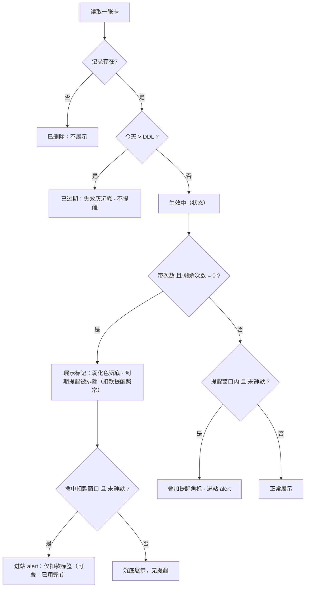
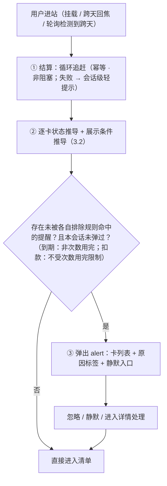
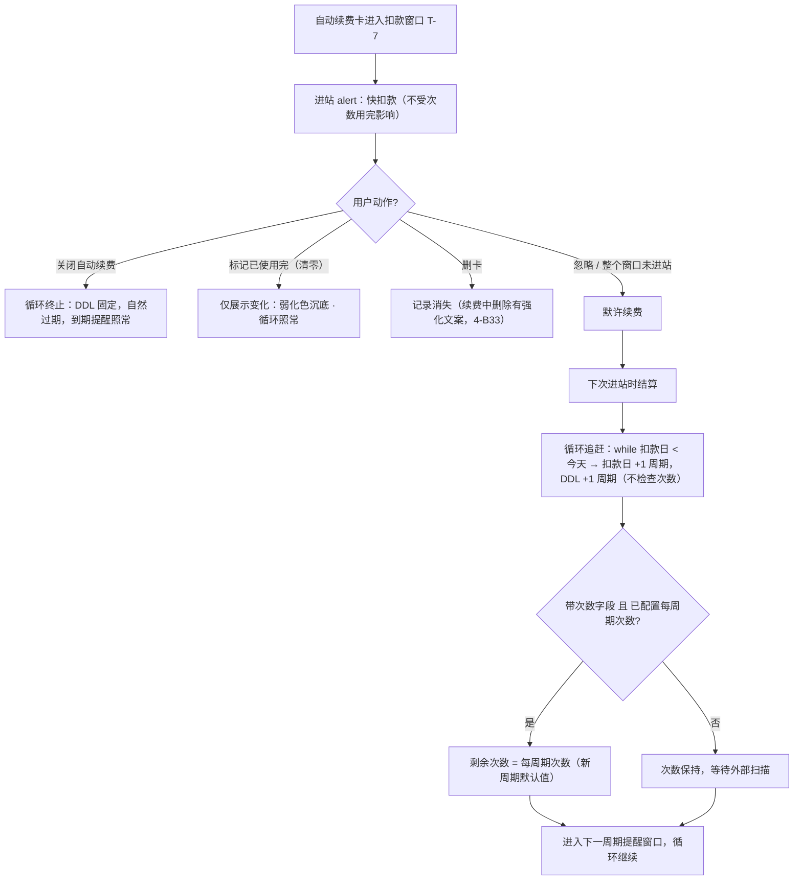
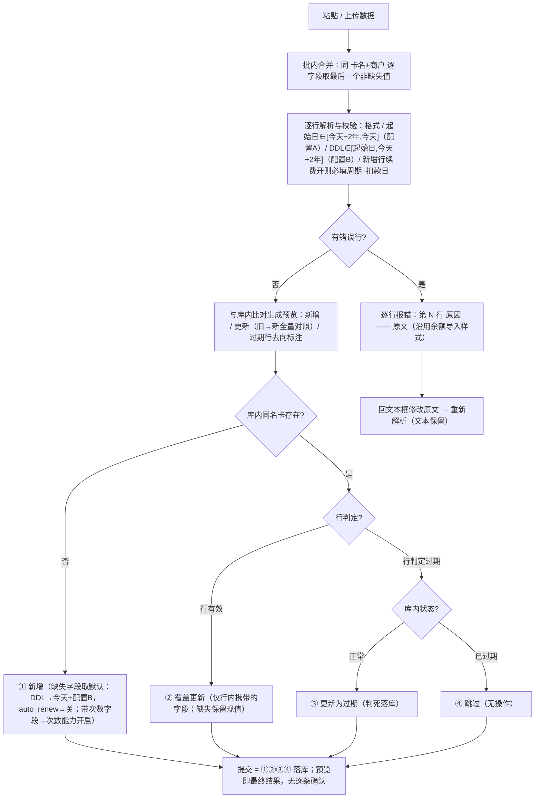

# 生活卡包 · 产品需求文档（PRD v2 · 结论版）

| 项目 | 内容 |
| --- | --- |
| 产品名称 | Handle · 生活卡包（健身 / 洗车 / 理发 / 按摩 / 瑜伽 / 美甲 / 影音会员等） |
| 版本 | v2.4（2026-08-31 · 产品裁定 R18：商户必填、展示名 = "商户名-卡名" 拼接，见 4-B36 / 5.4 / 第八章）· v2.3（2026-08-31 · v2.2 评审合入：文案/名词统一、结算范围收窄、起始日可改、无限期物化对齐配置 B、边界重编号）· 结论版：只含最终规则；推导与评审过程见 `lifestyle-cardpack-prd.md` 与本文第八章纪要 |
| 前置模块 | 管理端首页「余额」（`Hello.jsx`，已上线）——本产品为第二类资产模块 |
| 关联文档 | `design-language.md`（视觉规范）、`lifestyle-cardpack-prd.md`（完整版）、`cards-db.md`（库表设计，需随 v2 写入模型简化） |

---

# 第一章 产品定位与目标

## 1.1 一句话定位

**所有付费项目，一眼看清；该处理的，进站即见。**

一个基于"当下数据"的付费资格仪表盘：健身、洗车、理发、按摩、瑜伽、美甲、影音会员等付费项目的有效期、剩余次数、续费扣款日集中清晰呈现；处于提醒窗口内的卡，进站即 alert。

- 不碰钱、不算花销；不管使用规则；不记历史。
- 数据主权在外部自动化工具；**导入永远是人工通道**——扫描结果由用户复制粘贴进批量导入页、预览核对后提交，用户是数据搬运的最后一环（3.6.3）；用户日常动作是"看 + 被提醒"。
- 与「余额」模块构成"余额管钱、卡包管资格与周期"的双资产结构。
- 三条价值：**集中梳理**（一张清单看清所有付费项目）、**到期不浪费**（提前 15 天）、**扣款不意外**（提前 7 天）。

**分阶段触达**：本阶段的"提醒"是被动、进站可见的（进站 alert）；push / 短信 / 邮件是下一阶段的通道扩展——复用同一份提醒判定结果（3.3.4），只换投递方式，不改数据模型与状态推导。

## 1.2 产品目标

1. **准确的当下呈现**：清单与 alert 对"还剩多少天 / 多少次 / 何时扣款"零误导；提醒窗口内进站必现、零误报。
2. **可投递的提醒判定**：提醒判定输出为结构化数据（3.3.4），通道阶段可直接消费，不需要改动状态推导与数据模型。
3. **一屏清晰的当下**：10 秒内回答四个问题——还剩多少天、还剩多少次、下次什么时候扣费、扣费之后的 DDL 是什么。
4. **趋近于零的维护成本**：数据由外部自动化工具周期扫描 + 批量导入，用户日常只"看"和"被提醒"，不做任何日常录入。

## 1.3 非目标（明确不做）

| 不做的事 | 理由 |
| --- | --- |
| 不记金额、不算花销、不做成本/摊提统计 | 定位是提醒服务不是账本 |
| 不做核销/签到/打卡，不做使用规则（单日限用、停卡顺延） | 核销打卡记录商户 App 后台可查，不重复建设 |
| 不记时长（小时卡只记有效期） | 时长型用量无法从外部稳定获取且价值低 |
| 不设独立"取消截止提醒" | 快扣款提醒已承担"要取消趁早"的职能；**已知取舍**：要求更长提前通知期（如 30 天）才可免扣的服务，T-7 窗口可能来不及——监管正收紧此类"取消限制日期"场景，产品不另行兜底（3.3.1） |
| 不保留任何历史（续费/开卡/购买历程、旧卡世代、变更流水） | 只存当下，写入即覆盖（3.6） |
| 不做真正的支付/代扣/代取消 | 只做"标注 + 提醒"，取消动作发生在各平台 |
| 不做日历 / ics 聚合 | 需要把推导结果物化为时间轴事件，与"只存当下"冲突 |
| 储值类卡（充值本金/赠金） | 归「余额」模块（本金/赠金区分另行立项） |

## 1.4 名词表

| 名词 | 定义 |
| --- | --- |
| 卡 / 卡种 | 一条「卡名 + 商户」唯一的记录，代表一种付费资格的**当下状态**；只有一种卡（期限卡基座），"次数"与"自动续费"是两个可选能力 |
| DDL | 终止日期（Deadline），卡的有效期截止日；**当天仍有效，次日起为已过期** |
| 扣款日 | 下次扣费日期；**只有开启自动续费的卡存在此字段** |
| 窗口 | 提醒生效的时间区间（到期窗口 15 天 / 扣款窗口 7 天），窗口内每次进站都提醒；**两类窗口的排除规则相互独立**（4-B10） |
| 进站 | 应用根组件挂载（刷新 / 新开 / 外链进入）、同会话内跨天后重新获得焦点、或可见态轮询检测到跨天；结算与 alert 的触发单位（4-B37） |
| 结算 | 仅在进站时执行的数据演进：自动续费循环的周期追赶（3.4）；**导入不触发结算**——进站已结算过，导入数据是用户预览确认后的最新状态（3.6.3） |
| 次数用完 | 带次数的卡剩余次数 = 0 的**数据条件**：沉底展示（弱化色，区别于失效灰）、排除到期提醒；**不排除扣款提醒、不是状态、不影响循环** |
| 每周期次数 | 带次数卡的可选配置（库字段 total_sessions）：每次新周期结算时剩余次数默认重置为该值；也是"剩余 N / 共 M 次"的展示锚点；用户可改、扫描可更新 |
| 无限期卡 | DDL 留空的卡：**创建时**物化为"今天 + 配置 B"（初始配置下即 +2 年；与起始日无关，4-B5），此后与普通卡无异；到期未顺延即失效灰沉底（有意设计），手动顺延即"重新激活"（3.5） |
| 重新激活 | 对已过期卡执行顺延（把 DDL 改回未来）使卡恢复生效的**别称**，非独立功能；可一并修正起始日 / 次数 / 续费设置等业务字段（卡名 / 商户除外——唯一键不可经此变更，3.6.1）；状态是否恢复只由 DDL 决定 |
| 默许续费 | 扣款窗口内用户未做任何打断动作，视为同意续费，扣款日后自动顺延 |
| 顺延 | 自动续费卡：按扣款周期推进 DDL / 扣款日（系统结算；手动顺延受 4-B21 闸门）；非自动续费卡（含无限期卡）：手动把 DDL 改到任意合法未来日期（≥ 今天、≤ 今天 + 配置 B，4-B2） |
| 静默 | 按卡的提醒开关：本周期不提醒 / 永远静默；只关提醒，不影响状态与循环 |

---

# 第二章 用户与场景

## 2.1 目标用户

- 有 3 张以上生活卡 / 连续订阅、且付费项目跨多个平台的个人用户；
- 数据由用户自建的外部自动化工具扫描产出（本产品不负责采集）；扫描结果**不自动入库**，由用户粘贴进批量导入页、核对后提交——用户是数据搬运的最后一环（3.6.3）；
- 使用场景是**低频、被动**的：想起来才打开，打开就要立刻有价值。

## 2.2 场景卡片

> 格式：前置 → 触发 → 系统行为（分步）→ 结果。括号内为对应规则章节。

### S1 单条添加一张卡

- 前置：用户线下刚办了一张理发店次卡（30 次季卡）。
- 触发：FAB →「单条添加」。
- 系统行为：弹窗填基础字段（卡名、商户、DDL；起始日默认今天、可改历史，4-B3）→ 按需打开两个能力开关：次数（露出剩余次数 + 每周期次数配置，**剩余必填 >0**）、自动续费（露出周期与扣款日）（5.5，向导只是字段组合预设，不锁类型）。
- 结果：创建成功；**notice 反馈**——若落入提醒窗口，附带"已进入到期提醒窗口"提示（4-B38），不弹 alert。

### S2 外部工具周期性批量导入

- 前置：外部自动化工具每天扫描一次所有卡服务，产出表格数据。
- 触发：用户（或工具触发的人为步骤）打开批量导入页，粘贴数据（5.6）。
- 系统行为：逐行解析校验（格式、起始日 ∈ [今天−2 年, 今天]、DDL ∈ [起始日, 今天+2 年]、新增行续费开则必填周期与扣款日）→ 批内同名合并（逐字段后写覆盖、缺失保留）→ 与库内比对生成预览（新增 / 更新〔旧 → 新全量对照〕/ 错误，3.6）→ 回改原文或直接提交落库。
- 结果：按 3.6.2 写入模型直接生效——后写覆盖先写，扫描判定过期的行按三分支处理（正常 → 更新 / 已过期 → 跳过 / 没有 → 插入）；**缺失字段保留现值**。**导入本身不触发 alert**——提醒在下一次进站时按新数据统一计算（4-B29）。

### S3 日常进站，一切正常

- 前置：所有卡都生效中，无一处于提醒窗口。
- 触发：进站（4-B37）。
- 系统行为：先结算（本例无自动续费卡到期的，结算为空操作）→ 状态与展示条件推导 → 无 alert → 直接进入清单。
- 结果：用户浏览清单，看到各卡"剩 N 天 / 剩 N 次"，10 秒内获得当下全貌。

### S4 进站看到到期提醒（非自动续费卡）

- 前置：一张理发季卡 DDL 还剩 9 天（已进入 15 天窗口）。
- 触发：进站。
- 系统行为：alert 弹出，该卡显示「剩 9 天」倒计时摘要（5.3，alert 标签统一取倒计时文案）。
- 结果：用户可以选择忽略（关掉弹层）、本周期静默、永远静默，或进入卡片详情顺延 DDL（若线下已续）。

### S5 扣款提醒 → 忽略 → 默许顺延（自动续费主路径）

- 前置：爱奇艺月度自动续费会员，扣款日 9 月 14 日，DDL = 9 月 14 日。
- 系统行为：
  1. 9 月 7 日起（T-7 窗口）每次进站 alert「即将扣款」；
  2. 用户全程忽略（或压根没打开网站）；
  3. 9 月 15 日用户进站 → **结算**：扣款日与 DDL 各 +1 周期 → 10 月 14 日，卡回到正常展示，无 alert；
  4. 10 月 7 日起进入下一个扣款窗口，循环继续（3.4）。
- 结果：卡"永远活着"并按周期持续提醒；这正是"忽略即续"的语义。

### S6 扣款提醒 → 决定退订

- 前置：同 S5，但用户决定不再续。
- 系统行为：alert 提示后，在详情内把**续费区块开关拨关**（关闭自动续费，5.7）→ 标志变关。
- 结果：循环终止；DDL 固定在 9 月 14 日；此后适用 15 天到期提醒（若在窗口内），过期后失效灰沉底、不再提醒。**取消续费 ≠ 删卡**——已付费的期限照样用完。

### S7 长期未进站后回来（多周期追赶）

- 前置：月度自动续费卡，用户出差三个月没打开网站，期间外部工具也没导入。
- 触发：三个月后进站。
- 系统行为：结算执行**周期追赶**——扣款日落后今天约 2 个周期，系统连续推进 N 次直到扣款日 ≥ 今天（3.4.2），DDL 同步推进，次数重置为每周期次数。
- 结果：卡恢复最新周期状态，DDL 与扣款日指向最新周期；等待外部下次扫描进一步校准。

### S8 次卡用完的两条路径

- 路径 A（客观用完）：外部扫描报告剩余次数 = 0 → **次数用完**：沉底展示（弱化色）、不进**到期**提醒；**状态仍由 DDL 决定**（DDL 未到 = 生效中）；**循环照常**——月度自动续费次卡扣款日照常顺延，次数由结算重置为每周期次数。
- 路径 B（主观用完）：点「标记已使用完」→ 次数清零 → 展示同上；**循环同样照常**——"这个周期用完了"是关于用量的陈述，不是关于订阅的决定；若订阅在续，下个周期次数自动恢复。
- 结果：两条路径在展示、状态、循环三个层面**完全等价**。一切修改都是普通更新操作，遵循唯一写入规则（3.6.2）：谁后操作，谁覆盖前面的记录。另：次数用完不屏蔽扣款提醒（4-B10，见 S16）。

### S9 误操作的恢复

- 场景：改错了次数、或误点「标记已使用完」→ 卡沉底（弱化色）。
- 恢复：就是一次普通更新——手动把数据改回去；或下次把扫描结果贴回来，导入按 3.6.2 自然覆盖。
- 结果：全程无"取消标记"按钮——把数据改回去，一切自然回来（3.5）。

### S10 手动顺延（线下续了，工具还没扫到）

- 场景 a（未开自动续费）：健身年卡 DDL 9 月 30 日，线下续了明年 → 详情内「顺延」改 DDL 至明年 9 月 30 日（≥ 今天且 ≤ 今天+2 年）→ 正常展示。下次导入若带来不同 DDL → 直接覆盖（扫描为准，预览可见旧 → 新）。
- 场景 b（自动续费卡）：**不允许直接顺延**。必须先关闭自动续费 → 卡变普通期限卡 → 顺延 → 之后还想要自动续费，重新打开并重设周期与扣款日（3.4.4，闸门规则 B21）。

### S11 静默一张吵人的卡

- 场景：用户知道自己每月都会续爱奇艺，扣款提醒每月都弹很烦。
- 系统行为：alert 行内或详情内设「永远静默」→ 此卡不再 alert。
- 结果：时间照走、状态照常推导、**自动续费循环照跑**（静默只是不吵）；卡片上显示静默标识，可随时解除（4-B22）。若只是"这个月别吵、下个月再说"→「本周期不提醒」，到下次顺延后自动恢复提醒。

### S12 删卡（含续费中强提醒）

- 触发：详情内「删除」→ 红色确认弹窗。
- 系统行为：**弹窗文案动态判断**（4-B33）——若该卡自动续费开着，追加强化提示：删除只清本地记录、不会代取消平台续费、此后扣款不再有任何提醒。
- 结果：记录整个消失，列表里找不到，唯一不可逆操作。

### S13 混合能力拆两张

- 场景：健身年卡送 12 节私教课。
- 系统行为：录入为两张独立卡——「XX健身·年卡」（DDL 一年）+「XX健身·私教 12 次」（带自己的次数与有效期）。
- 结果：无任何关联；各自独立推导、独立提醒、独立终结。

### S14 无限期卡

- 场景：某店"终身 8 折卡"没有期限；或外部工具扫描终身卡时 DDL 字段缺失。
- 系统行为：**创建时** DDL 物化为"**今天 + 配置 B**"（与起始日无关，4-B5）；此后扫描再缺 DDL → 保留现值不刷新（3.6.3 缺失字段语义）。
- 结果：到期前 15 天照常提醒；到期未顺延会失效灰沉底（有意设计，4-B5），手动顺延即重新激活——单次顺延最多推进至今天 + 配置 B，可多次累积。

### S15 导入预览与人工修正

- 前置：外部工具扫描产出表格；结果可能与库内不一致，也可能有错（明示接受扫描不准，见 3.6.3 已知取舍）。
- 系统行为：粘贴 → 解析校验 → 预览分三组（新增 / 更新 / 错误）；**更新组每行显示「字段 | 旧值 → 新值」全量对照**，扫描判定过期的行标注去向（将更新为过期 / 跳过（库内已过期）/ 新增过期记录，3.6.2）→ 发现不对，回文本框改原文重新解析 → 提交落库。
- 结果：提交即按 3.6.2 写入模型生效——无逐条确认、无「采纳 / 保留」。人工核对发生在预览区的一次性核对里。

### S16 次数用完撞上扣款窗口

- 前置：月付按摩卡，每月 8 次，自动续费开。用户本月第 10 天就用完了 8 次，进详情点「标记已使用完」（或外部扫描报 0）。
- 系统行为（时间线）：
  1. 当下：卡沉底（弱化色）、不进**到期**提醒（资格已尽）；
  2. 循环不受影响：扣款日照常推进；
  3. 扣款日进入 T-7 窗口 → **alert 照常弹出**「MM-DD 扣款」，条目可叠加「已用完」信息标签（4-B10/B12）。
- 结果：一笔即将发生的扣款不会因为"次数用完"而对用户失明；这条提醒恰出现在"钱花了没享受到"风险最高的时刻——若用户本就不想续，这正是去取消的最佳时机。

---

# 第三章 业务规则

## 3.0 公理

- **数据不变式**：每张卡只存当下状态；任何写入直接覆盖，后写覆盖先写，不记录写入来源。
- **状态公理**：状态只有一条轴——由 DDL 与今天推导（生效中 / 已过期）。**次数维度不产生状态、不影响循环、不屏蔽扣款提醒**，只产生两个正交的数据条件：展示标记（沉底展示，弱化色区别于失效灰）、到期提醒排除。静默同理是数据条件，不是状态。**循环只由"自动续费"开关与扣款日驱动**，对次数一无所知。

## 3.1 数据概念模型

| 组 | 字段 | 约束 |
| --- | --- | --- |
| 身份 | 卡名、商户 | 无分类维度（4-I）：不做分类、不做用户配置，清单按关键日一目了然 |
| 有效期 | 起始日期、DDL | **起始日为纯展示字段，不参与任何推导与默认值计算**：录入时可选（单条默认今天、可改历史），录入后手动可改（校验同配置 A）、导入可静默覆盖。DDL：手动改 ≥ 今天 且 ≤ 今天+2 年（配置 B）；DDL ≥ 起始日；**无限期（DDL 留空）创建时物化为今天 + 配置 B，与起始日无关**（4-B5） |
| 用量（可选） | 剩余次数、（可选）每周期次数 | 只记次数不记时长；次数 = 0 触发"次数用完"展示条件（非状态、不影响循环、**仅排除到期提醒**）；**能力开启时剩余次数必填且 > 0**（3.6.3 / 5.5）；**每周期次数是用户可配置项**：每次新周期结算时剩余次数默认重置为该值，用户可随时修改，扫描也可更新（库字段 total_sessions）；**能力可双向开关**（关闭语义见 4-B31）；**remaining 与每周期次数无大小关系约束（有意）**——累加型/赠送型真实数据存在（3.4.3），remaining 是扫描事实、每周期次数是可选配置，展示照常（"剩余 10 / 共 8 次"不是 bug） |
| 续费（可选开关） | 自动续费（默认关）；开启时必填下次扣款日，且**周期信息二选一**：扣款周期（周/月/季/年，日历语义——连续包月类）或**合同天数 period_days**（"30 天月卡""365 天年卡"写合同多少是多少） | 扣款日只有开启自动续费的卡才有、才可改；默认 = 当前 DDL 往后延续；**开启的准入闸门见 4-B23（过期卡禁开）**；**循环是它唯一的开关语义**；**两种周期表示互斥、至多一个非空（库表 CHECK 强制）** |
| 静默（按卡） | 不静默 / 本周期 / 永远 | 只影响 alert，不影响状态与循环 |

- **卡的模型**：只有**一种卡**（期限卡基座）；"次数"与"自动续费"是两个可选能力（字段组 / 开关），可创建时开启、可事后在详情页补开或关闭——建卡向导只是字段组合预设，不存在互斥卡型（5.5 / 4-B31）。
- 混合能力的卡拆成两张独立卡；储值类归「余额」模块。

## 3.2 状态系统（推导制 · 单轴）

**状态（唯一轴，按优先级取第一个命中）：**

```
已删除   记录不存在                → 不可见（不可逆）
已过期   今天 > DDL                → 失效灰沉底，不提醒（真正的失效）
生效中   其余                      → 正常展示；提醒窗口内叠加角标并进 alert
```

**展示条件（非状态，叠加在状态之上）：**

```
次数用完   带次数字段 且 剩余次数 = 0（无论来源）
           → 沉底（弱化色，区别于失效灰——资格暂尽不是失效）、
             排除到期提醒（扣款提醒不受影响）；
             状态仍由 DDL 决定；循环不受影响
静默中     按卡设置                  → 不进 alert（两类窗口全排除）；状态与循环不受影响
```



- 状态全部推导、不存储：状态与数据永远一致；恢复操作免费（改数据即恢复）；新增状态不需要数据迁移。
- 不存在"人工标记过期"：想让卡别吵有静默，想让卡消失有删卡。

## 3.3 提醒引擎

### 3.3.1 两类窗口与各自的排除规则

| 提醒 | 适用卡 | 窗口（**含两端边界日**） | 说明 |
| --- | --- | --- | --- |
| 快到期 | **所有卡** | `[DDL − 15 天, DDL]` | DDL 当天仍提醒；次日起进入已过期，不再提醒 |
| 快扣款 | 自动续费卡（**额外**） | `[扣款日 − 7 天, 扣款日]` | 扣款日当天仍提醒；之后由结算接管 |

- 自动续费卡可能同时命中两类（其 DDL ≈ 扣款日）→ alert 中**合并为一条、罗列全部原因标签**。
- 窗口内**每次进站都 alert**（窗口制而非时点制）；窗口自然结束：过期（不再提醒）/ 扣款完成（结算顺延）/ 用户处理 / 静默。
- **排除规则**：
  - **两类窗口共同排除**：已过期的卡；静默中的卡；剩余次数多少（用量**水平**永不提醒）。
  - **仅到期提醒排除**：**次数用完的卡**。
  - **次数用完不排除扣款提醒**：扣款提醒回答"钱什么时候走"，与用量正交。
- **已知取舍**：扣款窗口固定 T-7；要求更长提前通知期（如 30 天）才可免扣的服务可能来不及取消——监管正收紧此类"取消限制日期"场景，产品不设独立取消截止提醒（1.3）。

### 3.3.2 静默语义

| 设置 | 生效范围 | 解除 |
| --- | --- | --- |
| 本周期不提醒 | 到下一次顺延 / 周期更替为止 | 自动恢复（4-B22），或手动解除 |
| 永远静默 | 无限期 | 仅手动解除 |

- 静默**只关 alert**：时间照走、状态照常推导、自动续费循环照跑。
- "不想被吵"（静默）与"不想续了"（关闭自动续费）是两个独立操作。
- 静默状态必须在卡片上**可见**（标识）且**可解除**（4-B22）。

### 3.3.3 进站处理顺序（SPA 会话定义）

**"进站"的精确定义**：进站 ≡ 应用根组件**挂载**（浏览器刷新、新开标签页、外部链接进入）、**同会话内跨天后重新获得焦点**（focus 检测到"今天"变化）、或**可见态轮询检测到跨天**（页面可见期间每 30 分钟检查一次本地日期，不可见时不轮询）。内部标签切换、路由跳转**不是**进站。

- **结算**：每次进站执行，幂等；**非阻塞降级**——结算失败时按上次已知状态渲染、不挡首屏，但本次会话内在清单顶部显示一条低优先级 notice（信息态）「部分数据可能未及时刷新，请稍后重新打开」。
- **alert**：**会话级去重**——一次会话（根组件挂载存活期间）只弹一次；用内存标志位实现，不落地存储。跨天回焦 / 轮询检测到跨天视为新进站，标志重置。**多标签页各自独立维持会话标志，不做跨 tab 同步**（接受多 tab 各弹一次）。
- **结算先于推导**：结算可能改变 DDL（顺延），不先结算会拿旧日期算出错误提醒。
- **结算在进站时做（lazy settlement）**：产品无后台定时任务；"今天"本身因用户进站才有意义。



### 3.3.4 提醒判定的结构化输出（可投递约束）

提醒判定**不得内联在 UI 里**，统一输出为结构化记录：

```
{ card_id,
  reasons: [ { type: expiring | billing, deadline, days_left } ],
            // 排除按 reason.type 独立判定：expiring 受"次数用完"排除；
            // billing 不受任何用量条件影响
  muted, display_group }        // 展示分组（正常 / 沉底）独立推导，
                                // 与"是否有 reasons"无关（沉底卡可带扣款 reason）
```

- 进站 alert 是该结果的**消费方之一**；通道阶段（push / 短信 / 邮件）消费同一份结果，不改推导逻辑、不重写文案判断。
- 文案模板参数化（"剩 {n} 天""{date} 扣款"），通道阶段直接填充。

## 3.4 自动续费循环（忽略即续）

### 3.4.1 循环流程

**开关开启即默认续费**：自动续费开着的卡，扣款日到达后由结算无条件顺延进新的当前循环阶段——不需要任何用户动作或确认（默许续费）；不看次数、不看用户是否进站过。



### 3.4.2 结算算法（精确语义）

```
对每张 自动续费 = 开 的卡（不检查次数状态）：
  N = 0
  while 下次扣款日 < 今天：
      下次扣款日 += 1 个扣款周期
      DDL        += 1 个扣款周期     （保持两者相对关系）
      N += 1
  若 N > 0：
      若带次数字段且已配置每周期次数 → 剩余次数 = 每周期次数（新周期默认值）
```

- **周期推进语义**：两类周期两种算法——**合同固定天数类**（period_days 非空：健身"30 天月卡""365 天年卡"）恰好推进 period_days 天，无钳制、无漂移；**自然日历类**（period_days 为空：爱奇艺连续包月）按 billing_cycle 日历推进（月 = +1 日历月，逐周期钳制；锚点收缩——31 → 28 → 28——是显式接受的行为，联调必测断言）。两种算法由 period_days 是否为空选择——两种表示**互斥**（库表 CHECK 强制至多一个非空）。
- 与商户真实周期的偏差由扫描主权持续纠正，方向保守（提醒恒早于真实扣款）。
- 追赶以**当下**的周期值推算整个缺口——周期在缺口内被更替时真实轨迹无法重放，显式接受。
- 算法幂等：无论隔多久进站、几台设备同时进站，收敛到同一个正确周期。
- **已知取舍（明示接受）**：若卡内实际存在开卡赠送等不随周期重置的次数，周期追赶结算仍会把剩余次数重置为"每周期次数"配置值，产生短暂展示偏差；该偏差与扫描误差同规则处理——由下一次导入覆盖或用户手动编辑纠正（3.6.2 / S9），不做赠送/套餐分字段建模。

### 3.4.3 每周期次数未配置与叠加型套餐

- **未配置每周期次数的卡**（带次数、有续费，但没配置每周期次数）：结算只推进 DDL 与扣款日，**次数保持原值**，等待周期性扫描校准；配置每周期次数后即恢复"新周期重置"语义。
- **叠加型套餐**（每次续费在剩余次数上累加而非重置）：不做累加推演、**不拆分赠送/套餐字段**，单一剩余次数以扫描/手动更新为准；若配置了每周期次数，追赶结算的重置偏差按 3.4.2 已知取舍处理（下次导入或手动编辑自愈）。

### 3.4.4 打断方式与后果矩阵

| 动作 | 循环 | DDL | 后续提醒 | 可逆性 |
| --- | --- | --- | --- | --- |
| **关闭自动续费**（唯一显式打断） | 终止 | 固定不变 | 到期提醒照常 → 过期沉底 | 可逆（重开需重设周期+扣款日，受 B23 闸门） |
| **删卡**（唯一不可逆） | —— | —— | —— | 不可逆（续费中删除有强化文案，4-B33） |
| 标记已使用完 / 次数清零 | **不影响循环** | 不变（到期后转过期） | 到期提醒排除；**扣款提醒照常** | 可逆（改回次数 / 导入覆盖 / 结算重置） |
| （手动顺延） | 自动续费卡**不可直接顺延**；须先关闭自动续费 → 顺延 → 按需重开 | | | |

- 能让循环停止的操作只有两个：「关闭自动续费」（显式订阅决定，续费区块开关）与「删卡」（记录消失）。
- 对非自动续费卡：没有循环，"标记用完"语义不变（弱化色沉底，直到 DDL 过期或改回次数）。

## 3.5 终结与恢复

- **终结只有两种**：**已过期**（自然状态，今天 > DDL）与**删除**（不可逆）。"次数用完"不是终结——它是展示条件，且永远自愈：改回次数、导入覆盖、或（自动续费卡）下周期结算重置。
- **已过期**：恢复 = 手动顺延 DDL（≥ 今天），或导入带来未来 DDL（直接落库，预览可见）。
- 自动续费卡的恢复：重开自动续费由结算追赶，或先关续费再手动顺延。
- 恢复后展示**立即**回到正常，零额外步骤，不留过程痕迹。

## 3.6 录入、覆盖与写入模型

### 3.6.1 upsert 基本规则

- **唯一键 = 卡名（trim）+ 商户（trim）**，精确匹配（**商户必填**，4-B36）。每个键有且只有一条记录、只有最新状态——用户侧的真实多张同卡种并存视为一条记录的最新状态（数量以最新数据为准），产品不建模"两张同名卡"。
- 写入次序：**后面的覆盖前面的**（批内同名合并取最后一条；提交即覆盖库内——与「余额」模块同则，无冲突判定，见 3.6.2）。
- 起始日必须是记录属性而非键的一部分（同卡种续买生成的是同一条记录的新状态，不是第二条记录）。

### 3.6.2 写入模型（后写覆盖先写）

- **唯一规则**：一切操作都是更新操作——谁后操作，谁覆盖前面的记录。单条添加、单条编辑、批量导入、结算四条写入路径完全同则，无来源区分、无优先级、无冲突判定、无逐条确认。与「余额」模块完全一致（余额导入即纯 upsert：解析 → 批内去重 → 预览 → 提交）。
- 结算的写入同则：追赶结果落库后，下一次扫描照常覆盖（扫描主权校准）。
- 不记录任何"写入来源"字段或标记。
- **导入行规则（全产品唯一的行级条件）**：

  | 行判定 | 库内状态 | 动作 |
  | --- | --- | --- |
  | 行有效（DDL ≥ 今天） | 任何（有 / 没有） | upsert：没有则新增（缺字段取默认）；有则覆盖更新（仅行内携带的字段，缺失保留现值） |
  | 行判定过期（DDL < 今天） | 库内正常 | **更新**（判死落库——扫描主权，明示接受） |
  | 行判定过期 | 库内已过期 | **跳过**（无操作） |
  | 行判定过期 | 库内没有 | **插入**（记录已结束的卡，4-B4） |

### 3.6.3 导入流水线与校验



- **缺失字段语义**：导入行中**缺失的字段不参与更新**（保留库内现值）；仅**新增**记录时缺失才取默认值（**起始日 → 今天**；DDL → 今天 + 配置 B；auto_renew → 关）。批内合并同规则：逐字段取最后一个非缺失值。预览中由默认值填充的字段标注「默认」。
- **校验细则**：
  - **商户缺失 / trim 后为空** → 行报错（必填，4-B36）；
  - 起始日早于今天 − 2 年或晚于今天 → 行报错（配置 A）；
  - DDL 早于起始日或晚于今天 + 2 年 → 行报错（配置 B）；
  - **行内同时携带扣款周期与 period_days**（两表示互斥）→ 行报错（预览阶段即校验，不依赖落库时 DB CHECK）；
  - **新增行** `auto_renew = true` 但缺扣款日，或缺（周期与 period_days 两者）→ 行报错；
  - **更新行**缺失周期/扣款日 → 保留现值放行；
  - **行内 total_sessions 提供且 ≤ 0** → 行报错；
  - **新增行**携带剩余次数 → 次数能力随之开启（数据驱动创建）；
  - **更新行**携带剩余次数而卡的次数能力未开启 → 宽容忽略、**不自动重开能力**（能力位是用户的结构决定，机器不得擅自恢复——B31）；
  - `auto_renew = false` 时携带的扣款字段**宽容忽略**（不报错）；
  - `auto_renew` 缺失 → 默认关（仅新增时）。
- **过期行判定**：行判定过期 = 行内 DDL < 今天；库内状态 = 库内 DDL 与今天比较。两侧都是纯推导，三分支动作见 3.6.2 与上图 ③④。
- **人工通道前提**：扫描结果永不自动入库——一律由用户复制粘贴到批量导入页，经预览核对后提交（S2 / S15）；扫描工具自身承诺不产出错误数据。
- **已知取舍（明示接受）**：在人工通道前提下仍可能落库的错误（预览未发现），与正确值同通道落库，不被标记、不进入任何待处理队列；持续性扫描 bug（解析错误每天重现）不会自愈。已知暴露面：判死误报（关掉正常卡提醒）、`auto_renew` 被误扫为关（扣款提醒消失）、任意字段值错误。唯一缓解 = 预览区的旧 → 新全量对照 + 文本框回改（5.6）。
- **导入不触发 alert**：落库后状态重推导即可，提醒在下次进站统一呈现（4-B29）。

## 3.7 日期与时间规则汇总

| 规则 | 定义 |
| --- | --- |
| "今天" | 用户浏览器本地时区的当日；日期值不带时区存储 |
| 过期边界 | 今天 = DDL 仍生效；今天 > DDL 为已过期（"到期日当天有效"惯例） |
| 窗口边界 | 两类窗口均含端点日（3.3.1） |
| 起始日 | **纯展示，不参与任何推导与默认值计算**：录入时可选（单条默认今天、可改历史），录入后手动可改（校验同配置 A）、导入静默覆盖 |
| DDL 手动修改 | ≥ 今天 且 ≤ 今天 + 2 年（配置 B）；可以多次顺延累积 |
| 无限期卡 | DDL 留空 → **创建时物化为今天 + 配置 B**（与起始日无关）；之后更新路径上 DDL 缺失保留现值；到期走正常提醒/顺延流程（到期未续 = 失效灰沉底，手动顺延即重新激活——有意设计，4-B5） |
| 校验配置 | 两个**独立配置**：A = 起始日回溯上限、B = DDL 前瞻上限；初始均为 2 年，各自可调（`shared/cardsConfig.js`） |
| 结算时点 | 仅进站时（**导入不触发结算**——进站已结算过，导入数据是用户预览确认后的最新状态）；幂等；非阻塞 + 失败会话级轻提示；无后台定时任务；**不检查次数状态** |

---

# 第四章 边界定义（穷尽清单）

> 每条格式：**编号 · 情形 → 处理**。A–G 为正边界（必须正确处理的），I 为反边界（明确不处理）。

## A. 日期与状态边界

- **B1 · DDL 当天** → 生效中（今天 > DDL 才过期）；到期窗口含 DDL 当天，当天是"最后一天提醒"。
- **B2 · DDL 手动修改范围** → ≥ 今天（不能顺延进过去）、≤ 今天 + 2 年（配置 B，防 2099 式脏数据）；可以多次顺延累积。
- **B3 · 起始日** → **纯展示字段，不参与任何推导与默认值计算**：录入时可选（单条默认今天、可改历史）；**录入后手动可改**（v2.2 评审修订，原"手动不可改"废除），校验不变：≤ 今天 且 ≥ 今天 − 2 年（配置 A）；导入带来的差异仍静默覆盖。**详情编辑字段范围**：可改起始日 / DDL / 次数 / 续费设置等业务字段；**卡名 / 商户不可改**（唯一键，改键等于变成另一张卡——删卡重录，3.6.1）。
- **B4 · 批量导入已过期的卡（DDL 在过去）** → 允许录入，直接失效灰沉底不提醒——"记录一堆已结束的卡"是合法诉求。
- **B5 · 无限期卡（DDL 留空）** → **创建时物化为今天 + 配置 B**（与起始日无关；与 DDL 前瞻上限同源，不存在硬编码超限）。物化后与普通卡无异；到期前正常提醒；**单次顺延最多推进至今天 + 配置 B，可多次累积顺延**。**到期未顺延即失效灰沉底是有意设计**：产品不内置"永不过期"态（监管趋势下永久/长周期卡本身在收敛）；恢复 = 详情内手动顺延"重新激活"（3.5），详情页带「无限期卡」标注提醒可激活（5.4）。之后扫描再缺 DDL → 保留现值不刷新（3.6.3）。
- **B6 · DDL < 起始日期** → 创建/导入校验直接拒绝（时间倒置非法）。
- **B7 · 同商户同卡种真实多张并存** → 单条记录最新状态；数量类字段以最新数据为准。产品不接受"两张同名卡"——"商户-卡种有且只有一条记录"是核心原则。**同名合并后数量对不上的处理**：直接把剩余次数编辑为实际值（如两张 10 次洗车卡合并记 20），或等下一次扫描结果覆盖（3.6.2）——都是普通更新操作。
- **B8 · 跨时区** → "今天"取进站设备的本地时区；结算幂等，多端收敛于同一结果；极端跨时区交替进站的偏差 ≤ 1 天，可接受。

## B. 提醒边界

- **B9 · 窗口端点** → 两类窗口均含端点日：`[DDL−15, DDL]`、`[扣款日−7, 扣款日]`。
- **B10 · 提醒排除按窗口类型拆分** →
  - **两类窗口共同排除**：已过期的卡；静默中的卡；剩余次数多少（用量**水平**永不提醒）。
  - **仅到期提醒排除**：**次数用完的卡**（资格已尽，"还剩几天资格"信息量低）。
  - **次数用完不排除扣款提醒**：扣款提醒回答"钱什么时候走"，与用量正交；"次数刚用完 + 扣款在即"的提醒必须可见。
- **B11 · 静默卡落在窗口内** → 不 alert（两类窗口全排除）；角标语义保留；状态与循环不受影响。
- **B12 · 同卡多提醒合并 + 沉底与提醒并存** →
  - 同卡同时命中两类窗口 → alert 合并为一条、双标签；
  - **"次数用完（沉底展示）+ 命中扣款窗口"**：清单保持沉底，alert 照常纳入、条目可叠加「已用完」信息标签。展示分组与提醒判定是结构化输出（3.3.4）的两个独立字段，互不约束。
- **B13 · 同一窗口内反复进站** → 每次进站都 alert（会话级去重防同会话重复骚扰，4-B37）。嫌吵的正解是静默，不是降低提醒频率。
- **B14 · 自动续费卡缺扣款日/周期** → 手工创建被表单强制；新增行导入报错；更新行缺失 → 保留现值放行（3.6.3）；若历史数据存在此形态 → 不结算不提醒，详情内提示补全（防御性兜底）。

## C. 循环与顺延边界

- **B15 · 长期未进站的追赶结算** → `while 扣款日 < 今天` 连续推进 N 周期（3.4.2），幂等；次数重置一次为每周期次数。
- **B16 · 次数与循环解耦** → **任何来源的"次数 = 0"都不暂停循环**；次数也不屏蔽扣款提醒（4-B10）。
- **B17 · 未配置每周期次数的自动续费次卡** → 结算只推进日期、不重置次数；次数由周期扫描持续校准、零人工介入（3.4.3）；配置每周期次数即可恢复"新周期重置"语义。
- **B18 · DDL 与扣款日错位** → 各自独立：状态由 DDL 推导、扣款提醒由扣款日驱动、循环只由扣款日驱动；顺延同时推进两者（保持相对差），单独改扣款日不动 DDL。
- **B19 · DDL 已过但扣款日未到**（用户把扣款日改到 DDL 之后）→ 卡失效灰沉底（已过期），循环未触发（扣款未发生）；扣款日到达后结算将 DDL 一并推齐。展示与事实一致："资格到期了，但账还没扣"。
- **B20 · 关闭自动续费后** → 扣款日字段保留但不再提醒、不再结算；DDL 固定走到过期；重开自动续费必须重设周期 + 扣款日（且受 B23 闸门约束）。
- **B21 · 自动续费卡的手动顺延闸门** → 先关续费 → 顺延 → 按需重开（3.4.4）。
- **B22 · 静默的本周期终点** → 自动续费卡：下次结算顺延即恢复；非自动续费卡：DDL 被顺延或过期即恢复。**解除渠道不限**：手动顺延（PATCH / POST 覆盖）、结算追赶、导入推进周期日期——凡 `end_date` 实际发生变化即自动解除「本周期」静默（含扫描校正提前；重新静默是一次点击）。**静默必须可见、可解（防数据黑洞）**：静默中的卡（含永远静默），折叠卡右上静音图标即**一键解除按钮**，点击即恢复提醒；要重新静默走详情内静默入口（5.4 / 5.7）。
- **B23 · 自动续费开关的准入闸门** → 只能在卡处于**生效中**（今天 ≤ DDL）时开启；已过期的卡，开关置灰 + notice：「卡已过期，请先顺延有效期恢复生效，才能开启自动续费」。用户先「顺延」把 DDL 改到未来、卡恢复生效后，开关自动解禁。**手动建卡同则**：5.5 表单 DDL < 今天时开关置灰（拦"从关拨到开"；同名覆盖表单预填已开启的过期 + 续费中卡可维持——维持不是开启）。**导入路径无此闸门**：扫描行按 3.6.2 直接落库（扫描主权）。

## D. 导入与写入边界

- **B24 · 写入模型** → 一切操作都是更新操作：所有写入路径（单条添加 / 单条编辑 / 批量导入 / 结算）统一为**后写覆盖先写**——谁后操作，谁覆盖前面的记录，无来源区分、无优先级、无逐条确认（与「余额」模块同则）。导入行按 3.6.2 过期行三分支处理。
- **B25 · 批内同名** → 预览阶段逐字段合并取最后一个非缺失值；不产生逐条确认。
- **B26 · 非自动续费卡携带扣款字段** → 宽容忽略不报错。
- **B27 · `auto_renew = true` 缺周期或扣款日** → **新增行**报错（修完才能提交）；**更新行**缺失 → 保留现值放行（3.6.3 缺失字段语义）。
- **B28 · `auto_renew` 缺失** → 新增时默认关；更新时保留现值。
- **B29 · 导入后是否弹提醒** → 不弹；下次进站按新数据统一计算。（导入往往是批量刷新，当场弹一批 alert 会把"录入完成"的正反馈变成噪音。）
- **B30 · 过期行与客观更替** → 扫描把已过期的卡更新为新周期（行有效）→ 直接落库（同卡种续买即覆盖）；扫描判定过期的行按 3.6.2 三分支（库内正常 → 更新 / 已过期 → 跳过 / 没有 → 插入）。
- **B31 · 次数能力的关闭与导入互动** →
  - **关闭**：详情页可关闭次数能力（与开启对称、双向可逆）——剩余次数/每周期次数**两个字段一并移除**（DB CHECK 强制联动：total_sessions 非空而 remaining 为空是非法态），卡退回纯期限卡；展示立即回归推导（若原为 0 沉底，关闭后恢复原位）；无确认（可逆）、无特殊提示（行为自明）；重新开启时必填 > 0（同 5.5/5.7 规则）。**入口落位**：次数区块自带开关（与续费区块对称），与"标记用完/改次数"（值操作）入口分离（5.7）。
  - **导入互动**：更新行携带剩余次数而卡的次数能力未开启 → **宽容忽略、不自动重开**（能力位是用户的结构决定，机器不得擅自恢复；与 B26"宽容冗余"同则）；若扫描持续带来次数而用户想恢复次数维度，手动重开即可（一次性动作）。新增行携带剩余次数 → 创建即开启次数能力（数据驱动创建）。

## E. 数据一致性边界

- **B32 · 多端并发** → 与所有写入路径同则：后写覆盖先写（B24）；结算幂等，重复执行无副作用；不做行锁、不做合并冲突 UI。
- **B33 · 删除（含续费中强提醒）** → 唯一不可逆操作；确认弹窗文案**动态判断**：
  - 通用文案：「删除后记录整个消失；只想别吵请用静默，卡已到期会自动沉底」；
  - **该卡自动续费开着时追加**：「该卡仍在自动续费中，删除只清除本地记录，不会帮你取消{商户}的续费——请先自行前往对应 App 取消，否则后续扣款将不再有任何提醒。」（{商户}取该卡商户字段；未开续费不堆砌此警告）。
- **B34 · 手动编辑与结算的竞争** → 结算仅由"扣款日 < 今天"触发且立即完成，与用户编辑在时间上天然错开；即便交错，同样适用后写覆盖先写（B24）。

## F. 展示边界

- **B35 · 混合能力卡** → 一律拆两张独立卡，无关联字段；不在数据层制造"卡组"概念。
- **B36 · 商户字段** → 自由文本，**必填**（v2.4 产品裁定，覆盖原"可空有意"——理由：外部扫描工具以"小程序名 / 网站名"作为商户产出，用户录入时填写商户名也更符合直觉）；不做商户实体/多门店建模；**展示名 = "商户名-卡名" 拼接**（5.4 折叠卡主标题；纯展示推导，不落库、不参与唯一键）；同商户同卡种多条并存按 4-B7 合并为单条最新状态。

## G. 事件与反馈边界

- **B37 · 进站与会话（SPA）** → 进站 = 根组件挂载 / 同会话跨天回焦（focus）/ **可见态 30 分钟轮询检测到跨天**（页面不可见时不轮询）。结算每进站执行（幂等、非阻塞、**失败时会话级轻提示**）；alert 会话级内存去重、跨天重置；**多标签页各自独立、接受各弹一次**（不做跨 tab 同步）；标签/路由切换不算进站（3.3.3）。
- **B38 · 操作反馈语义** → 用户主动操作（创建/编辑/顺延/清零/开关）的即时结果一律走 **notice**，不触发 alert；alert 专属"进站时被动发现"。创建成功 notice 若落入提醒窗口，附带"已进入到期提醒窗口"提示。

## I. 反边界（明确不处理，防止范围蔓延）

- 停卡/冻结、退款、转让、家庭共享、价格与发票、门店归属、卡号与凭证、商户对接、推送渠道（通道阶段另立项）——全部不处理。
- **分类 / 标签体系**——不做分类维度、不做用户配置（5.1），清单按关键日一目了然。
- **叠加型次数套餐的累加推演、赠送/套餐分字段建模**——不做，保持单一剩余次数；重置偏差靠下一次覆盖自愈（3.4.2 / 3.4.3）。
- **跨 tab 会话同步**——多标签页各自独立弹 alert，接受（4-B37）。
- **次数对循环、对扣款提醒可见性的任何影响**——循环只由自动续费开关与扣款日驱动；扣款提醒只被已过期与静默排除（4-B10/B16）。
- 用户问"为什么不能 X"时的判据：**X 是否服务于"准确的当下呈现 + 可投递的提醒"？不是，就不做。**

---

# 第五章 操作与交互设计

> 视觉规范全部继承 `design-language.md`：内容列 560px 居中、卡包层叠、三色滑动语义、弹窗体系、notice 反馈体系。本章只定义落位与新增件的规则。

## 5.1 信息架构

- 管理端首页新增第四个真实标签**「卡包」**（余额 / 会籍 / 优惠券 / 卡包）。
- **不做分类**：无分类 chips 行、无分类字段、无用户配置（4-I）——清单按关键日一目了然。
- 排序行：默认「按关键日」（DDL 与扣款日取近者升序——最先要处理的在前）；备选「按名称」。已过期与次数用完永远沉底，不参与主排序（两种沉底颜色区分，5.4；沉底卡命中扣款窗口时照常进 alert——位置与提醒是两件事，4-B12）。

## 5.2 操作全集落位（9 操作 × 触点矩阵）

| # | 操作 | 入口触点 | 确认 |
| --- | --- | --- | --- |
| 1 | 看 | 清单层叠卡 / 展开卡详情 | — |
| 2 | 提醒处理（忽略/静默/解除静默） | 进站 alert 行内 + 详情内 + 静默卡折叠卡一键解除（5.4） | 静默无需确认（可逆可解除） |
| 3 | 手动顺延 | 详情内「顺延」 | 无（可逆；自动续费卡置灰并提示闸门 B21） |
| 4 | 次数区块（能力开关 + 剩余次数/每周期次数编辑） | 详情内次数区块（**区块自带开关**，与续费区块对称，5.7） | 开关/编辑均无确认（可逆；清零区分提示、关闭自明，见 5.8/4-B31） |
| 5 | 标记已使用完 | 详情内（仅带次数的卡；= 次数清零，与改 0 等价） | 无（可逆） |
| 6 | 删卡 | 详情内「删除」 | **红色确认弹窗（动态文案，4-B33）** |
| 7 | 自动续费开关/扣款日 | 详情内续费区块（**开关是续费唯一入口**，5.7） | 关闭时轻提示"关闭后不再自动顺延"；**过期卡开启被 B23 闸门拦截** |
| 8 | 批量/单条录入 | FAB 菜单两项 | 预览/确认即门槛 |
| 9 | 编辑基础资料（起始日等业务字段） | 详情内「编辑」入口（卡名 / 商户不可改，4-B3） | 无（校验实时） |

**设计原则：**

- **可逆操作一律不弹确认**（静默、顺延、改次数、标记用完、关闭次数能力都点一下就生效），确认弹窗只留给不可逆的删卡——与余额模块"清零无确认、删除有确认"的梯度一致。
- **清零提示按卡型区分**：
  - **自动续费卡**：「次数已清零 · 卡将沉底不再提醒；若订阅仍在续，下个周期会自动恢复次数——想让卡停止续费，请关闭自动续费（续费区块开关）」；
  - **非自动续费卡**：无特殊提示（清零 = 沉底，行为自明、可逆）。
- **反馈语义分离（4-B38）**：主动操作的即时结果一律走 notice；alert 只属于进站被动发现。
- **删除的风险分级文案（4-B33）**：确认弹窗动态判断续费状态，续费中的卡必须看到"不会代你取消平台续费"的强化提示。

## 5.3 进站 alert（新组件，全站最高浮层）

- **触发**：进站结算与推导后，若存在未被各自排除规则命中的提醒（到期提醒：非次数用完；扣款提醒：不受次数用完限制；静默全排除——4-B10）→ 弹出；否则不出现。**一次会话只弹一次**（4-B37；多 tab 各自独立）。
- **结构**：遮罩（复用弹窗遮罩）+ 白卡（`min(400px, 100%)`，圆角 16，spring 入场）：
  - 标题「有 N 张卡需要注意」；
  - 卡条目列表：每条 = 色点（记录色）+ 卡名 + 商户 + 原因标签（「剩 N 天」/「MM-DD 扣款」/双标签；沉底的次数用完卡以**独立小标签**「已用完」叠加，4-B12）+ 行内两个幽灵小按钮「本周期静默」「永远静默」；点击条目本体 → 关闭 alert 并展开该卡详情；
  - 底部主按钮「知道了」（= 忽略，关闭弹层）。
- **z-index**：1030（层级表：展开卡 1000 < FAB 1010 < 弹窗 1020 < 进站 alert 1030）。
- **没有"确认续费"按钮**：默许续费是"不作为"的语义，alert 只提供"不吵"（静默）和"处理"（进详情）两个方向。

## 5.4 卡片（折叠 / 展开）

- **折叠态**：左 `◆ 展示名`（**展示名 = 商户名-卡名 拼接**，4-B36——商户不再单独显示小字），右侧主信息取**当前最紧要的一项**：提醒窗口内 → 倒计时（「3 天后扣款」/「剩 9 天」）；否则 → 「剩 N 次」（带次数的卡）或「剩 N 天」。**静默卡右上静音图标 = 一键解除按钮**：点击即解除静默、恢复提醒；要重新静默走详情内静默入口（5.7）。
- **沉底卡必须文字区分原因**：已过期、次数用完两种沉底卡的折叠态右侧**固定展示对应文字**——「已过期」（状态，DDL 已过）与「已用完」（展示条件，次数 = 0，DDL 未到），不能只靠颜色。**两种沉底颜色不同**：到期才是真正的失效（失效灰），次数用完只是资格暂尽（弱化色），见本节状态视觉与 6.5。**例外**：沉底的次数用完卡若同时命中扣款窗口，折叠态**追加独立小标签**「MM-DD 扣款」（与 alert 一致，4-B12）——沉底不等于对钱的事失明。
- **展开态**（复用单张展开、跳层、居中滚动交互）meta 行：
  1. 有效期：`2025.09.20 − 2026.09.19 · 剩 22 天`；
  2. 次数（如有）：`剩余 8 / 共 30 次`（未配置每周期次数则只显示剩余）；
  3. 续费：`自动续费 · 每月 · 下次 09-14 扣款`（扣款周期表示）或 `自动续费 · 每 30 天 · 下次 09-14 扣款`（period_days 表示——两表示互斥后展示与结算恒读同一字段）或 `未开自动续费`。
  meta 行下方为操作区（顺延 / 标记用完 / 改次数 / 静默 / 编辑 / 删除）；**续费不设按钮**——开启 / 关闭只在续费区块开关完成（5.7）；「编辑」修改起始日等业务字段（4-B3，卡名 / 商户不可改）。
- **无限期卡标注**：由"DDL 留空"物化而来的卡，详情页有效期行带小标注「无限期卡 · 到期后可顺延续期」——提示失效灰沉底后手动顺延即可重新激活（4-B5）。
- **状态与展示视觉**：已过期 = **失效灰** `#CDD3D9` 沉底（真正的失效）；次数用完 = **弱化色沉底**（浅灰蓝系，明度相近、色相可区分——资格暂尽不是失效；具体 token 由 design-language.md 定义）；静默 = 右上静音图标（即一键解除按钮）+ 正常色（静默不是终结态，不用灰）。

## 5.5 建卡弹窗（单条添加 · 一种卡 + 能力开关）

- **没有互斥卡型**：一种卡（期限卡基座）+ 两个能力开关，向导只是字段组合预设；创建后可随时在详情页补开或关闭任一能力（4-B31）。
- **基础字段**：卡名、**商户（必填）**、**起始日**（默认今天、可改历史，校验 ∈ [今天−2 年, 今天]，配置 A）、**DDL**（校验 ∈ [起始日, 今天+2 年]，配置 B；**留空 = 无限期，创建时物化为今天 + 配置 B**，占位文案说明，与起始日无关）。**商户必填**（4-B36 v2.4 裁定：外部扫描以"小程序名 / 网站名"作为商户产出；表单实时校验非空）。
- **能力开关①次数**：开启时**剩余次数必填且 > 0**（不允许留空或 0）；**每周期次数可选配置**（折叠输入——每次新周期结算时，剩余次数默认重置为该值）。
- **能力开关②自动续费**：开启时下次扣款日（默认 = DDL）必填，**周期信息二选一**：扣款周期胶囊组（周/月/季/年，日历语义）或**合同天数**（选填输入框，填了按固定天数推进）。两者互斥，同填拦截（库表 CHECK 同款规则）。
- **已过期卡上开关置灰**：DDL 填了过去日期（B4 允许录入已过期卡）时，自动续费开关置灰 + B23 文案。置灰拦的是"从关拨到开"；同名覆盖表单预填已开启的（过期 + 续费中的既有卡）保持可交互——**维持不是开启**。
- 校验实时化：DDL 与起始日区间、次数开启必填 > 0、开续费必填扣款日 + 周期/合同天数二选一。
- 提交中「保存中…」双按钮禁用；失败弹窗内红色 notice、内容保留；成功走 notice（含窗口提示，4-B38），不弹 alert。

## 5.6 批量导入页

- 骨架复用 `BalanceImport`：hero 说明文案 → 大 textarea（占位文案给出列格式示例）→ 解析预览 → 全宽提交按钮 → 结果 notice。
- **预览区分三组**：
  1. 新增 N 条（常规预览表；由默认值填充的字段标注「默认」，如无限期卡的 DDL）；
  2. **更新 N 条（默认展开——这是唯一的人工核对关卡）**：每行紧凑对照（字段 | 旧值 → 新值；未变化字段不列）；扫描判定过期的行标注去向（「将更新为过期」/「跳过（库内已过期）」/「新增过期记录」）；
  3. 错误 N 行（浅红块逐行报错，沿用现有样式）。
- **可回改**：预览里发现不对的值 → 直接改 textarea 原文 → 重新解析 → 再预览；扫描错误的修正入口就是粘贴文本本身。
- 提交可用条件：≥1 条有效且零错误；提交中「提交中…」禁用；成功后 textarea 清空 + 成功 notice 汇报「新增 N / 更新 N / 跳过 N」。

## 5.7 详情内的能力开关（次数 / 自动续费 · 双向可逆）

- **自动续费开关**（iOS 式，复用 0 余额开关交互：布局属性动画；**开关是续费的唯一入口**——拨关 = 关闭自动续费（3.4.4 唯一显式打断），拨开 = 开启（受 4-B23 闸门），操作区不另设续费按钮）：
  - 开启时露出：周期选择（胶囊组）+ 扣款日编辑（默认 = DDL；校验 ≥ 今天且 ≤ 今天+2 年）；
  - **已过期卡上开关置灰 + notice（B23）**：「卡已过期，请先顺延有效期恢复生效，才能开启自动续费」——顺延恢复生效后自动解禁；
  - 关闭时的轻提示（notice，信息态）：「关闭后将不再自动顺延，卡会在 DDL 后自然过期」。
- **次数区块**：次数区块**自带开关**，与续费区块完全对称——开关在区块头部，**不与「标记用完」「改次数」共用按钮位**（后两者是次数**值**的操作，开关是次数**能力**的结构操作，入口必须分离）：
  - **开启（事后补开）**：剩余次数必填且 > 0（与 5.5 创建时同一条规则）；补开后区块内露出值编辑（剩余次数 + 每周期次数）与「标记用完」入口。
  - **关闭**：开关拨关即移除剩余次数/每周期次数字段，卡退回纯期限卡；展示立即回归推导（原为 0 沉底的卡关闭后恢复原位）；无确认、无特殊提示（可逆、行为自明）；区块内的「标记用完」「改次数」入口随之消失。导入互动规则见 4-B31。

## 5.8 反馈与错误

- 一切反馈走 notice 体系（信息蓝 / 危险红），不用系统 alert；
- **创建成功 notice（4-B38）**：「已添加「理发季卡」· 剩余 9 天，已进入到期提醒窗口」（未落窗口则只报创建成功）；
- **次数清零 notice（区分卡型）**：
  - 自动续费卡：「次数已清零 · 卡将沉底不再提醒；若订阅仍在续，下个周期会自动恢复次数——想让卡停止续费，请关闭自动续费（续费区块开关）」；
  - 非自动续费卡：无特殊提示（行为自明）；
- **结算失败轻提示**：本次进站结算失败 → 清单顶部低优先级 notice（信息态）「部分数据可能未及时刷新，请稍后重新打开」——会话级内存标志，不跨会话记忆；
- 操作成功轻反馈：列表就地刷新 + 短 notice（如「已顺延至 2027-09-30」）；
- 结算成功无感知（静默写库），只有 alert 体现结果。

---

# 第六章 用户界面大致设计

## 6.1 首页骨架（卡包标签激活时）

```
┌──────────────────────────────────────────┐
│ ██ 深蓝渐变 hero：眉题 CARDS OVERVIEW      │
│    字标 H1        · 退出登录 · 登录态胶囊  │
├──────────────────────────────────────────┤
│ [余额 12] [会籍] [优惠券] [卡包 8]        │ ← 分段控件（选中=品牌蓝）
│ [按关键日↓] [按名称]                     │ ← 排序行（无分类）
│ ┌──────────────────────────────────────┐ │
│ │◆ 爱奇艺-月会员          3天后扣款 ▸│ │ ← 折叠卡（记录色底；展示名=商户-卡名）
│ ├──────────────────────────────────────┤
│ │◆ 超鹿-30次卡              剩 8 次    │ │
│ ├──────────────────────────────────────┤ │
│ │◆ 理发季卡  已过期    失效灰 · 沉底    │ │ ← 沉底卡带原因文字
│ │◆ 美甲次卡  已用完    弱化色 · 沉底    │ │ ← 颜色区别于失效灰（资格暂尽非失效）
│ │            [09-14 扣款]              │ │ ← 沉底卡命中扣款窗口时追加（4-B12）
│ └──────────────────────────────────────┘ │
│              （ ⊕  ）                    │ ← FAB：单条添加 / 批量导入
└──────────────────────────────────────────┘
   内容列 560px 居中；卡包层叠 -16px 叠压
```

## 6.2 进站 alert 弹层

```
┌────────────── 遮罩 rgba(1,15,28,.42)+模糊 ──────────────┐
│  ┌────────────────────────────────────────┐            │
│  │ 有 2 张卡需要注意                       │            │
│  │ ● 爱奇艺-月会员 [9-14扣款]  [本周期静默][永远静默] │
│  │ ● 按摩店-按摩月卡 [已用完][9-14扣款] [本周期静默][永远静默] │
│  │        （ 知道了 ）                      │            │
│  └────────────────────────────────────────┘            │
└─────────────────────────────────────────────────────────┘
   白卡 min(400px,100%) 圆角16 spring 入场；z 1030；一次会话只弹一次
   沉底的次数用完卡照常出现在列表（4-B12），「已用完」为独立小标签
```

## 6.3 展开卡详情

```
┌────────────────────────────────────────────┐
│ ◆ 按摩店-按摩月卡                            │   记录色底、跳最上层（展示名=商户-卡名）
│ 有效期 2026.08.14 − 2026.09.13 · 剩 16 天   │   meta 12px/60%
│ 次数 · 剩 8/8                     [开关 ●]  │   次数区块自带开关
│ 自动续费 · 每月 · 下次 09-13 扣款 [开关 ●]  │   续费区块自带开关
│ ────────────────────────────────────────── │
│ [顺延] [标记用完] [改次数] [静默▾] [编辑] [删除] │
└────────────────────────────────────────────┘
   「标记用完 / 改次数」是次数**值**的操作（开关开启时才出现）；
   关闭次数能力 = 拨次数区块的开关（**结构**操作）——两者入口分离（5.7）；
   续费不设按钮：开启 / 关闭 = 续费区块开关（5.7）；「编辑」修改起始日等资料（4-B3）
```

## 6.4 导入页更新预览区

```
│ 更新 2 条 · 请核对 旧 → 新                  │
│ ┌────────────────────────────────────────────┐ │
│ │ 超鹿-30次卡                                  │ │
│ │  剩余次数  8 → 5                            │ │
│ ├────────────────────────────────────────────┤ │
│ │ 理发季卡 · 将更新为过期                      │ │
│ │  终止日期  2026-12-31 → 2026-08-20           │ │
│ └────────────────────────────────────────────┘ │
   全量旧 → 新对照 = 唯一人工关卡；发现不对 → 回文本框改原文重新解析
   提交后无逐条确认
```

## 6.5 视觉规则对齐清单

- Token、圆角阶梯、阴影表、动效曲线全部沿用 `design-language.md`；**新增一个「弱化色」沉底 token**（已用完卡专用，见 5.4）——这是本模块唯一的新颜色；提醒角标用品牌浅蓝底 + 深蓝字（信息语义），静默标识用 `--au-text-3` 灰；
- 生活卡记录色板新增一组（青绿-紫罗兰系），与余额暖橙盘区分，id 哈希取色不变色；
- **金额不存在于本模块**（数据模型无金额字段，视觉层不得出现价格）；数字展示（天数/次数）用 `tabular-nums`；
- 沉底卡必须带原因文字（「已过期」/「已用完」），不允许只变灰（5.4）；**两种沉底颜色不同**：已过期 = 失效灰 `#CDD3D9`（真正的失效），已用完 = 弱化灰蓝（资格暂尽，token 由 design-language.md 定义）——到期才是真正的失效；状态/提醒标签统一为**独立小标签**（「已用完」「MM-DD 扣款」），不使用括号后缀拼接，样式复用提醒角标体系；
- 动效沿用 bd-rise / bd-pop / bd-modal-in / 弹簧曲线与 `prefers-reduced-motion` 兜底；开关、展开、层叠交互常量照抄余额模块。

---

# 七、下一阶段

1. **库表简化（随 v2 写入模型）**：`supabase/cards.sql` + `src/cards-db.md` 待办——删除来源标记列与盖章触发器（cards_sync_meta）、删除冲突判定 / 采纳闸门的 RPC 逻辑与手动-导入路径 GUC 分层；保留唯一键 upsert、行级过期三分支（3.6.2）、表单与服务端输入校验（B2 / B27 / B23）。另新增：**无限期物化标记**（详情页「无限期卡」标注用，评审 R1）。
2. **交互实现**：按第五章落位，对齐管理端既有组件；alert 会话标志、跨天回焦 + 30 分钟轮询为前端运行时逻辑。
3. **后端通路**：对齐余额模块（Cloudflare 中间层 → Supabase）。
4. **通道阶段（数据准确后启动）**：push / 短信 / 邮件消费 3.3.4 的结构化判定结果。

---

# 八、评审纪要（结论式记录）

> 每轮评审的问题与最终裁定，细则已合入正文对应章节。R16 含边界重编号映射，供与历史文档（cards-db.md 等）对照。

## v2.1 评审（2026-08-31）

| # | 评审提出的问题 | 裁定（已合入正文） |
| --- | --- | --- |
| R1 | 无限期卡物化 1 年后若未顺延会"假过期"失效沉底，可能永久不再被看见 | **有意设计**：到期未顺延即失效沉底、可手动顺延"重新激活"（4-B5 / 3.5）。配套：详情页加「无限期卡」标注（5.4，库表需物化标记）。**v2.2 修订（见 R17）**：物化值改为对齐配置 B，放弃"刻意更短"初衷；顺延表述改为"单次最多推进至今天 + 配置 B，可多次累积" |
| R2 | 结算重置会覆盖叠加型/赠送次数；曾提议拆分"套餐次数 + 赠送次数"两字段并优先抵扣赠送 | **最终裁定：不拆分，保持单一剩余次数**——次数不对就在批量导入页或编辑页手动改正（与 S9 同路径）；重置偏差记为已知取舍（术语后经 R15 统一），靠下一次导入 / 手动编辑覆盖自愈（3.4.2 / 3.4.3） |
| R3 | 导入路径无续费准入闸门（时为 B39，重编号后为 B23），auto_renew 误报为开可能把过期卡"复活" | **前提澄清**：导入永远是人工通道（粘贴 → 预览核对 → 提交），不存在自动入库；扫描工具承诺不产出错误数据——风险由人工核对兜住，不另设闸门（3.6.3） |
| R4 | 批量导入新增行缺失起始日未定义默认值 | 默认今天，预览标注「默认」（3.6.3） |
| R5 | 扣款周期与合同天数互斥校验只在库表 CHECK 兜底，预览阶段不报错 | 提到预览阶段行级校验（3.6.3） |
| R6 | 同名卡合并后次数不合并（两张 10 次洗车卡只保留最新扫描值） | 处理指引：手动把剩余次数改成实际值（如 20），或等下一次扫描覆盖——都是普通更新操作（4-B7 / 3.6.1） |
| R7 | 扣款窗口固定 T-7，对要求 30 天通知期取消的服务可能来不及 | **显式记为已知取舍**（术语后经 R15 统一）：监管正收紧"取消限制日期"类场景，产品不设独立取消截止提醒（1.3 / 3.3.1） |

## v2.2 评审（2026-08-31）

| # | 评审提出的问题 | 裁定（已合入正文） |
| --- | --- | --- |
| R8 | 到期提醒 alert 文案三处不一致（S4「即将到期」vs 5.3 / 5.4「剩 N 天」） | 统一为倒计时「剩 N 天」（S4 / 5.3） |
| R9 | 详情页「取消续费」按钮与续费区块开关语义重复 | **删除按钮，保留开关**——开关是续费唯一入口；动作名统一「关闭自动续费」（S6 / 3.4.1 / 3.4.4 / 4-B20 / 5.2 / 5.4 / 5.8 / 6.3） |
| R10 | 「顺延」定义只覆盖自动续费卡 | 拆两句：自动续费卡 = 周期推进；非自动续费卡 = 手动改到任意合法未来日期（1.4） |
| R11 | 「重新激活」像独立功能，且牵出 B3"起始日不可改"的冲突 | 名词表明示"重新激活 = 顺延别称，非独立功能"；**B3 修订：起始日改为手动可改（符合配置 A 校验）**；详情编辑字段范围 = 起始日 / DDL / 次数 / 续费设置等业务字段，**不含卡名 / 商户**（唯一键不可经此变更）（1.4 / 4-B3 / 5.2 / 5.4） |
| R12 | "最长每 2 年顺延一次"易误读为频率限制，与 B2"可多次累积"冲突 | 改为"单次顺延最多推进至今天 + 配置 B，可多次累积顺延"（4-B5 / S14） |
| R13 | 名词表 / 3.7 称"结算在进站**或导入**时执行"，与 3.3.3 / 3.6.3 的实际描述矛盾 | **拍板：导入不触发结算**——进站已结算过，导入数据是用户预览确认后的最新状态；名词表 / 3.7 / 3.4.1 流程图同步收窄（1.4 / 3.4.1 / 3.7） |
| R14 | "数据主权 / 扫描产出"易读成全自动同步入库 | "用户是数据搬运的最后一环（人工粘贴 + 预览核对）"前置到 1.1 / 2.1（R3 前提前置） |
| R15 | 已知权衡 / 已知偏差 / 残余风险三词混用 | 统一为**「已知取舍（明示接受）」**（1.3 / 3.3.1 / 3.4.2 / 3.6.3） |
| R16 | 第四章边界编号非单调、有缺号（B24 / B34 / B40 不存在，B39 跳号） | 按文档顺序重编号为 **B1–B38 连续**；映射：旧 B39→B23、旧 B23→B24、旧 B41→B31、旧 B31→B32、旧 B32→B33、旧 B33→B34，其余不变；正文引用全部同步 |
| R17 | 无限期卡物化值"今天 + 1 年"硬编码，可能与配置 B 上限冲突 | **物化值改为对齐配置 B**（今天 + 配置 B，初始即 2 年）——放弃 R1"刻意更短"初衷（R1 措辞已同步修订），消除硬编码耦合（1.4 / 3.1 / 3.6.3 / 3.7 / 4-B5 / 5.5 / S14） |

评审确认成立、不再改动的设计：单轴状态推导、次数与循环解耦、两类窗口排除规则拆分、后写覆盖先写（3.6.2）、结构化提醒输出（3.3.4）；v2.2 评审另确认：导入不触发结算（3.7）、开关是续费唯一入口（5.7）、单一剩余次数不拆赠送/套餐字段（3.4.2）。

## v2.4 产品裁定（2026-08-31）

| # | 裁定 | 内容与波及 |
| --- | --- | --- |
| R18 | **商户必填 + 展示名拼接** | 推翻 4-B36"可空有意"：外部扫描以"小程序名 / 网站名"作为商户产出，用户录入时填写商户名更符合直觉。波及：3.6.1（唯一键匹配，商户必填）、3.6.3 校验细则（缺商户行报错）、5.5（表单必填）、5.6（删"未填商户"弱标注）、5.4 / 第六章（折叠卡主标题 = 商户名-卡名 拼接，商户不再单独小字）；库表 `merchant` 去默认值、导入行缺商户报错（`cards-db.md` v2.3）。"空商户 + 同名合并"语义随之消失；展示名不落库、不参与唯一键（身份仍是 卡名+商户 两列） |
