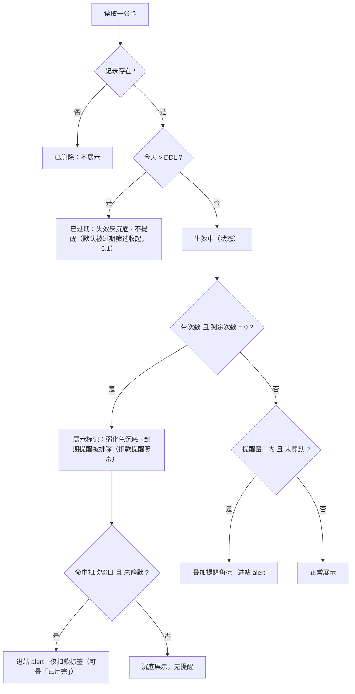
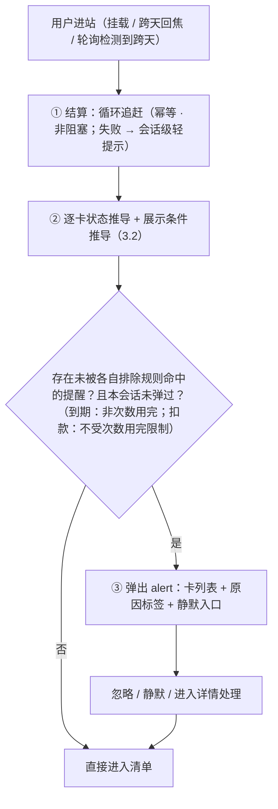
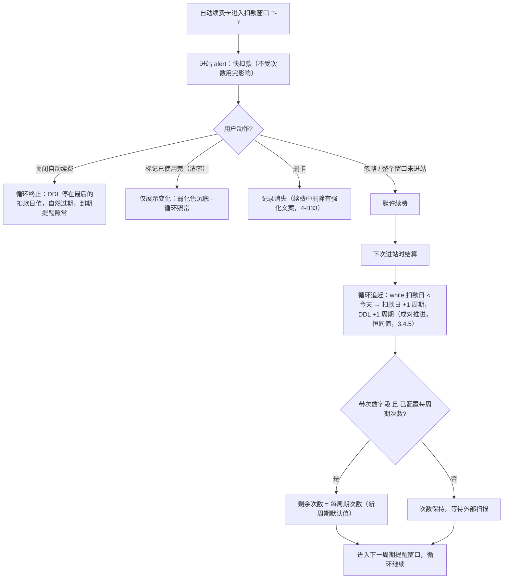
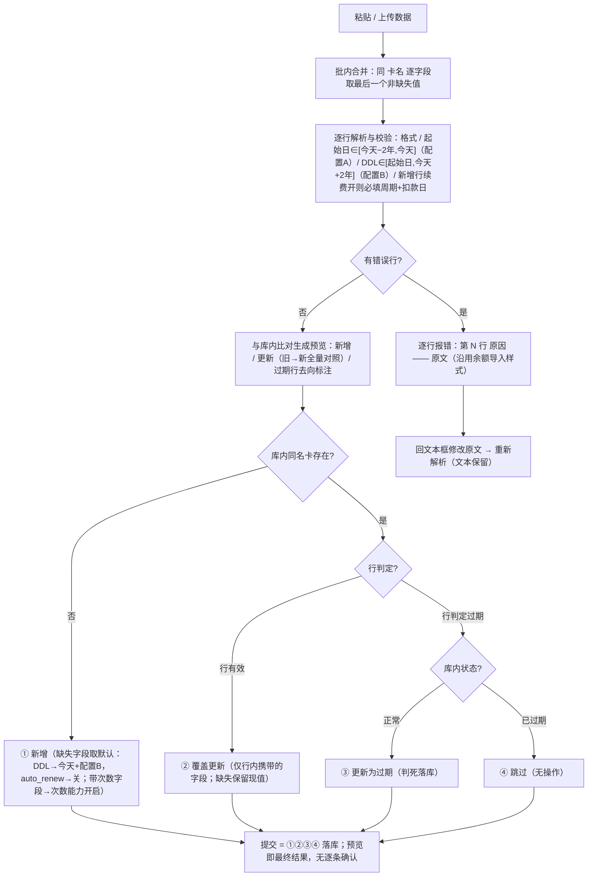

# 生活卡包 · 产品需求文档（PRD v3）

| 项目 | 内容 |
| --- | --- |
| 产品名称 | Handle · 生活卡包（健身 / 洗车 / 理发 / 按摩 / 瑜伽 / 美甲 / 影音会员等） |
| 版本 | v3.2（2026-09-03）· 在 v3.1 基线上合入当日实现裁定：①标签更名「会员」（取代会籍占位，余额/会员/优惠券三标签）；②静默交互改三态图标点击循环（3.3.2/5.3/5.4）；③新增日历展示模式（飞书式月视图，5.9）；④批量导入续费行扣款日一律强制 = 生效 DDL（3.6.3 / B14 / B27）；⑤「每周期次数」收编为续费区块「周期刷新次数」，新增弹窗与详情页同款默认规则（5.5 / 5.7）。仅含最终共识结论，作为后续修改与迭代的唯一基线 |
| 前置模块 | 管理端首页「余额」（`Hello.jsx`，已上线）——本产品为第二类资产模块 |
| 关联文档 | `design-language.md`（视觉规范）、`cards-db.md`（v3 库表设计，与本文档同步）；`lifestyle-cardpack-prd.md`、`lifestyle-cardpack-prd-v2.md` 为历史版本，仅存档、不再维护 |

---

# 第一章 产品定位与目标

## 1.1 一句话定位

**所有付费项目，一眼看清；该处理的，进站即见。**

一个基于"当下数据"的付费资格仪表盘：健身、洗车、理发、按摩、瑜伽、美甲、影音会员等付费项目的有效期、剩余次数、续费扣款日集中清晰呈现；处于提醒窗口内的卡，进站即 alert。

- 不碰钱、不算花销；不管使用规则；不记历史。
- 数据主权在外部自动化工具；**导入永远是人工通道**——扫描结果由用户复制粘贴进批量导入页、预览核对后提交，用户是数据搬运的最后一环（3.6.3）；用户日常动作是"看 + 被提醒"。
- 与「余额」模块构成"余额管钱、卡包管资格与周期"的双资产结构。
- 三条价值：**集中梳理**（一张清单看清所有付费项目）、**到期不浪费**（提前 15 天）、**扣款不意外**（提前 7 天）。

**分阶段触达**：本阶段的"提醒"是被动、进站可见的（进站 alert）；push / 短信 / 邮件是下一阶段的通道扩展——复用同一份提醒判定结果（3.3.4），只换投递方式，不改数据模型与状态推导。

## 1.2 产品目标

1. **准确的当下呈现**：清单与 alert 对"还剩多少天 / 多少次 / 何时扣款"零误导；提醒窗口内进站必现、零误报。
2. **可投递的提醒判定**：提醒判定输出为结构化数据（3.3.4），通道阶段可直接消费，不需要改动状态推导与数据模型。
3. **一屏清晰的当下**：10 秒内回答四个问题——还剩多少天、还剩多少次、下次什么时候扣费、扣费之后的 DDL 是什么。
4. **趋近于零的维护成本**：数据由外部自动化工具周期扫描 + 批量导入，用户日常只"看"和"被提醒"，不做任何日常录入。

## 1.3 非目标（明确不做）

| 不做的事 | 理由 |
| --- | --- |
| 不记金额、不算花销、不做成本/摊提统计 | 定位是提醒服务不是账本 |
| 不做核销/签到/打卡，不做使用规则（单日限用、停卡顺延） | 核销打卡记录商户 App 后台可查，不重复建设 |
| 不记时长（小时卡只记有效期） | 时长型用量无法从外部稳定获取且价值低 |
| 不设独立"取消截止提醒" | 快扣款提醒已承担"要取消趁早"的职能；**已知取舍**：要求更长提前通知期（如 30 天）才可免扣的服务，T-7 窗口可能来不及，产品不另行兜底（3.3.1） |
| 不保留任何历史（续费/开卡/购买历程、旧卡世代、变更流水） | 只存当下，写入即覆盖（3.6） |
| 不做真正的支付/代扣/代取消 | 只做"标注 + 提醒"，取消动作发生在各平台 |
| 不做日历 / ics 聚合 | 指不导出 ics、不对接外部日历（2026-09-03 修订：应用内只读日历展示模式已上线，5.9——只是另一副"看"的眼镜，不物化任何时间轴数据） |
| 不做"永久卡"概念（2026-09-02 裁定取消） | 无限期与 2 年最长在提醒行为上无差别；DDL 留空创建时物化为"今天 + 配置 B"，不记录物化标记、不展示"无限期卡"标注 |
| 储值类卡（充值本金/赠金） | 归「余额」模块（本金/赠金区分另行立项） |

## 1.4 名词表

| 名词 | 定义 |
| --- | --- |
| 卡 / 卡种 | 一条「卡名」唯一的记录，代表一种付费资格的**当下状态**；只有一种卡（期限卡基座），"次数"与"自动续费"是两个可选能力 |
| 卡名 | **卡名即展示名**（2026-09-02 裁定：原"卡名 + 商户"两列合并为单列）——按"商户名-卡名"全称直接录入（如「Tony-理发季卡」），落库、展示、唯一键三处同源；**可改名**（编辑弹窗内，2026-09-02 裁定，对齐余额的小程序名）：改成已有其他卡的卡名 → 保存报错「已有同名卡券」 |
| DDL | 终止日期（Deadline），卡的有效期截止日；**当天仍有效，次日起为已过期**；自动续费开启时与扣款日恒同值（3.4.5） |
| 扣款日 | 下次扣费日期；**只有开启自动续费的卡存在此字段** |
| 窗口 | 提醒生效的时间区间（到期窗口 15 天 / 扣款窗口 7 天），窗口内每次进站都提醒；**两类窗口的排除规则相互独立**（4-B10） |
| 进站 | 应用根组件挂载（刷新 / 新开 / 外链进入）、同会话内跨天后重新获得焦点、或可见态轮询检测到跨天；结算与 alert 的触发单位（4-B37） |
| 结算 | 仅在进站时执行的数据演进：自动续费循环的周期追赶（3.4）；**导入不触发结算**——进站已结算过，导入数据是用户预览确认后的最新状态（3.6.3） |
| 次数用完 | 带次数的卡剩余次数 = 0 的**数据条件**：沉底展示（弱化色，区别于失效灰）、排除到期提醒；**不排除扣款提醒、不是状态、不影响循环** |
| 每周期次数 | 带次数卡的可选配置（库字段 total_sessions）：每次新周期结算时剩余次数默认重置为该值；也是"剩余 N / 共 M 次"的展示锚点；用户可改、扫描可更新 |
| DDL 留空物化 | 不填终止日期的卡：**创建时**物化为"今天 + 配置 B"（初始配置下即最长 2 年；与起始日无关，4-B5），此后与普通卡无异；到期未顺延即失效灰沉底（有意设计），顺延即"重新激活"（3.5） |
| 重新激活 | 对已过期卡执行顺延（把 DDL 改回未来）使卡恢复生效的**别称**，非独立功能；可一并修正卡名 / 起始日 / 次数 / 续费设置等业务字段（改名受同名唯一性约束，3.6.1）；状态是否恢复只由 DDL 决定 |
| 默许续费 | 扣款窗口内用户未做任何打断动作，视为同意续费，扣款日后自动顺延 |
| 顺延 | 自动续费卡：由结算按扣款周期成对推进 DDL 与扣款日（两日期恒同值，3.4.5；手动顺延受 4-B21 闸门）；非自动续费卡：经「编辑」弹窗把 DDL 改到任意合法未来日期（≥ 今天、≤ 今天 + 配置 B，4-B2） |
| 静默 | 按卡的提醒开关：不静默（提醒中）/ 本周期静默 / 永久静默；只关提醒，不影响状态与循环；以三态图标表达（notification=提醒中 / mute=本周期 / all-mute=永久），点击循环切换（2026-09-03 裁定，3.3.2） |

---

# 第二章 目标用户与使用模式

## 2.1 目标用户

- 有 3 张以上生活卡 / 连续订阅、且付费项目跨多个平台的个人用户；
- 数据由用户自建的外部自动化工具扫描产出（本产品不负责采集）；扫描结果**不自动入库**，由用户粘贴进批量导入页、核对后提交——用户是数据搬运的最后一环（3.6.3）；
- 使用场景是**低频、被动**的：想起来才打开，打开就要立刻有价值。

## 2.2 核心使用模式

| 模式 | 内容 | 对应规则 |
| --- | --- | --- |
| 看与被提醒 | 进站即结算 + 状态推导；命中提醒窗口且未被排除的卡进站 alert | 3.3 |
| 数据维护 | 外部工具周期扫描 → 人工粘贴 → 预览核对 → 提交落库；或单条添加 / 编辑 | 3.6 / 5.5 / 5.6 |
| 提醒处理 | 忽略（= 默许续费）/ 静默（本周期 / 永远）/ 进详情处理（顺延、关闭自动续费） | 3.3.2 / 3.4.4 |
| 恢复与纠正 | 一切修改都是普通更新操作，后写覆盖先写；改回数据即恢复 | 3.5 / 3.6.2 |

---

# 第三章 业务规则

## 3.0 公理

- **数据不变式**：每张卡只存当下状态；任何写入直接覆盖，后写覆盖先写，不记录写入来源。
- **状态公理**：状态只有一条轴——由 DDL 与今天推导（生效中 / 已过期）。**次数维度不产生状态、不影响循环、不屏蔽扣款提醒**，只产生两个正交的数据条件：展示标记（沉底展示，弱化色区别于失效灰）、到期提醒排除。静默同理是数据条件，不是状态。**循环只由"自动续费"开关与扣款日驱动**，对次数一无所知。

## 3.1 数据概念模型

| 组 | 字段 | 约束 |
| --- | --- | --- |
| 身份 | 卡名（单字段） | 无分类维度（4-I）：不做分类、不做用户配置；**卡名即展示名**（"商户名-卡名"全称直接录入），唯一键 `(user_id, 卡名)`，trim 后精确匹配；**可改名**（2026-09-02 裁定，对齐余额）：编辑弹窗内修改，改成已有其他卡的卡名 → 报错「已有同名卡券」；改名是同一条记录的键值更新，非"变成另一张卡" |
| 有效期 | 起始日期、DDL | **起始日为纯展示字段，不参与任何推导与默认值计算**：录入时可选（单条默认今天、可改历史），录入后手动可改（校验同配置 A）、导入可静默覆盖。DDL：手动改 ≥ 今天 且 ≤ 今天+2 年（配置 B）；DDL ≥ 起始日；**不填创建时物化为今天 + 配置 B（"最长 2 年"），与起始日无关**（4-B5）；自动续费开启时与扣款日恒同值（3.4.5） |
| 用量（可选） | 剩余次数、（可选）每周期次数 | 只记次数不记时长；次数 = 0 触发"次数用完"展示条件（非状态、不影响循环、**仅排除到期提醒**）；**能力开启时剩余次数必填且 > 0**（3.6.3 / 5.5）；**每周期次数是用户可配置项**：每次新周期结算时剩余次数默认重置为该值，用户可随时修改，扫描也可更新（库字段 total_sessions）；**能力可双向开关**（关闭语义见 4-B31）；**remaining 与每周期次数无大小关系约束（有意）**——累加型/赠送型真实数据存在（3.4.3），remaining 是扫描事实、每周期次数是可选配置，展示照常（"剩余 10 / 共 8 次"不是 bug） |
| 续费（可选开关） | 自动续费（默认关）；开启时必填下次扣款日，且**周期信息二选一**：扣款周期（周/月/季/年，日历语义——连续包月类）或**合同天数 period_days**（"30 天月卡""365 天年卡"写合同多少是多少） | 扣款日只有开启自动续费的卡才有、才可改；**DDL ≡ 扣款日**（3.4.5）；**扣款日窗口按周期限窗**（4-B39）；**开启的准入闸门见 4-B23（过期卡禁开）**；**循环是它唯一的开关语义**；**两种周期表示互斥、至多一个非空（库表 CHECK 强制）** |
| 静默（按卡） | 不静默 / 本周期 / 永远 | 只影响 alert，不影响状态与循环 |

- **卡的模型**：只有**一种卡**（期限卡基座）；"次数"与"自动续费"是两个可选能力（字段组 / 开关），可创建时开启、可事后在详情页补开或关闭——建卡向导只是字段组合预设，不存在互斥卡型（5.5 / 4-B31）。
- 混合能力的卡拆成两张独立卡；储值类归「余额」模块。

## 3.2 状态系统（推导制 · 单轴）

**状态（唯一轴，按优先级取第一个命中）：**

```
已删除   记录不存在                → 不可见（不可逆）
已过期   今天 > DDL                → 失效灰沉底，不提醒（真正的失效）
生效中   其余                      → 正常展示；提醒窗口内叠加角标并进 alert
```

**展示条件（非状态，叠加在状态之上）：**

```
次数用完   带次数字段 且 剩余次数 = 0（无论来源）
           → 沉底（弱化色，区别于失效灰——资格暂尽不是失效）、
             排除到期提醒（扣款提醒不受影响）；
             状态仍由 DDL 决定；循环不受影响
静默中     按卡设置                  → 不进 alert（两类窗口全排除）；状态与循环不受影响
```



- 状态全部推导、不存储：状态与数据永远一致；恢复操作免费（改数据即恢复）；新增状态不需要数据迁移。
- 不存在"人工标记过期"：想让卡别吵有静默，想让卡消失有删卡。

## 3.3 提醒引擎

### 3.3.1 两类窗口与各自的排除规则

| 提醒 | 适用卡 | 窗口（**含两端边界日**） | 说明 |
| --- | --- | --- | --- |
| 快到期 | **所有卡** | `[DDL − 15 天, DDL]` | DDL 当天仍提醒；次日起进入已过期，不再提醒 |
| 快扣款 | 自动续费卡（**额外**） | `[扣款日 − 7 天, 扣款日]` | 扣款日当天仍提醒；之后由结算接管 |

- 自动续费卡可能同时命中两类（其 DDL ≡ 扣款日）→ alert 中**合并为一条、罗列全部原因标签**。
- 窗口内**每次进站都 alert**（窗口制而非时点制）；窗口自然结束：过期（不再提醒）/ 扣款完成（结算顺延）/ 用户处理 / 静默。
- **排除规则**：
  - **两类窗口共同排除**：已过期的卡；静默中的卡；剩余次数多少（用量**水平**永不提醒）。
  - **仅到期提醒排除**：**次数用完的卡**。
  - **次数用完不排除扣款提醒**：扣款提醒回答"钱什么时候走"，与用量正交。
- **已知取舍**：扣款窗口固定 T-7；要求更长提前通知期（如 30 天）才可免扣的服务可能来不及取消——产品不设独立取消截止提醒（1.3）。

### 3.3.2 静默语义

| 设置 | 生效范围 | 解除 |
| --- | --- | --- |
| 本周期不提醒 | 到下一次顺延 / 周期更替为止 | 自动恢复（4-B22），或手动解除 |
| 永远静默 | 无限期 | 仅手动解除 |

- 静默**只关 alert**：时间照走、状态照常推导、自动续费循环照跑。
- "不想被吵"（静默）与"不想续了"（关闭自动续费）是两个独立操作。
- 静默状态必须**可见、可逆**（4-B22）。
- **触点交互（2026-09-03 裁定）**：静默操作统一为**三态图标点击循环**——notification.svg（提醒中）/ mute.svg（本周期静默）/ all-mute.svg（永久静默）表达当前状态，点击切到下一状态：
  - **自动续费卡**：提醒 → 本周期静默 → 永久静默 → 提醒（三态循环）；
  - **非自动续费卡**：提醒 ⇄ 永久静默（两态，无"本周期"概念）；
  - **清单内**（折叠/半展开名称行）：仅静默状态显示图标（提醒中不显示），点击循环直至解除；静默的设置入口在全量详情静默菜单（5.7）；
  - **进站 alert 行内**：常驻图标按钮循环，点击**不关闭弹窗**、条目不重排不消失（条目带静默文字标注，可再点回来）。

### 3.3.3 进站处理顺序（SPA 会话定义）

**"进站"的精确定义**：进站 ≡ 应用根组件**挂载**（浏览器刷新、新开标签页、外部链接进入）、**同会话内跨天后重新获得焦点**（focus 检测到"今天"变化）、或**可见态轮询检测到跨天**（页面可见期间每 30 分钟检查一次本地日期，不可见时不轮询）。内部标签切换、路由跳转**不是**进站。

- **结算**：每次进站执行，幂等；**非阻塞降级**——结算失败时按上次已知状态渲染、不挡首屏，但本次会话内在清单顶部显示一条低优先级 notice（信息态）「部分数据可能未及时刷新，请稍后重新打开」。
- **alert**：**会话级去重**——一次会话（根组件挂载存活期间）只弹一次；用内存标志位实现，不落地存储。跨天回焦 / 轮询检测到跨天视为新进站，标志重置。**多标签页各自独立维持会话标志，不做跨 tab 同步**（接受多 tab 各弹一次）。
- **结算先于推导**：结算可能改变 DDL（顺延），不先结算会拿旧日期算出错误提醒。
- **结算在进站时做（lazy settlement）**：产品无后台定时任务；"今天"本身因用户进站才有意义。



### 3.3.4 提醒判定的结构化输出（可投递约束）

提醒判定**不得内联在 UI 里**，统一输出为结构化记录：

```
{ card_id, name,                      // name = 卡名全称（即展示名）
  reasons: [ { type: expiring | billing, deadline, days_left } ],
            // 排除按 reason.type 独立判定：expiring 受"次数用完"排除；
            // billing 不受任何用量条件影响
  muted, display_group }        // 展示分组（正常 / 沉底）独立推导，
                                // 与"是否有 reasons"无关（沉底卡可带扣款 reason）
```

- 进站 alert 是该结果的**消费方之一**；通道阶段（push / 短信 / 邮件）消费同一份结果，不改推导逻辑、不重写文案判断。
- 文案模板参数化（"剩 {n} 天""{date} 扣款"），通道阶段直接填充。

## 3.4 自动续费循环（忽略即续）

### 3.4.1 循环流程

**开关开启即默认续费**：自动续费开着的卡，扣款日到达后由结算无条件顺延进新的当前循环阶段——不需要任何用户动作或确认（默许续费）；不看次数、不看用户是否进站过。



### 3.4.2 结算算法（精确语义）

```
对每张 自动续费 = 开 的卡（不检查次数状态）：
  N = 0
  while 下次扣款日 < 今天：
      下次扣款日 += 1 个扣款周期
      DDL        += 1 个扣款周期     （两日期恒同值：同时写入，不保持旧"相对差"）
      N += 1
  若 N > 0：
      若带次数字段且已配置每周期次数 → 剩余次数 = 每周期次数（新周期默认值）
```

- **周期推进语义**：两类周期两种算法——**合同固定天数类**（period_days 非空：健身"30 天月卡""365 天年卡"）恰好推进 period_days 天，无钳制、无漂移；**自然日历类**（period_days 为空：爱奇艺连续包月）按 billing_cycle 日历推进（月 = +1 日历月，逐周期钳制；锚点收缩——31 → 28 → 28——是显式接受的行为，联调必测断言）。两种算法由 period_days 是否为空选择——两种表示**互斥**（库表 CHECK 强制至多一个非空）。
- 与商户真实周期的偏差由扫描主权持续纠正，方向保守（提醒恒早于真实扣款）。
- **已知取舍**：追赶以**当下**的周期值推算整个缺口——周期在缺口内被更替时真实轨迹无法重放。
- 算法幂等：无论隔多久进站、几台设备同时进站，收敛到同一个正确周期。
- **已知取舍**：周期追赶结算统一将剩余次数重置为"每周期次数"配置值；开卡赠送等不随周期重置的次数会产生短暂展示偏差，由下一次导入覆盖或手动编辑纠正（3.6.2），不做赠送/套餐分字段建模。

### 3.4.3 每周期次数未配置与叠加型套餐

- **未配置每周期次数的卡**（带次数、有续费，但没配置每周期次数）：结算只推进 DDL 与扣款日，**次数保持原值**，等待周期性扫描校准；配置每周期次数后即恢复"新周期重置"语义。
- **叠加型套餐**（每次续费在剩余次数上累加而非重置）：不做累加推演、**不拆分赠送/套餐字段**，单一剩余次数以扫描/手动更新为准；若配置了每周期次数，追赶结算的重置偏差按 3.4.2 已知取舍处理（下次导入或手动编辑自愈）。

### 3.4.4 打断方式与后果矩阵

| 动作 | 循环 | DDL | 后续提醒 | 可逆性 |
| --- | --- | --- | --- | --- |
| **关闭自动续费**（唯一显式打断） | 终止 | **停留在最后的扣款日值不变** | 到期提醒照常 → 过期沉底 | 可逆（重开需重设周期+扣款日，受 B23 闸门） |
| **删卡**（唯一不可逆） | —— | —— | —— | 不可逆（续费中删除有强化文案，4-B33） |
| 标记已使用完 / 次数清零 / 次数减一 | **不影响循环** | 不变（到期后转过期） | 到期提醒排除；**扣款提醒照常** | 可逆（改回次数 / 导入覆盖 / 结算重置） |
| （手动顺延） | 自动续费卡**不可直接改 DDL**（编辑弹窗置灰）；须先关闭自动续费 → 顺延 → 按需重开 | | | |

- 能让循环停止的操作只有两个：「关闭自动续费」（显式订阅决定，续费区块开关）与「删卡」（记录消失）。
- 对非自动续费卡：没有循环，"标记用完"语义不变（弱化色沉底，直到 DDL 过期或改回次数）。

### 3.4.5 DDL ≡ 扣款日（2026-09-02 用户裁定，核心不变式）

**自动续费开启时，扣款日就是 DDL——两字段恒同值。**

| 情形 | DDL 行为 |
| --- | --- |
| **开启自动续费**（或已开启时改扣款日） | 扣款日覆盖有效期：DDL = 扣款日（同值同步写入） |
| **关闭自动续费** | DDL 停留在最后一次的扣款日值，不再变化（自然过期走提醒 → 沉底） |
| **从未开启过续费的卡** | DDL 独立：创建时填写或留空物化（4-B5）；经「编辑」弹窗手动修改 |
| **结算追赶** | 扣款日与 DDL **成对推进**（3.4.2），两者恒同值 |
| **防御性兜底** | 历史/直调产生的"DDL 落后于扣款日"异常态，由结算收尾对齐归一（DDL := 扣款日）；显式携带 end_date 的写入载荷以显式值为准 |

- 前端保存、POST、PATCH 三条写入路径写扣款日必同步写 end_date；服务端（Cloudflare 层）与结算 RPC 双侧强制——API 直调无法绕过。
- 推论：清单排序只看 DDL 单键即同时覆盖"到期"与"扣款"两种关注点（5.1）。

## 3.5 终结与恢复

- **终结只有两种**：**已过期**（自然状态，今天 > DDL）与**删除**（不可逆）。"次数用完"不是终结——它是展示条件，且永远自愈：改回次数、导入覆盖、或（自动续费卡）下周期结算重置。
- **已过期**：恢复 = 经「编辑」弹窗顺延 DDL（≥ 今天），或导入带来未来 DDL（直接落库，预览可见）。
- 自动续费卡的恢复：重开自动续费由结算追赶，或先关续费再手动顺延。
- 恢复后展示**立即**回到正常，零额外步骤，不留过程痕迹。

## 3.6 录入、覆盖与写入模型

### 3.6.1 upsert 基本规则

- **唯一键 = 卡名（trim）**，精确匹配。每个键有且只有一条记录、只有最新状态——用户侧的真实多张同卡种并存视为一条记录的最新状态（数量以最新数据为准），产品不建模"两张同名卡"。
- 写入次序：**后面的覆盖前面的**（批内同名合并取最后一条；提交即覆盖库内——与「余额」模块同则，无冲突判定，见 3.6.2）。
- 起始日必须是记录属性而非键的一部分（同卡种续买生成的是同一条记录的新状态，不是第二条记录）。

### 3.6.2 写入模型（后写覆盖先写）

- **唯一规则**：一切操作都是更新操作——谁后操作，谁覆盖前面的记录。单条添加、单条编辑、批量导入、结算四条写入路径完全同则，无来源区分、无优先级、无冲突判定、无逐条确认。与「余额」模块完全一致（余额导入即纯 upsert：解析 → 批内去重 → 预览 → 提交）。
- 结算的写入同则：追赶结果落库后，下一次扫描照常覆盖（扫描主权校准）。
- 不记录任何"写入来源"字段或标记。
- **导入行规则（全产品唯一的行级条件）**：

  | 行判定 | 库内状态 | 动作 |
  | --- | --- | --- |
  | 行有效（DDL ≥ 今天） | 任何（有 / 没有） | upsert：没有则新增（缺字段取默认）；有则覆盖更新（仅行内携带的字段，缺失保留现值） |
  | 行判定过期（DDL < 今天） | 库内正常 | **更新**（判死落库——扫描主权，明示接受） |
  | 行判定过期 | 库内已过期 | **跳过**（无操作） |
  | 行判定过期 | 库内没有 | **插入**（记录已结束的卡，4-B4） |

### 3.6.3 导入流水线与校验



- **缺失字段语义**：导入行中**缺失的字段不参与更新**（保留库内现值）；仅**新增**记录时缺失才取默认值（**起始日 → 今天**；DDL → 今天 + 配置 B；auto_renew → 关）。批内合并同规则：逐字段取最后一个非缺失值。预览中由默认值填充的字段标注「默认」。
- **校验细则**：
  - 起始日早于今天 − 2 年或晚于今天 → 行报错（配置 A）；
  - DDL 早于起始日或晚于今天 + 2 年 → 行报错（配置 B）；
  - **行内同时携带扣款周期与 period_days**（两表示互斥）→ 行报错（预览阶段即校验，不依赖落库时 DB CHECK）；
  - **扣款日规则（2026-09-03 二次裁定）**：**续费行（resolved 续费为开）的扣款日一律强制 = 生效 DDL**（行内 DDL > 库内 DDL > 物化默认今天 + 配置 B），**行内显式携带的扣款日被忽略**（预览 diff 如实显示旧 → 新）——落实"续费卡 DDL ≡ 扣款日"全站不变式（3.4.5）；CF / SQL RPC 同规则兜底；
  - **新增行** `auto_renew = true` 但缺（周期与 period_days 两者）→ 行报错（扣款日不报错，自动取 DDL）；
  - **更新行**缺周期/天数且库内也为空 → 行报错；缺扣款日 → 不报错（自动取生效 DDL）；
  - **行内 total_sessions 提供且 ≤ 0** → 行报错；
  - **新增行**携带剩余次数 → 次数能力随之开启（数据驱动创建）；
  - **更新行**携带剩余次数而卡的次数能力未开启 → 宽容忽略、**不自动重开能力**（能力位是用户的结构决定，机器不得擅自恢复——B31）；
  - `auto_renew = false` 时携带的扣款字段**宽容忽略**（不报错）；
  - `auto_renew` 缺失 → 默认关（仅新增时）。
- **过期行判定**：行判定过期 = 行内 DDL < 今天；库内状态 = 库内 DDL 与今天比较。两侧都是纯推导，三分支动作见 3.6.2 与上图 ③④。
- **人工通道前提**：扫描结果永不自动入库——一律由用户复制粘贴到批量导入页，经预览核对后提交；扫描工具自身承诺不产出错误数据。
- **已知取舍**：人工通道前提下仍可能落库预览未发现的错误——与正确值同通道落库，不标记、不进入任何待处理队列；持续性扫描 bug（解析错误每天重现）不会自愈。已知暴露面：判死误报（关掉正常卡提醒）、`auto_renew` 被误扫为关（扣款提醒消失）、任意字段值错误。唯一缓解 = 预览区旧 → 新全量对照 + 文本框回改（5.6）。
- **导入不触发 alert**：落库后状态重推导即可，提醒在下次进站统一呈现（4-B29）。

## 3.7 日期与时间规则汇总

| 规则 | 定义 |
| --- | --- |
| "今天" | 用户浏览器本地时区的当日；日期值不带时区存储 |
| 过期边界 | 今天 = DDL 仍生效；今天 > DDL 为已过期（"到期日当天有效"惯例） |
| 窗口边界 | 两类窗口均含端点日（3.3.1） |
| 起始日 | **纯展示，不参与任何推导与默认值计算**：录入时可选（单条默认今天、可改历史），录入后手动可改（校验同配置 A）、导入静默覆盖 |
| DDL 手动修改 | ≥ 今天 且 ≤ 今天 + 2 年（配置 B）；可以多次顺延累积；经「编辑」弹窗（自动续费卡置灰，4-B21） |
| DDL 留空 | 不填 → **创建时物化为今天 + 配置 B（"不填 = 最长 2 年"）**，与起始日无关；之后更新路径上 DDL 缺失保留现值；到期走正常提醒/顺延流程（到期未续 = 失效灰沉底，顺延即重新激活——有意设计，4-B5） |
| 扣款日窗口（周期限窗，4-B39） | 开启续费时 ∈ **[今天, 本周期上限]**：每周 → 今天+7 天；每月 → 今天+1 月（月末钳位）；每季 → +3 月；每年 → +1 年；固定天数 → 今天+N−1 天（"固定期限前日期"，保证首扣落在固定期限内）。前端输入框 `max` 实时跟随周期；提交校验与服务端（CF 层）同则双侧强制 |
| 校验配置 | 两个**独立配置**：A = 起始日回溯上限、B = DDL 前瞻上限；初始均为 2 年，各自可调（`shared/cardsConfig.js`） |
| 结算时点 | 仅进站时（**导入不触发结算**——进站已结算过，导入数据是用户预览确认后的最新状态）；幂等；非阻塞 + 失败会话级轻提示；无后台定时任务；**不检查次数状态** |

---

# 第四章 边界定义（穷尽清单）

> 每条格式：**编号 · 情形 → 处理**。A–G 为正边界（必须正确处理的），I 为反边界（明确不处理）。

## A. 日期与状态边界

- **B1 · DDL 当天** → 生效中（今天 > DDL 才过期）；到期窗口含 DDL 当天，当天是"最后一天提醒"。
- **B2 · DDL 手动修改范围** → ≥ 今天（不能顺延进过去）、≤ 今天 + 2 年（配置 B，防 2099 式脏数据）；可以多次顺延累积。
- **B3 · 起始日** → **纯展示字段，不参与任何推导与默认值计算**：录入时可选（单条默认今天、可改历史）；**录入后手动可改**，校验：≤ 今天 且 ≥ 今天 − 2 年（配置 A）；导入带来的差异仍静默覆盖。**详情编辑字段范围**：可改**卡名**（2026-09-02 裁定放开，对齐余额小程序名） / 起始日 / DDL / 次数 / 续费设置等业务字段；改名**唯一性约束**：目标名与已有其他卡重名 → 保存报错「已有同名卡券」（前端快照即时反馈 + 服务端唯一性预检双侧强制；trim 后精确匹配口径与唯一键一致）。
- **B4 · 批量导入已过期的卡（DDL 在过去）** → 允许录入，直接失效灰沉底不提醒——"记录一堆已结束的卡"是合法诉求。清单默认收起（5.1 过期筛选），导入落库后与库内过期卡同规则。
- **B5 · DDL 留空** → **创建时物化为今天 + 配置 B（"不填 = 最长 2 年"）**（与起始日无关；与 DDL 前瞻上限同源，不存在硬编码超限）。物化后与普通卡完全无异——**不记录物化标记、无"无限期卡/永久卡"展示概念（2026-09-02 裁定取消）**；到期前正常提醒；**单次顺延最多推进至今天 + 配置 B，可多次累积顺延**。**到期未顺延即失效灰沉底是有意设计**：产品不内置"永不过期"态；恢复 = 顺延"重新激活"（3.5）。之后扫描再缺 DDL → 保留现值不刷新（3.6.3）。
- **B6 · DDL < 起始日期** → 创建/导入校验直接拒绝（时间倒置非法）。
- **B7 · 同卡种真实多张并存** → 单条记录最新状态；数量类字段以最新数据为准。产品不接受"两张同名卡"——"卡名有且只有一条记录"是核心原则。**同名合并后数量对不上的处理**：直接把剩余次数编辑为实际值（如两张 10 次洗车卡合并记 20），或等下一次扫描结果覆盖（3.6.2）——都是普通更新操作。
- **B8 · 跨时区** → "今天"取进站设备的本地时区；结算幂等，多端收敛于同一结果；极端跨时区交替进站的偏差 ≤ 1 天，可接受。

## B. 提醒边界

- **B9 · 窗口端点** → 两类窗口均含端点日：`[DDL−15, DDL]`、`[扣款日−7, 扣款日]`。
- **B10 · 提醒排除按窗口类型拆分** →
  - **两类窗口共同排除**：已过期的卡；静默中的卡；剩余次数多少（用量**水平**永不提醒）。
  - **仅到期提醒排除**：**次数用完的卡**（资格已尽，"还剩几天资格"信息量低）。
  - **次数用完不排除扣款提醒**：扣款提醒回答"钱什么时候走"，与用量正交；"次数刚用完 + 扣款在即"的提醒必须可见。
- **B11 · 静默卡落在窗口内** → 不 alert（两类窗口全排除）；角标语义保留；状态与循环不受影响。
- **B12 · 同卡多提醒合并 + 沉底与提醒并存** →
  - 同卡同时命中两类窗口 → alert 合并为一条、双标签；
  - **"次数用完（沉底展示）+ 命中扣款窗口"**：清单保持沉底，alert 照常纳入、条目可叠加「已用完」信息标签。展示分组与提醒判定是结构化输出（3.3.4）的两个独立字段，互不约束。
- **B13 · 同一窗口内反复进站** → 每次进站都 alert（会话级去重防同会话重复骚扰，4-B37）。嫌吵的正解是静默，不是降低提醒频率。
- **B14 · 自动续费卡缺扣款日/周期** → 手工创建被表单强制；新增行导入报错；更新行缺失 → 保留现值放行（3.6.3）；若历史数据存在此形态 → 不结算不提醒，详情内提示补全（防御性兜底）。

## C. 循环与顺延边界

- **B15 · 长期未进站的追赶结算** → `while 扣款日 < 今天` 连续推进 N 周期（3.4.2），幂等；次数重置一次为每周期次数。
- **B16 · 次数与循环解耦** → **任何来源的"次数 = 0"都不暂停循环**；次数也不屏蔽扣款提醒（4-B10）。
- **B17 · 未配置每周期次数的自动续费次卡** → 结算只推进日期、不重置次数；次数由周期扫描持续校准、零人工介入（3.4.3）；配置每周期次数即可恢复"新周期重置"语义。
- **B18 · DDL ≡ 扣款日**（2026-09-02 裁定，取代原"各自独立"模型）→ 开启自动续费后两字段恒同值（3.4.5 全表）；关闭续费 DDL 停在最后的扣款日值；从未开启续费的卡 DDL 独立。状态、提醒、排序因此只看 DDL 一个键。
- **B19 · DDL 落后于扣款日的异常态** → 正常写入路径（前端保存 / POST / PATCH）已同步两值，该形态仅存在于历史数据或 API 直调；结算收尾对齐归一（DDL := 扣款日），一次性赋值、幂等。
- **B20 · 关闭自动续费后** → 扣款日字段保留但不再提醒、不再结算；**DDL 停留在最后的扣款日值**，固定走到过期；重开自动续费必须重设周期 + 扣款日（且受 B23 闸门约束）。
- **B21 · 自动续费卡的手动顺延闸门** → 「编辑」弹窗内终止日期**置灰** + 提示「自动续费卡不可直接顺延：请先在续费区块关闭自动续费，再来修改终止日期」；操作区**不再设独立「顺延」按钮**（2026-09-02 裁定：顺延统一走编辑弹窗改终止日期）。
- **B22 · 静默的本周期终点** → 自动续费卡：下次结算顺延即恢复；非自动续费卡：DDL 被顺延或过期即恢复。**解除渠道不限**：手动顺延（PATCH / POST 覆盖）、结算追赶、导入推进周期日期——凡 `end_date` 实际发生变化即自动解除「本周期」静默（含扫描校正提前；重新静默是一次点击）。**静默必须可见、可解（防数据黑洞）**：折叠/半展开卡名右侧静音图标（**两种形态区分「本周期」与「永远」**）即**一键解除按钮**，点击即恢复提醒；要重新静默走详情内静默菜单（5.4 / 5.7）。
- **B23 · 自动续费开关的准入闸门** → 只能在卡处于**生效中**（今天 ≤ DDL）时开启；已过期的卡，开关置灰 + notice：「卡已过期，请先顺延有效期恢复生效，才能开启自动续费」。用户先「顺延」把 DDL 改到未来、卡恢复生效后，开关自动解禁。**手动建卡同则**：5.5 表单 DDL < 今天时开关置灰（拦"从关拨到开"；同名覆盖表单预填已开启的过期 + 续费中卡可维持——维持不是开启）。**导入路径无此闸门**：扫描行按 3.6.2 直接落库（扫描主权）。
- **B39 · 扣款日的周期限窗**（2026-09-02 裁定）→ 开启续费时的扣款日 ∈ **[今天, 本周期上限]**：每周 → 今天 + 7 天；每月 → 今天 + 1 月（月末钳位，1/31 选到 → 2/28）；每季 → +3 月；每年 → +1 年；固定天数 N → 今天 + N − 1（"固定期限前日期"——保证首次扣款落在固定期限内）。**交互顺序**：必须**先选周期**（固定天数还需先填天数），扣款日输入框才渐进出现——避免"先选日期再选周期"的倒置；建卡弹窗与详情续费区块同则。前端 `max` 属性 + 提交校验、Cloudflare 服务层双侧同则强制（直调绕不过）。

## D. 导入与写入边界

- **B24 · 写入模型** → 一切操作都是更新操作：所有写入路径（单条添加 / 单条编辑 / 批量导入 / 结算）统一为**后写覆盖先写**——谁后操作，谁覆盖前面的记录，无来源区分、无优先级、无逐条确认（与「余额」模块同则）。导入行按 3.6.2 过期行三分支处理。
- **B25 · 批内同名** → 预览阶段逐字段合并取最后一个非缺失值；不产生逐条确认。
- **B26 · 非自动续费卡携带扣款字段** → 宽容忽略不报错。
- **B27 · `auto_renew = true` 缺周期或扣款日** → **新增行**报错（修完才能提交）；**更新行**缺失 → 保留现值放行（3.6.3 缺失字段语义）。
- **B28 · `auto_renew` 缺失** → 新增时默认关；更新时保留现值。
- **B29 · 导入后是否弹提醒** → 不弹；下次进站按新数据统一计算。
- **B30 · 过期行与客观更替** → 扫描把已过期的卡更新为新周期（行有效）→ 直接落库（同卡种续买即覆盖）；扫描判定过期的行按 3.6.2 三分支（库内正常 → 更新 / 已过期 → 跳过 / 没有 → 插入）。
- **B31 · 次数能力的关闭与导入互动** →
  - **关闭**：详情页可关闭次数能力（与开启对称、双向可逆）——剩余次数/每周期次数**两个字段一并移除**（DB CHECK 强制联动：total_sessions 非空而 remaining 为空是非法态），卡退回纯期限卡；展示立即回归推导（若原为 0 沉底，关闭后恢复原位）；无确认（可逆）、无特殊提示（行为自明）；重新开启时必填 > 0（同 5.5/5.7 规则）。**入口落位**：次数区块自带开关（与续费区块对称），与值操作入口分离（5.7）。
  - **导入互动**：更新行携带剩余次数而卡的次数能力未开启 → **宽容忽略、不自动重开**（能力位是用户的结构决定，机器不得擅自恢复；与 B26"宽容冗余"同则）；若扫描持续带来次数而用户想恢复次数维度，手动重开即可（一次性动作）。新增行携带剩余次数 → 创建即开启次数能力（数据驱动创建）。

## E. 数据一致性边界

- **B32 · 多端并发** → 与所有写入路径同则：后写覆盖先写（B24）；结算幂等，重复执行无副作用；不做行锁、不做合并冲突 UI。
- **B33 · 删除（含续费中强提醒）** → 唯一不可逆操作；入口 = 半展开态**左滑拉出删除面板**（2026-09-02 裁定：详情操作区不再设删除按钮）。确认弹窗文案**动态判断**：
  - 通用文案：「删除后记录整个消失；只想别吵请用静默，卡已到期会自动沉底」；
  - **该卡自动续费开着时追加**：「该卡仍在自动续费中，删除只清除本地记录，不会帮你取消对应平台的续费——请先自行前往对应 App 取消，否则后续扣款将不再有任何提醒。」（未开续费不堆砌此警告）。
- **B34 · 手动编辑与结算的竞争** → 结算仅由"扣款日 < 今天"触发且立即完成，与用户编辑在时间上天然错开；即便交错，同样适用后写覆盖先写（B24）。

## F. 展示边界

- **B35 · 混合能力卡** → 一律拆两张独立卡，无关联字段；不在数据层制造"卡组"概念。
- **B36 · 卡名（原商户字段已合并，2026-09-02 裁定）** → 单字段自由文本 = 展示名，按"商户名-卡名"全称直接录入（如「Tony-理发季卡」）；不做商户实体/多门店建模；唯一键 `(user_id, name)`；trim 后精确匹配；**可改名**（编辑弹窗，B3 同名唯一性约束）。旧库迁移：`name := merchant || '-' || name`，同键冲突按 `updated_at` 保留最新（`supabase/cards.sql` 第 0 节，幂等）。原 v2.4"商户必填独立列"裁定随之作废。

## G. 事件与反馈边界

- **B37 · 进站与会话（SPA）** → 进站 = 根组件挂载 / 同会话跨天回焦（focus）/ **可见态 30 分钟轮询检测到跨天**（页面不可见时不轮询）。结算每进站执行（幂等、非阻塞、**失败时会话级轻提示**）；alert 会话级内存去重、跨天重置；**多标签页各自独立、接受各弹一次**（不做跨 tab 同步）；标签/路由切换不算进站（3.3.3）。
- **B38 · 操作反馈语义** → 用户主动操作（创建/编辑/顺延/清零/开关）的即时结果一律走 **notice**，不触发 alert；alert 专属"进站时被动发现"。创建成功 notice 若落入提醒窗口，附带"已进入到期提醒窗口"提示。

## I. 反边界（明确不处理，防止范围蔓延）

- 停卡/冻结、退款、转让、家庭共享、价格与发票、门店归属、卡号与凭证、商户对接、推送渠道（通道阶段另立项）——全部不处理。
- **分类 / 标签体系**——不做分类维度、不做用户配置（5.1），清单按到期日一目了然。
- **叠加型次数套餐的累加推演、赠送/套餐分字段建模**——不做，保持单一剩余次数；重置偏差靠下一次覆盖自愈（3.4.2 / 3.4.3）。
- **跨 tab 会话同步**——多标签页各自独立弹 alert，接受（4-B37）。
- **次数对循环、对扣款提醒可见性的任何影响**——循环只由自动续费开关与扣款日驱动；扣款提醒只被已过期与静默排除（4-B10/B16）。
- 用户问"为什么不能 X"时的判据：**X 是否服务于"准确的当下呈现 + 可投递的提醒"？不是，就不做。**

---

# 第五章 操作与交互设计

> 视觉规范全部继承 `design-language.md`：内容列 560px 居中、卡包层叠、三色滑动语义、弹窗体系、notice 反馈体系。本章只定义落位与新增件的规则。

## 5.1 信息架构

- 管理端三个真实标签：**余额 / 会员 / 优惠券**（2026-09-03 裁定：原「卡包」标签取代「会籍」占位并更名「会员」——会籍为无数据的演示占位，已删除；组件内部键名仍为 cards，路由 `/app/cards-import` 不变）。
- **不做分类**：无分类 chips 行、无分类字段、无用户配置（4-I）——清单按到期日一目了然。
- **排序行**：默认「**按到期日**」（DDL 升序——最先到期的在前；DDL ≡ 扣款日使单键同时覆盖两种关注点，原"关键日"取近者定义已取消，2026-09-02）；备选「按名称」（拼音序）、「按更新时间」（按 `updated_at`，**默认最新在前**，再点切换方向）。已过期与次数用完永远沉底，不参与主排序（两种沉底颜色区分，5.4；沉底卡命中扣款窗口时照常进 alert——位置与提醒是两件事，4-B12）。
- **已过期卡筛选开关**（2026-09-02 新增）：排序行下方独立开关行「**展示已过期的卡片（N）**」（复用 0 余额开关交互），**默认关**——过期卡不占列表空间；开启后过期卡带回归队沉底（沉底规则不变）。开关实时显示过期卡数量；关闭开关时若当前展开的正是过期卡，一并收回展开态；全部卡都过期且被收起时列表内显示引导提示。**次数用完的沉底卡不参与此筛选**（常驻列表）。

## 5.2 操作全集落位（9 操作 × 触点矩阵）

**三级交互骨架（2026-09-02 裁定，对齐余额页心智模型）**：折叠 → **半展开**（点击折叠卡本体；余额同款宽卡样式，展示更多但不露修改项）→ **全量详情**（点半展开内「展开修改」按钮；头部点击回落半展开，不直接收回折叠）。

| # | 操作 | 入口触点 | 确认 |
| --- | --- | --- | --- |
| 1 | 看 | 折叠卡（天数主信息 + 次数副槽）/ 半展开（日期区间、续费摘要）| — |
| 2 | 提醒处理（忽略/静默/切换静默档位） | 进站 alert 行内**图标循环**（不关弹窗、条目常驻）+ 折叠/半展开卡名右侧静默图标循环（仅静默态显示）+ 详情静默菜单（5.4 / 5.7） | 静默无需确认（可逆，点回去即恢复提醒） |
| 3 | 手动顺延（改 DDL） | 「编辑」弹窗改终止日期（**操作区无顺延按钮**；自动续费卡置灰并提示闸门 B21） | 无（可逆） |
| 4 | 次数区块（能力开关 + 值编辑） | 详情次数区块（**区块自带开关**，值编辑草稿流：保存/取消，5.7） | 开关/编辑均无确认（可逆；清零区分提示、关闭自明，见 5.8/4-B31） |
| 5 | 次数减一 / 清零（标记用完） | **半展开右滑**（仅次数类生效卡）：拉到底 = 减一；滑动一部分松手露出「清零」按钮 | 无（可逆；减到 0 触发按卡型提示，5.8） |
| 6 | 删卡 | **半展开左滑**拉出删除面板（**操作区无删除按钮**） | **红色确认弹窗（动态文案，4-B33）** |
| 7 | 自动续费开关/周期/扣款日 | 详情续费区块（**开关是续费唯一入口**；**草稿流**：保存才生效，5.7） | 保存/取消即门槛；**过期卡开启被 B23 闸门拦截** |
| 8 | 批量/单条录入 | FAB 菜单两项 | 预览/确认即门槛 |
| 9 | 编辑基础资料（**卡名** / 起始日等业务字段） | 详情内「编辑」入口（卡名可改名；重名报错「已有同名卡券」，B3） | 无（校验实时） |

**设计原则：**

- **可逆操作一律不弹确认**（静默、顺延、改次数、清零、减一、关闭次数能力都点一下就生效），确认弹窗只留给不可逆的删卡——与余额模块"清零无确认、删除有确认"的梯度一致。
- **清零提示按卡型区分**：
  - **自动续费卡**：「次数已清零 · 卡将沉底不再提醒；若订阅仍在续，下个周期会自动恢复次数——想让卡停止续费，请关闭自动续费（续费区块开关）」；
  - **非自动续费卡**：无特殊提示（清零 = 沉底，行为自明、可逆）。
- **反馈语义分离（4-B38）**：主动操作的即时结果一律走 notice；alert 只属于进站被动发现。
- **删除的风险分级文案（4-B33）**：确认弹窗动态判断续费状态，续费中的卡必须看到"不会代你取消平台续费"的强化提示。

## 5.3 进站 alert（新组件，全站最高浮层）

- **触发**：进站结算与推导后，若存在未被各自排除规则命中的提醒（到期提醒：非次数用完；扣款提醒：不受次数用完限制；静默全排除——4-B10）→ 弹出；否则不出现。**一次会话只弹一次**（4-B37；多 tab 各自独立）。
- **结构**：遮罩（复用弹窗遮罩）+ 白卡（`min(400px, 100%)`，圆角 16，spring 入场）：
  - 标题「有 N 张卡需要注意」；
  - 卡条目列表：每条 = 色点（记录色）+ 卡名全称 + 原因标签（「剩 N 天」/「MM-DD 扣款」/双标签；沉底的次数用完卡以**独立小标签**「已用完」叠加，4-B12）+ 行内两个幽灵小按钮「本周期静默」「永远静默」；点击条目本体 → 关闭 alert 并半展开该卡；
  - 底部主按钮「知道了」（= 忽略，关闭弹层）。
- **z-index**：1030（层级表：展开卡 1000 < FAB 1010 < 弹窗 1020 < 进站 alert 1030）。
- **没有"确认续费"按钮**：默许续费是"不作为"的语义，alert 只提供"不吵"（静默）和"处理"（进详情）两个方向。

## 5.4 卡片（折叠 / 半展开 / 全量详情 · 三级展开）

### 折叠态

- 左 `◆ 卡名全称`，卡名右侧**能力图标**（名称超长截断时图标不消失）：
  - **自动续费静态图标** ⟳（自动续费卡显示；随开关实时出现/消失）；
  - **静音图标**（在续费图标之右；**两种形态区分「本周期」与「永远」**；即一键解除按钮，点击恢复提醒）。
- 右侧**双槽信息行**（列表按天数列右对齐，数字 `tabular-nums`）：左槽「剩 N 次」（次数卡）+ **右槽「剩 N 天」**（**天数恒为主信息**）；提醒窗口内右槽换倒计时「N 天后扣款」（同为天数语义）。已过期「已过期」、已用完「已用完」。
- **沉底卡必须文字区分原因**：已过期、次数用完两种沉底卡的右槽**固定展示对应文字**，不能只靠颜色。**两种沉底颜色不同**：到期才是真正的失效（失效灰），次数用完只是资格暂尽（弱化色），见 6.5。**例外**：沉底的次数用完卡若同时命中扣款窗口，追加独立小标签「MM-DD 扣款」（与 alert 一致，4-B12）——沉底不等于对钱的事失明。
- **过期卡默认被 5.1 开关收起**，不在折叠列表出现。

### 半展开态（点击折叠卡）

- 余额同款宽卡样式；展示：卡名 + 图标、日期区间（`2026.08.31 − 2026.11.29`，**不带"剩 XX 天"静态文案**——天数在折叠右槽）、续费摘要（`每月续 · 09-14 扣款`）。
- **滑动操作**（余额三色滑动语义）：
  - **右滑**（仅**次数类生效卡**——带次数且未用完；沉底/过期/无次数卡无此手势）：滑出一部分松手 → 露出「清零」按钮（点击 = 清除所有次数，标记用完）；**拉到底或快速甩动 = 次数减一**，滑动过程底部显示进度提示「拉到底 · 次数减一」，减后面板自动回缩支持连续滑动；
  - **左滑**：拉出「删除」面板 → 红色确认弹窗（4-B33）。
- 「**展开修改**」按钮 → 进入全量详情；再点击半展开卡本体 → 收回折叠。

### 全量详情（「展开修改」）

- 头部（卡名 + 图标）点击 → **回落半展开**（不直接收回折叠，保留中间层）。
- meta 行：有效期 `2025.09.20 − 2026.09.19 · 剩 22 天`；次数（如有）`剩余 8 / 共 30 次`；续费 `自动续费 · 每月 · 下次 09-14 扣款` 或 `未开自动续费`。
- 区块：次数区块（自带开关 + 值编辑草稿流，5.7）、续费区块（开关 + 周期下拉 + 渐进扣款日 + 草稿流，5.7）、静默菜单（见下）、「编辑」入口（**卡名** / 起始日等业务字段，卡名改名受 B3 同名唯一性约束；续费卡终止日期置灰 B21）。
- **静默菜单**：点开显示选项、**点击菜单外部自动收起**；**自动续费卡三选项**（不静默 / 本周期静默 / 静默），**非自动续费卡两选项**（不静默 / 静默——无周期概念）。
- **无"永久卡/无限期卡"标注**（概念已取消，1.3）。

### 状态与展示视觉

已过期 = **失效灰** `#CDD3D9` 沉底（真正的失效）；次数用完 = **弱化色沉底**（浅灰蓝系，明度相近、色相可区分——资格暂尽不是失效；token 由 design-language.md 定义）；静默 = 卡名右侧静音图标（即一键解除按钮）+ 正常色（静默不是终结态，不用灰）。

## 5.5 建卡弹窗（单条添加 · 一种卡 + 能力开关）

- **没有互斥卡型**：一种卡（期限卡基座）+ 两个能力开关，向导只是字段组合预设；创建后可随时在详情页补开或关闭任一能力（4-B31）。
- **基础字段**：**卡名**（单字段，全称直接录入，placeholder 示例「如：Tony-理发季卡（商户名-卡名）」；与已有卡同名 → 预填其当前状态、提交覆盖）、**起始日**（默认今天、可改历史，校验 ∈ [今天−2 年, 今天]，配置 A）、**DDL** label「**终止日期（不填 = 最长 2 年）**」（留空创建时物化为今天 + 配置 B，提示文案说明；填写时校验 ∈ [起始日, 今天+2 年]，配置 B）。**开启自动续费时该字段置灰**，label 变「终止日期（= 下次扣款日）」、值回显扣款日（DDL ≡ 扣款日，3.4.5）。
- **能力开关①次数**：开启时**剩余次数必填且 > 0**（不允许留空或 0）；**每周期次数可选配置**（折叠输入——每次新周期结算时，剩余次数默认重置为该值）。
- **能力开关②自动续费**（与详情续费区块同则，2026-09-02 同步裁定）：
  - 拨开即进入草稿态：**周期清空 → 必须先选周期**；
  - **周期为下拉**：`请选择 / 每周 / 每月 / 每季 / 每年 / 固定天数`；选「固定天数」紧跟着弹出天数输入框（正整数），其他选项不出现；
  - 周期选齐后「下次扣款日」输入框**渐进出现**，`max` = 本周期上限（4-B39）；
  - 提示文案：「先选周期再选扣款日；扣款日限本周期内，保存后开启，有效期与扣款日一致」；
  - 校验顺序：缺周期 →「请选择扣款周期」；固定天数非正整数 → 行级报错；缺扣款日 →「请选择扣款日」；超出周期限窗 → 提示窗口范围。
- **已过期卡上开关置灰**：DDL 填了过去日期（B4 允许录入已过期卡）时，自动续费开关置灰 + B23 文案。置灰拦的是"从关拨到开"；同名覆盖表单预填已开启的（过期 + 续费中的既有卡）保持可交互——**维持不是开启**。
- 校验实时化：DDL 与起始日区间、次数开启必填 > 0、开续费必填周期 + 扣款日（同 4-B39 限窗）。
- 提交中「保存中…」双按钮禁用；失败弹窗内红色 notice、内容保留；成功走 notice（含窗口提示，4-B38），不弹 alert。

## 5.6 批量导入页

- 骨架复用 `BalanceImport`：hero 说明文案 → 大 textarea（占位文案给出列格式示例）→ 解析预览 → 全宽提交按钮 → 结果 notice。
- **无表头时的默认列序（9 列）**：卡名 / 起始日 / 终止日期 / 剩余次数 / 每周期次数 / 自动续费 / 扣款周期 / 合同天数 / 扣款日；表头可识别别名（如「商户」列不再识别，含商户列的旧粘贴会被优雅忽略该列）。
- **预览区分三组**：
  1. 新增 N 条（常规预览表；由默认值填充的字段标注「默认」）；
  2. **更新 N 条（默认展开——这是唯一的人工核对关卡）**：每行紧凑对照（字段 | 旧值 → 新值；未变化字段不列）；扫描判定过期的行标注去向（「将更新为过期」/「跳过（库内已过期）」/「新增过期记录」）；
  3. 错误 N 行（浅红块逐行报错，沿用现有样式）。
- **可回改**：预览里发现不对的值 → 直接改 textarea 原文 → 重新解析 → 再预览；扫描错误的修正入口就是粘贴文本本身。
- 提交可用条件：≥1 条有效且零错误；提交中「提交中…」禁用；成功后 textarea 清空 + 成功 notice 汇报「新增 N / 更新 N / 跳过 N」。

## 5.7 详情内的能力开关（次数 / 自动续费 · 双向可逆）

- **自动续费开关**（iOS 式，复用 0 余额开关交互；**开关是续费的唯一入口**——拨关 = 关闭自动续费（3.4.4 唯一显式打断），拨开 = 开启草稿，操作区不另设续费按钮）：
  - **草稿流（2026-09-02 裁定）**：拨开**不立即生效**——进入开启草稿态（周期清空），按 5.5 同则完成"周期下拉 → 固定天数（如选）→ 渐进扣款日"的渐进填写；区块内**「保存」「取消」按钮**（与次数区块对称）；**只有点「保存」才提交**（`auto_renew: true` + 周期 + 扣款日，DDL 同步为扣款日）；「取消」回退服务端真值。已开启卡修改周期/天数/扣款日同款草稿流（保存时改扣款日必同步写 DDL）；**拨关立即生效**（无草稿），notice「关闭后将不再自动顺延，卡会在 DDL 后自然过期」；
  - **已过期卡上开关置灰 + notice（B23）**：「卡已过期，请先顺延有效期恢复生效，才能开启自动续费」——顺延恢复生效后自动解禁。
- **次数区块**：次数区块**自带开关**，与续费区块完全对称——开关在区块头部，**值操作与能力开关入口分离**（值操作 = 半展开右滑清零/减一 + 区块内值编辑；开关 = 能力的结构操作）：
  - **开启（事后补开）**：剩余次数必填且 > 0（与 5.5 创建时同一条规则）；补开后区块内露出值编辑（剩余次数 + 每周期次数），**草稿流**（改动后出现保存/取消，保存才落库——引导用户确认，无悬空修改态）。
  - **关闭**：开关拨关即移除剩余次数/每周期次数字段，卡退回纯期限卡；展示立即回归推导（原为 0 沉底的卡关闭后恢复原位）；无确认、无特殊提示（可逆、行为自明）；区块内值编辑入口随之消失。导入互动规则见 4-B31。

## 5.8 反馈与错误

- 一切反馈走 notice 体系（信息蓝 / 危险红），不用系统 alert；
- **创建成功 notice（4-B38）**：「已添加「Tony-理发季卡」· 剩余 9 天，已进入到期提醒窗口」（未落窗口则只报创建成功）；
- **次数清零 notice（区分卡型）**：
  - 自动续费卡：「次数已清零 · 卡将沉底不再提醒；若订阅仍在续，下个周期会自动恢复次数——想让卡停止续费，请关闭自动续费（续费区块开关）」；
  - 非自动续费卡：无特殊提示（行为自明）；
- **次数减一 notice**：剩余次数减到 0 时同清零提示（区分卡型），否则无提示（就地刷新）；
- **结算失败轻提示**：本次进站结算失败 → 清单顶部低优先级 notice（信息态）「部分数据可能未及时刷新，请稍后重新打开」——会话级内存标志，不跨会话记忆；
- 操作成功轻反馈：列表就地刷新 + 短 notice；
- 结算成功无感知（静默写库），只有 alert 体现结果。

---

# 第六章 用户界面大致设计

## 6.1 首页骨架（卡包标签激活时）

```
┌──────────────────────────────────────────┐
│ ██ 深蓝渐变 hero：眉题 CARDS OVERVIEW      │
│    字标 H1        · 退出登录 · 登录态胶囊  │
├──────────────────────────────────────────┤
│ [余额 12] [会籍] [优惠券] [卡包 8]        │ ← 分段控件（选中=品牌蓝）
│ [按到期日↑] [按名称] [按更新时间]         │ ← 排序行（无分类；关键日概念已取消）
│ [○ 展示已过期的卡片（3）]                 │ ← 过期筛选开关（默认关；0 余额开关同款）
│ ┌────────────────────────────────────┐ │
│ │◆ 爱奇艺-月会员 ⟳    3天后扣款       │ │ ← 折叠卡（记录色底；天数列右对齐）
│ ├────────────────────────────────────┤ │
│ │◆ 超鹿-30次卡        剩 8 次  剩 22 天 │ │ ← 次卡双槽：左次数 + 右天数
│ ├────────────────────────────────────┤ │
│ │◆ 美甲次卡 ♪         已用完 [09-14 扣款]│ │ ← 弱化色沉底 + 独立小标签（4-B12）
│ └────────────────────────────────────┘ │
│              （ ⊕  ）                    │ ← FAB：单条添加 / 批量导入
└──────────────────────────────────────────┘
   内容列 560px 居中；卡包层叠 -16px 叠压；滚动条 gutter 稳定不挤压行宽
   已过期卡默认被开关收起；⟳ = 自动续费旗标，♪ = 静音图标（一键解除）
```

## 6.2 进站 alert 弹层

```
┌────────────── 遮罩 rgba(1,15,28,.42)+模糊 ──────────────┐
│  ┌────────────────────────────────────────┐            │
│  │ 有 2 张卡需要注意                       │            │
│  │ ● 爱奇艺-月会员 [9-14扣款]  [本周期静默][永远静默] │   │
│  │ ● 按摩店-按摩月卡 [已用完][9-14扣款] [本周期静默][永远静默] │
│  │        （ 知道了 ）                      │            │
│  └────────────────────────────────────────┘            │
└─────────────────────────────────────────────────────────┘
   白卡 min(400px,100%) 圆角16 spring 入场；z 1030；一次会话只弹一次
   沉底的次数用完卡照常出现在列表（4-B12），「已用完」为独立小标签
```

## 6.3 三级展开（折叠 / 半展开 / 全量详情）

```
折叠（默认）                 半展开（点击折叠卡）              全量详情（点「展开修改」）
┌───────────────────────┐  ┌───────────────────────────┐  ┌────────────────────────────────┐
│◆ Tony-理发季卡       │  │ ◆ Tony-理发季卡             │  │ ◆ Tony-理发季卡   （点头部回落半展开）│
│  ♪      剩 8 次  剩 22 天 │  │ 2026.08.31 − 2026.11.29     │  │ 有效期 2026.08.31 − 2026.11.29 · 剩 22 天 │
└───────────────────────┘  │ 每月续 · 09-14 扣款          │  │ 次数区块  [开关 ●] 剩8/共30  [保存][取消] │
                            │ [展开修改]      ←左滑[删除] │  │ 续费区块  [开关 ●] 周期▾ 固定天数… 扣款日… │
                            │ ↑右滑[清零] · 拉到底[减一]   │  │            [保存][取消]               │
                            └───────────────────────────┘  │ [静默▾(3/2选项)] [编辑]              │
                                                            └────────────────────────────────┘
   折叠卡名右侧旗标：⟳ 自动续费 / ♪ 静音（区分本周期·永远，点击一键解除）
   次数右滑仅"次数类生效卡"；拉到底=减一（带进度提示），滑一半露[清零]
   操作区无「顺延」「删除」按钮：顺延走「编辑」弹窗；删除走半展开左滑
```

## 6.4 导入页更新预览区

```
│ 更新 2 条 · 请核对 旧 → 新                  │
│ ┌────────────────────────────────────┐ │
│ │ 超鹿-30次卡                          │ │
│ │  剩余次数  8 → 5                    │ │
│ ├────────────────────────────────────┤ │
│ │ 理发季卡 · 将更新为过期              │ │
│ │  终止日期  2026-12-31 → 2026-08-20   │ │
│ └────────────────────────────────────┘ │
   全量旧 → 新对照 = 唯一人工关卡；发现不对 → 回文本框改原文重新解析
   提交后无逐条确认；默认列序 9 列（无商户列）
```

## 6.5 视觉规则对齐清单

- Token、圆角阶梯、阴影表、动效曲线全部沿用 `design-language.md`；**新增一个「弱化色」沉底 token**（已用完卡专用，见 5.4）——这是本模块唯一的新颜色；提醒角标用品牌浅蓝底 + 深蓝字（信息语义），静默标识用 `--au-text-3` 灰；
- 生活卡记录色板新增一组（青绿-紫罗兰系），与余额暖橙盘区分，id 哈希取色不变色；沉底色对旗标图标同步生效；
- **金额不存在于本模块**（数据模型无金额字段，视觉层不得出现价格）；数字展示（天数/次数）用 `tabular-nums`，列表按天数列右对齐；
- 沉底卡必须带原因文字（「已过期」/「已用完」），不允许只变灰（5.4）；**两种沉底颜色不同**：已过期 = 失效灰 `#CDD3D9`（真正的失效），已用完 = 弱化灰蓝（资格暂尽，token 由 design-language.md 定义）；状态/提醒标签统一为**独立小标签**（「已用完」「MM-DD 扣款」），不使用括号后缀拼接，样式复用提醒角标体系；
- **列表滚动条**：`scrollbar-gutter: stable`——滚动条出现/消失不挤压行宽、无视觉跳跃（2026-09-02 裁定）；
- 动效沿用 bd-rise / bd-pop / bd-modal-in / 弹簧曲线与 `prefers-reduced-motion` 兜底；开关、展开、层叠、滑动（三色滑动语义：右滑清零/减一、左滑删除）交互常量照抄余额模块。

---

# 七、下一阶段

1. **库表与实现（已完成，本 v3.1 即最终结论）**：`supabase/cards.sql` v3（含旧表幂等迁移段：卡名合并、indeterminate 处理见 4-B36/B5）、`src/cards-db.md` v3、第五章全部交互（三级展开、滑动操作、续费草稿流、排序与过期筛选）均已实现并通过验证（21→20 个领域用例、构建、lint）。
2. **SQL 侧对账**：导入预览（JS）与 `import_my_cards`（SQL）双实现按 `shared/cardsImportFixtures.js` 黄金用例持续双跑——任何一侧改动必须双侧通过，防"预览显示 A、落库变成 B"。
3. **通道阶段（数据准确后启动）**：push / 短信 / 邮件消费 3.3.4 的结构化判定结果，不改推导逻辑。
