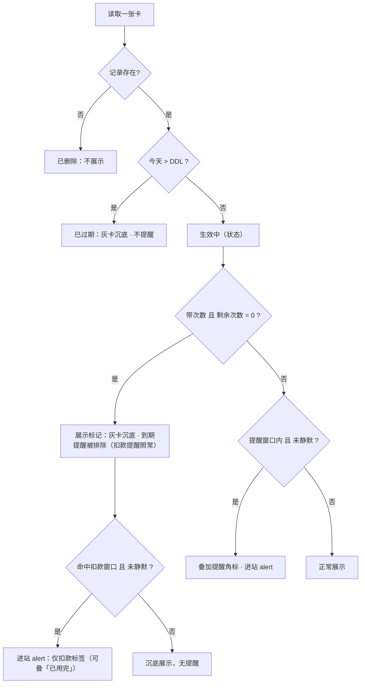
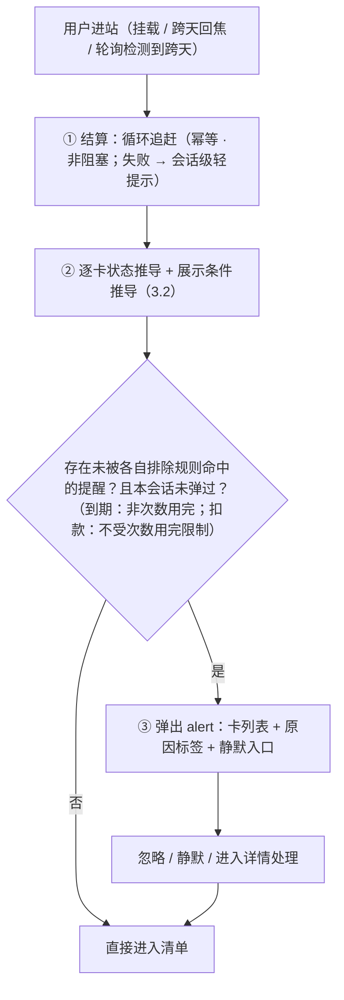
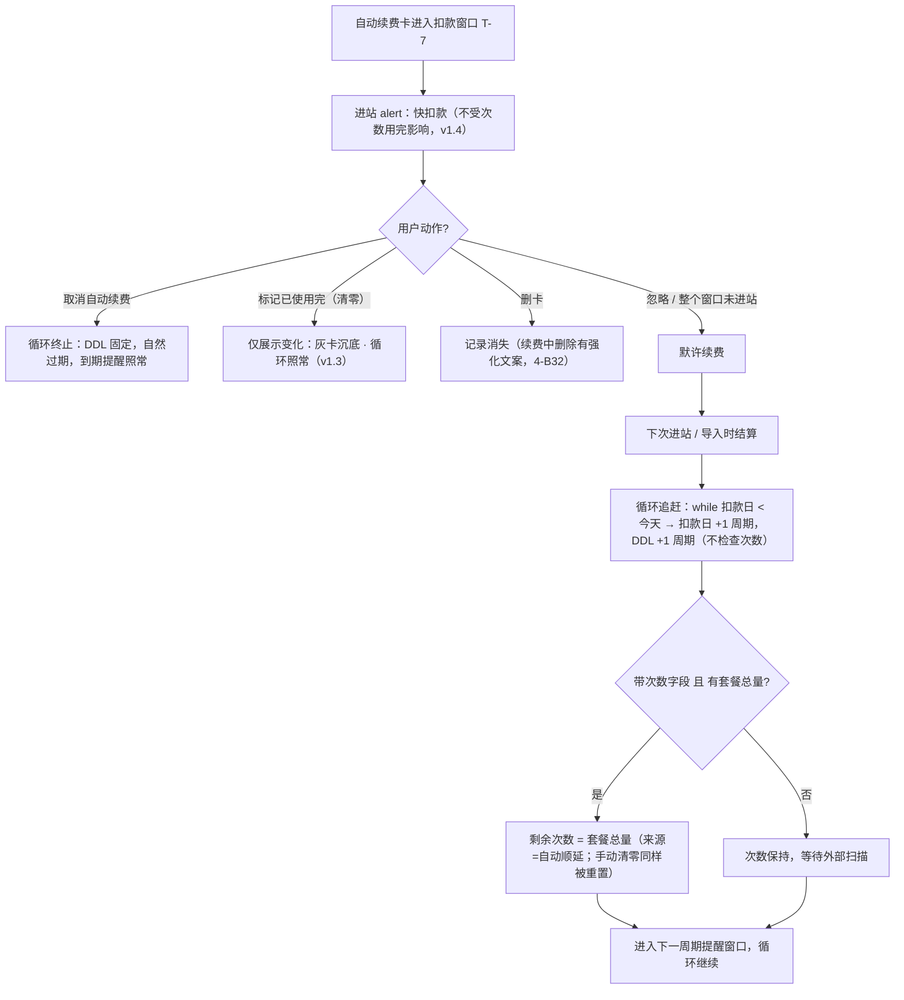
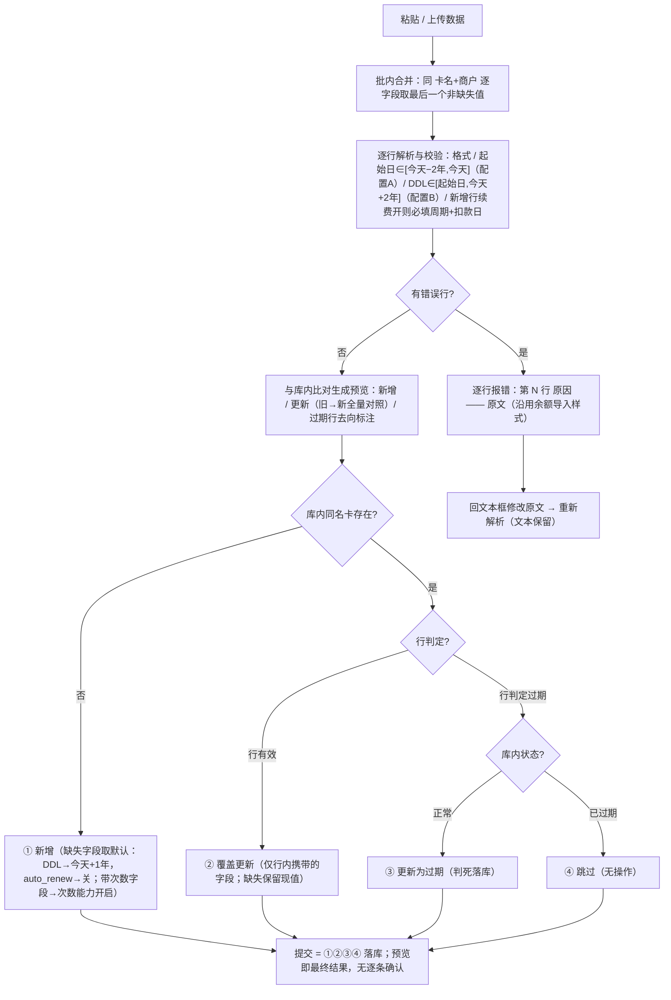

# 生活卡包 · 产品需求文档（PRD）

| 项目 | 内容 |
| --- | --- |
| 产品名称 | Handle · 生活卡包（健身 / 洗车 / 理发 / 按摩 / 瑜伽 / 美甲 / 影音会员等） |
| 文档版本 | PRD v2.0（2026-08-31 · 写入模型简化：后写覆盖先写） |
| 文档状态 | 产品逻辑已闭环（五轮评审 D1–D40 + 库表评审 D41–D50 + v2.0 写入模型简化 D51–D53）；库表设计需随 v2.0 同步简化（supabase/cards.sql + src/cards-db.md），待交互实现 |
| 前置模块 | 管理端首页「余额」（`Hello.jsx`，已上线）——本产品为第二类资产模块 |
| 关联文档 | `design-language.md`（视觉规范）、`feature-guide.md`（现有功能说明）、`lifestyle-cardpack-plan.md`（对齐过程 v1–v7） |

> 阅读说明：本文第三章（业务逻辑与流程）、第四章（边界）是全文核心，采用
> 「规则 → 流程图 → 思辨」的结构逐层展开；思辨块记录了推导过程中发现的谬误、
> 被否决的备选方案及其理由，是实现阶段的判据。文中「PRD 决议」「勘误」标注的点
> 是由讨论推导补全的结论，评审时请重点过目。
>
> **v1.1 要点**：① 状态收敛单轴；② 起始日纯展示化 + 配置化校验；③ SPA 会话级
> "进站"定义；④ alert 语义专属化；⑤ 分阶段触达 + 可投递约束；⑥ 金额勘误。
> **v1.2 要点**：① 无限期卡默认 DDL = 今天+1 年；② 导入缺失字段语义（D21）；
> ③ 自动续费准入闸门 B39；④ 次数开启必填 >0；⑤ 结算失败轻提示；⑥ 删除续费中卡
> 强化文案；⑦ 轮询兜底 + 多 tab 代价确认；⑧ 灰卡文字区分；⑨ 配置 2 年外部依据。
> **v1.3 要点**：① 循环与次数彻底解耦（D29，打断收敛为取消续费/删卡）；
> ② 翻转采纳字段完整性 B40（周期缺失拒绝采纳）；③ 闪烁窗口思辨清理；
> ④ 清零提示区分卡型（D32）。
> **v1.4 要点**（第四轮评审，见 7.1 D33–D35）：① **提醒排除按窗口类型拆分**——
> "次数用完"只排除到期提醒，**不再屏蔽扣款提醒**（D29 的解耦原则推到提醒层，
> 堵住"钱要走了却因次数用完而不提醒"的 P3 缝隙）；② 次数能力开关补齐关闭侧
> （双向可逆 + 关闭语义 + 导入互动规则）；③ "次数用完沉底 + 命中扣款窗口"的
> 展示与提醒并存规则（展示分组与提醒判定是结构化输出的两个独立字段）。
>
> **v1.5 要点**（第五轮评审，7.1 D36–D37）：① 「关闭次数能力」入口落位——次数区块
> 自带开关（与续费区块对称），与「标记用完」「改次数」（值操作）入口分离，
> 6.3 原型补齐双开关；② 状态/提醒标签呈现统一为**独立小标签**（「已用完」
> 「MM-DD 扣款」），不使用括号后缀拼接。
>
> **v2.0 要点**（2026-08-31 · 写入模型简化）：① 写入模型统一为**后写覆盖先写**
> （与「余额」模块同则，不区分人操作 / 机器扫描粘贴）——来源标记、冲突判定表、
> 对照确认、采纳闸门整体废除（D51，取代 D10/D41–D44/D46/D50 的判定职责）；
> ② 扫描判定过期的行按三分支处理：库内正常 → 更新、库内已过期 → 跳过、
> 库内没有 → 插入（D52）；③ 残余风险明示接受：扫描错误与正确值同通道落库、
> 持续性扫描 bug 不自愈，唯一人工关卡前移到导入预览的旧 → 新对照 +
> 文本框回改（D53）。

---

# 第一章 产品目标、痛点与价值主张

## 1.1 一句话定位

**所有付费项目，一眼看清；该处理的，进站即见。**

一个基于"当下数据"的付费资格仪表盘：健身、洗车、理发、按摩、瑜伽、美甲、
影音会员等付费项目的有效期、剩余次数、续费扣款日集中清晰呈现；
处于提醒窗口内的卡，进站即 alert。

**分阶段触达声明**：本阶段的"提醒"是**被动、进站可见**的（进站 alert）；
push / 短信 / 邮件等主动触达是下一阶段的**通道扩展**——复用同一份提醒判定结果，
只换投递方式，不改变数据模型与状态推导。数据不准就上通道，等于给用户送骚扰，
"先做准、再触达"是刻意的顺序（可投递约束见 3.3.4）。

- 不碰钱、不算花销；不管使用规则；不记历史。
- 数据主权在外部自动化工具；用户日常动作是"看 + 被提醒"。

三条价值：**集中梳理**（一张清单看清所有付费项目）、**到期不浪费**（提前 15 天）、
**扣款不意外**（提前 7 天）。

## 1.2 背景与痛点

现代人的付费资格是碎片化的：健身卡、瑜伽卡、按摩卡、理发卡、洗车卡、美甲卡、
视频/音乐会员……它们有三个共同特征——**花了钱、有期限或有次数、有的还会自动扣款**。
现状的问题是：

| 编号 | 痛点 | 具体表现 |
| --- | --- | --- |
| P1 | **分散，记不清** | 每个服务一个 App，"我到底办了哪些卡、各还剩多少"没有一处能看清 |
| P2 | **浪费** | 办了卡不去，有效期过了才想起来，钱白花 |
| P3 | **扣款意外** | 自动续费默认勾选、取消入口深，"莫名其妙又被扣了" |
| P4 | **记账工具太重** | 记金额、记流水的工具维护成本高，坚持不了两周就弃用 |
| P5 | **过程数据不可信也不必信** | 核销、打卡、开卡历史散在商户系统里，用户侧重复统计没有价值 |

> P3 的兑现是分阶段的：本阶段做到"进站即知、绝无暗扣"（清单与 alert 准确呈现），
> 主动送达由通道阶段完成（见 1.1 分阶段触达声明）。

## 1.3 产品目标

1. **准确的当下呈现（核心目标）**：清单与 alert 对"还剩多少天 / 多少次 / 何时扣款"
   零误导；提醒窗口内进站必现、零误报（**提醒排除只按各窗口自己的规则**，见 4-B10：
   已过期、静默、以及"次数用完对到期提醒"的排除，绝不殃及扣款提醒）；
   扣款日数据与真实账单零偏差。
2. **可投递的提醒判定**：提醒判定输出为结构化数据（3.3.4），通道阶段可直接消费，
   不需要改动状态推导与数据模型。
3. **一屏清晰的当下**：10 秒内回答四个问题——还剩多少天、还剩多少次、
   下次什么时候扣费、扣费之后的 DDL 是什么。
4. **趋近于零的维护成本**：数据由外部自动化工具周期扫描 + 批量导入，
   用户日常只"看"和"被提醒"，不做任何日常录入。

## 1.4 价值主张

- **对用户**：集中梳理 + 到期不浪费（提前 15 天）+ 扣款不意外（提前 7 天），
  且几乎不需要维护。
- **对产品**：只存当下、不存历史，数据模型极薄、实现成本最低，
  与「余额」模块构成"余额管钱、卡包管资格与周期"的双资产结构。

## 1.5 非目标（明确不做，与 1.2 痛点的对应关系）

| 不做的事 | 对应痛点 | 理由 |
| --- | --- | --- |
| 不记金额、不算花销、不做成本/摊提统计 | P4 | 定位是提醒服务不是账本 |
| 不做核销/签到/打卡，不做使用规则（单日限用、停卡顺延） | P5 | 核销打卡记录商户 App 后台可查，不重复建设 |
| 不记时长（小时卡只记有效期） | P4 | 时长型用量无法从外部稳定获取且价值低 |
| 不设独立"取消截止提醒" | P3 | 快扣款提醒已承担"要取消趁早"的职能 |
| 不保留任何历史（续费/开卡/购买历程、旧卡世代、变更流水） | P5 | 只存当下，写入即覆盖（见 2.2） |
| 不做真正的支付/代扣/代取消 | P3 | 只做"标注 + 提醒"，取消动作发生在各平台 |
| 不做日历 / ics 聚合 | P5 | 日历需要把推导结果物化为时间轴事件（变相历史积累），与"只存当下"冲突；相对各服务方无数据源优势 |
| 储值类卡（充值本金/赠金） | — | 归「余额」模块（本金/赠金区分另行立项） |

## 1.6 名词表

| 名词 | 定义 |
| --- | --- |
| 卡 / 卡种 | 一条「卡名 + 商户」唯一的记录，代表一种付费资格的**当下状态**；只有一种卡（期限卡基座），"次数"与"自动续费"是两个可选能力 |
| DDL | 终止日期（Deadline），卡的有效期截止日；**当天仍有效，次日起为已过期** |
| 扣款日 | 下次扣费日期；**只有开启自动续费的卡存在此字段** |
| 窗口 | 提醒生效的时间区间（到期窗口 15 天 / 扣款窗口 7 天），窗口内每次进站都提醒；**两类窗口的排除规则相互独立**（4-B10） |
| 进站 | 应用根组件挂载（刷新 / 新开 / 外链进入）、同会话内跨天后重新获得焦点、或可见态轮询检测到跨天；结算与 alert 的触发单位（4-B37） |
| 结算 | 进站或导入时执行的数据演进：自动续费循环的周期追赶（见 3.4） |
| 次数用完 | 带次数的卡剩余次数 = 0 的**数据条件**：展示灰卡沉底、排除到期提醒；**不排除扣款提醒、不是状态、不影响循环**（v1.4） |
| 无限期卡 | DDL 留空的卡：**创建时**物化为"今天 + 1 年"（与起始日无关），此后与普通卡无异（4-B5） |
| 默许续费 | 扣款窗口内用户未做任何打断动作，视为同意续费，扣款日后自动顺延 |
| 顺延 | 使 DDL / 扣款日向后推进一个或多个扣款周期（手动或系统自动） |
| 静默 | 按卡的提醒开关：本周期不提醒 / 永远静默；只关提醒，不影响状态与循环 |

---

# 第二章 用户与场景拆分

## 2.1 目标用户

- 有 3 张以上生活卡 / 连续订阅、且付费项目跨多个平台的个人用户；
- 数据由用户自建的外部自动化工具扫描产出（本产品不负责采集）；
- 使用场景是**低频、被动**的：想起来才打开，打开就要立刻有价值。

## 2.2 场景卡片

> 格式：前置 → 触发 → 系统行为（分步）→ 结果。括号内为对应规则章节。

### S1 单条添加一张卡

- 前置：用户线下刚办了一张理发店次卡（30 次季卡）。
- 触发：FAB →「单条添加」。
- 系统行为：弹窗填基础字段（卡名、商户、分类、DDL；**起始日默认今天、可改历史**，
  4-B3）→ 按需打开两个能力开关：次数（露出剩余/总量，**开启必填 >0**）、
  自动续费（露出周期与扣款日）（5.5，向导只是字段组合预设，不锁类型）。
- 结果：创建成功；**notice 反馈**——若落入提醒窗口，附带"已进入到期提醒窗口"提示
  （4-B38），不弹 alert。

### S2 外部工具周期性批量导入

- 前置：外部自动化工具每天扫描一次所有卡服务，产出表格数据。
- 触发：用户（或工具触发的人为步骤）打开批量导入页，粘贴数据（5.6）。
- 系统行为：逐行解析校验（格式、起始日 ∈ [今天−2 年, 今天]、DDL ∈ [起始日, 今天+2 年]、
  新增行续费开则必填周期与扣款日）→ 批内同名合并（逐字段后写覆盖、缺失保留）→
  与库内比对生成预览（新增 / 更新〔旧 → 新全量对照〕/ 错误，3.6）→
  回改原文或直接提交落库。
- 结果：按 3.6.2 写入模型直接生效——后写覆盖先写，扫描判定过期的行按三分支处理
  （正常 → 更新 / 已过期 → 跳过 / 没有 → 插入）；**缺失字段保留现值**。
  **导入本身不触发 alert**——提醒在下一次进站时按新数据统一计算（4-B29）。

### S3 日常进站，一切正常

- 前置：所有卡都生效中，无一处于提醒窗口。
- 触发：进站（4-B37）。
- 系统行为：先结算（本例无自动续费卡到期的，结算为空操作）→ 状态与展示条件推导 →
  无 alert → 直接进入清单。
- 结果：用户浏览清单，看到各卡"剩 N 天 / 剩 N 次"，10 秒内获得当下全貌。

### S4 进站看到到期提醒（非自动续费卡）

- 前置：一张理发季卡 DDL 还剩 9 天（已进入 15 天窗口）。
- 触发：进站。
- 系统行为：alert 弹出，该卡带「即将到期」标签与"剩 9 天"摘要（5.3）。
- 结果：用户可以选择忽略（关掉弹层）、本周期静默、永远静默，
  或进入卡片详情顺延 DDL（若线下已续）。

### S5 扣款提醒 → 忽略 → 默许顺延（自动续费主路径）

- 前置：爱奇艺月度自动续费会员，扣款日 9 月 14 日，DDL = 9 月 14 日。
- 系统行为：
  1. 9 月 7 日起（T-7 窗口）每次进站 alert「即将扣款」；
  2. 用户全程忽略（或压根没打开网站）；
  3. 9 月 15 日用户进站 → **结算**：扣款日与 DDL 各 +1 周期 → 10 月 14 日，
     来源 = 自动顺延 → 卡回到正常展示，无 alert；
  4. 10 月 7 日起进入下一个扣款窗口，循环继续（3.4）。
- 结果：卡"永远活着"并按周期持续提醒；这正是"忽略即续"的语义。

### S6 扣款提醒 → 决定退订

- 前置：同 S5，但用户决定不再续。
- 系统行为：alert 或详情内点「取消自动续费」→ 标志变关（来源 = 手动）。
- 结果：循环终止；DDL 固定在 9 月 14 日；此后适用 15 天到期提醒（若在窗口内），
  过期后灰卡沉底、不再提醒。**取消续费 ≠ 删卡**——已付费的期限照样用完。

### S7 长期未进站后回来（多周期追赶）★勘误场景

- 前置：月度自动续费卡，用户出差三个月没打开网站，期间外部工具也没导入。
- 触发：三个月后进站。
- 系统行为：结算执行**周期追赶**——扣款日落后今天约 2 个周期，
  系统连续推进 N 次直到扣款日 ≥ 今天（3.4 勘误①），DDL 同步推进，次数重置为套餐总量。
- 结果：卡恢复最新周期状态，DDL 与扣款日指向最新周期；等待外部下次扫描进一步校准。
  （v7 文档写"顺延一个周期"会留下 DDL 仍在过去的谬误，已修正，见 3.4 思辨①。）

### S8 次卡用完的两条路径

- 路径 A（客观用完）：外部扫描报告剩余次数 = 0 → **次数用完**：展示灰卡沉底、
  不进**到期**提醒；**状态仍由 DDL 决定**（DDL 未到 = 生效中）；**循环照常**——
  月度自动续费次卡扣款日照常顺延，次数由结算重置为套餐总量。
- 路径 B（主观用完）：点「标记已使用完」→ 次数清零（来源 = 手动）→ 展示同上；
  **循环同样照常（v1.3 方案 B）**——"这个周期用完了"是关于用量的陈述，
  不是关于订阅的决定；若订阅在续，下个周期次数自动恢复（3.4 思辨②终局）。
- 结果：两条路径在展示、状态、循环、导入四个层面**完全等价**——导入时扫描值一律
  直接覆盖（3.6.2，v2.0 无冲突判定），手动清零被扫描覆盖即自然恢复。
  另：次数用完不屏蔽扣款提醒（4-B10，见 S16）。

### S9 误操作的恢复

- 场景 a：手滑把剩余次数 8 改成 0 → 卡灰卡沉底。恢复：再改回 8 →
  灰卡标记消失（状态本就由 DDL 决定，从未"过期"）。
- 场景 b：标记已使用完之后后悔，而外部工具扫描出 count = 5 →
  下次导入直接覆盖（预览可见 旧 0 → 新 5）→ 灰卡标记消失；无扫描时，
  自动续费卡下个周期的结算重置也会自然恢复次数（3.4.2）。
- 结果：全程无"取消标记"按钮——把数据改回去，一切自然回来（3.5）。

### S10 手动顺延（线下续了，工具还没扫到）

- 场景 a（未开自动续费）：健身年卡 DDL 9 月 30 日，线下续了明年 →
  详情内「顺延」改 DDL 至明年 9 月 30 日（≥ 今天且 ≤ 今天+2 年）→ 正常展示。
  下次导入若带来不同 DDL → 直接覆盖（扫描为准，预览可见旧 → 新）。
- 场景 b（自动续费卡）：**不允许直接顺延**。必须先关闭自动续费 → 卡变普通期限卡 →
  顺延 → 之后还想要自动续费，重新打开并重设周期与扣款日（3.4，闸门规则）。

### S11 静默一张吵人的卡

- 场景：用户知道自己每月都会续爱奇艺，扣款提醒每月都弹很烦。
- 系统行为：alert 行内或详情内设「永远静默」→ 此卡不再 alert。
- 结果：时间照走、状态照常推导、**自动续费循环照跑**（静默只是不吵）；
  卡片上显示静默标识，可随时解除（4-B22）。
  若只是"这个月别吵、下个月再说"→「本周期不提醒」，到下次顺延后自动恢复提醒。

### S12 删卡（含续费中强提醒）

- 触发：详情内「删除」→ 红色确认弹窗。
- 系统行为：**弹窗文案动态判断**——若该卡自动续费开着，追加强化提示
  （见 4-B32）：删除只清本地记录、不会代取消平台续费、此后扣款不再有任何提醒。
- 结果：记录整个消失，列表里找不到，唯一不可逆操作。

### S13 混合能力拆两张

- 场景：健身年卡送 12 节私教课。
- 系统行为：录入为两张独立卡——「XX健身·年卡」（DDL 一年）+
  「XX健身·私教 12 次」（带自己的次数与有效期）。
- 结果：无任何关联；各自独立推导、独立提醒、独立终结。

### S14 无限期卡

- 场景：某店"终身 8 折卡"没有期限；或外部工具扫描终身卡时 DDL 字段缺失。
- 系统行为：**创建时** DDL 物化为"**今天 + 1 年**"（与起始日无关，4-B5）；
  此后扫描再缺 DDL → 保留现值不刷新（3.6.3 缺失字段语义）。
- 结果：到期前 15 天照常提醒；用户每年顺延一次。这是接受的简化代价（4-B5 思辨）。

### S15 导入预览与人工修正（v2.0）

- 前置：外部工具扫描产出表格；结果可能与库内不一致，也可能有错
  （v2.0 明示接受扫描不准，见 3.6.3 残余风险声明）。
- 系统行为：粘贴 → 解析校验 → 预览分三组（新增 / 更新 / 错误）；
  **更新组每行显示「字段 | 旧值 → 新值」全量对照**，扫描判定过期的行标注去向
  （将更新为过期 / 跳过（库内已过期）/ 新增过期记录，3.6.2）→
  发现不对，回文本框改原文重新解析 → 提交落库。
- 结果：提交即按 3.6.2 写入模型生效——无逐条确认、无「采纳 / 保留」。
  判死、续费标志翻转这类旧方案要"人看一眼"的情形，看一眼的动作发生在
  预览区的一次性核对里，而不是提交后的逐条确认里。

### S16 次数用完撞上扣款窗口（v1.4 修正场景）★

- 前置：月付按摩卡，每月 8 次，自动续费开。用户本月第 10 天就用完了 8 次，
  进详情点「标记已使用完」（或外部扫描报 0）。
- 系统行为（时间线）：
  1. 当下：卡灰卡沉底、不进**到期**提醒（资格已尽，"还剩几天"信息量低）；
  2. 循环不受影响（D29）：扣款日照常推进；
  3. 扣款日进入 T-7 窗口 → **alert 照常弹出**「MM-DD 扣款」，条目可叠加
     「已用完」信息标签——人躺在沉底区，钱的事该说还得说（4-B10/B12）。
- 结果：一笔即将发生的扣款不会因为"次数用完"这个纯用量条件而对用户失明；
  反过来，这条提醒恰好出现在"钱花了没享受到"风险最高的时刻——
  若用户本就不想续，这正是去取消的最佳时机（P3 的正向兑现）。

---

# 第三章 业务逻辑与流程（竭尽详细）

## 3.0 逻辑总纲

整个产品只有一个数据不变式和一条状态公理：

- **数据不变式**：每张卡只存当下状态；任何写入直接覆盖，后写覆盖先写（v2.0），
  不记录写入来源。
- **状态公理（v1.1 单轴版，v1.3/v1.4 收敛）**：状态只有一条轴——由 DDL 与今天推导
  （生效中 / 已过期）。**次数维度不产生状态、不影响循环，也不屏蔽扣款提醒**，
  只产生两个正交的数据条件：展示标记（灰卡沉底）、**到期提醒排除**
  （扣款提醒与次数正交，v1.4）。静默同理是数据条件，不是状态。
  **循环只由"自动续费"开关与扣款日驱动**——它对次数一无所知（v1.3 方案 B）。

由此推出全部行为：提醒、循环、终结、恢复。以下各节是这条公理的展开。

## 3.1 数据概念模型

| 组 | 字段 | 约束 |
| --- | --- | --- |
| 身份 | 卡名、商户、分类 | 分类为**预设示例 + 可配置枚举**（健身/洗车/理发/按摩/瑜伽/美甲/影音/其他） |
| 有效期 | 起始日期、DDL | **起始日为纯展示字段，不参与任何推导与默认值计算**：录入时可选（单条默认今天、可改历史），录入后手动不可改、导入可静默覆盖；校验 ≤ 今天 且 ≥ 今天−2 年（配置 A）。DDL：手动改 ≥ 今天 且 ≤ 今天+2 年（配置 B）；DDL ≥ 起始日；**无限期（DDL 留空）创建时物化为今天 + 1 年，与起始日无关**（4-B5） |
| 用量（可选） | 剩余次数、（可选）套餐总量 | 只记次数不记时长；次数 = 0 触发"次数用完"展示条件（非状态、不影响循环、**仅排除到期提醒**）；**能力开启时初始值必填且 > 0**（3.6.3 / 5.5）；**能力可双向开关**（关闭语义见 4-B41）；**remaining 与 total 无大小关系约束（有意，v1.11）**——累加型/赠送型真实数据存在（3.4.5 叠加型在模型外、以扫描为准），remaining 是扫描事实、total 是可选锚点，展示照常（"剩余 10 / 共 8 次"不是 bug） |
| 续费（可选开关） | 自动续费（默认关）；开启时必填下次扣款日，且**周期信息二选一**：扣款周期（周/月/季/年，日历语义——连续包月类）或**合同天数 period_days**（"30 天月卡""365 天年卡"写合同多少是多少，D39） | 扣款日只有开启自动续费的卡才有、才可改；默认 = 当前 DDL 往后延续；**开启的准入闸门见 4-B39（过期卡禁开）**；**循环是它唯一的开关语义（v1.3：次数不再参与）**；**两种周期表示互斥、至多一个非空（库表 CHECK 强制，v1.6）** |
| 静默（按卡） | 不静默 / 本周期 / 永远 | 只影响 alert，不影响状态与循环 |

- **卡的模型**：只有**一种卡**（期限卡基座）；"次数"与"自动续费"是两个可选能力
  （字段组 / 开关），可创建时开启、可事后在详情页补开或关闭——建卡向导只是字段
  组合预设，不存在互斥卡型（5.5 / 4-B41）。
- 混合能力的卡拆成两张独立卡；储值类归「余额」模块（本金/赠金区分另行立项）。

## 3.2 状态系统（推导制 · 单轴）

### 3.2.1 状态与展示条件

**状态（唯一轴，按优先级取第一个命中）：**

```
已删除   记录不存在                → 不可见（不可逆）
已过期   今天 > DDL                → 灰卡沉底，不提醒
生效中   其余                      → 正常展示；提醒窗口内叠加角标并进 alert
```

**展示条件（非状态，叠加在状态之上）：**

```
次数用完   带次数字段 且 剩余次数 = 0（无论来源）
           → 灰卡沉底、排除到期提醒（扣款提醒不受影响，v1.4）；
             状态仍由 DDL 决定；循环不受影响（v1.3）
静默中     按卡设置                  → 不进 alert（两类窗口全排除）；状态与循环不受影响
```



### 3.2.2 思辨：为什么状态全部推导而不是存储

- **推导制的收益**：状态与数据永远一致，不存在"卡过期了但状态字段没更新"的脏数据；
  恢复操作免费（改数据即恢复，不需要"取消标记"）；新增状态不需要数据迁移。
- **代价一（接受）**：查询期计算成本——卡量级是个人的几十张，可忽略。
- **代价二（v1.3 改写）**：**乐观渲染下的闪烁窗口**——3.3.3 已定义"结算 → 推导 → 展示"
  严格串行，产品逻辑上不存在"用户看到结算前过期态"的时刻；**仅当**前端工程选择
  乐观渲染（本地缓存先渲染首屏、结算 API 后台刷新）时，才会出现"先显示已过期、
  结算后恢复"的闪烁。这是工程实现选项而非产品逻辑必然：若选择乐观渲染以提速首屏，
  应接受该代价或以骨架屏规避；若严格等待结算完成再渲染，则不存在此现象。
- **被否决的方案**：人工可标记过期——会导致"假过期"与导入复活逻辑纠缠
  （一个非自然状态需要专门的反状态机制），且用户没有表达"标记过期"的真实需求
  （想让卡别吵有静默，想让卡消失有删卡）。对齐第五轮已裁定。

### 3.2.3 思辨（v1.1 → v1.4）：解耦原则必须推到底

- 勘误②③之后（3.4），"已用完"承载的行为——提醒排除、循环暂停、复活判定——
  已逐步表达为**数据条件**；v1.3 完成循环层：**循环暂停这个行为本身被删除**。
- **v1.4 完成提醒层（第四轮评审）**：v1.3 修好了"次数不该决定钱走不走"（循环层），
  但"次数用完"仍在提醒层屏蔽扣款提醒——同一个解耦原则没推到底。
  解耦的两半：次数与循环无关（v1.3）、次数与扣款提醒的可见性无关（v1.4），
  合起来才是完整的"次数对时间线影响为零"。
- 单轴的收益：状态与提醒 / 循环 / 导入的耦合点全部变成可独立解释的数据条件，
  旧模型里"已过期 vs 已用完谁优先"这类优先级问题**直接消失**。
- 评审确认（v1.1 递进共识，v1.2/v1.3 重申）：次数卡用完但 DDL 未到，状态就是生效中，
  只在展示上与其他正常卡区别开；**以后只有一种过期，就是时间过期**。

## 3.3 提醒引擎

### 3.3.1 两类窗口与各自的排除规则（v1.4）

| 提醒 | 适用卡 | 窗口（**含两端边界日**） | 说明 |
| --- | --- | --- | --- |
| 快到期 | **所有卡** | `[DDL − 15 天, DDL]` | DDL 当天仍提醒；次日起进入已过期，不再提醒 |
| 快扣款 | 自动续费卡（**额外**） | `[扣款日 − 7 天, 扣款日]` | 扣款日当天仍提醒；之后由结算接管 |

- 自动续费卡可能同时命中两类（其 DDL ≈ 扣款日）→ alert 中**合并为一条、
  罗列全部原因标签**。对齐第六轮裁定：接受双提醒，因为到期提醒回答"资格还剩多久"，
  扣款提醒回答"钱什么时候走"，是两个问题。
- 窗口内**每次进站都 alert**（窗口制而非时点制）；窗口自然结束：
  过期（不再提醒）/ 扣款完成（结算顺延）/ 用户处理 / 静默。
- **排除规则按窗口类型拆分（v1.4，勘误⑤）**：
  - **两类窗口共同排除**：已过期的卡；静默中的卡；
    剩余次数多少（用量**水平**永不提醒）。
  - **仅到期提醒排除**：**次数用完的卡**——资格已尽（灰卡文字已表达），
    "还剩几天资格"信息量低。
  - **次数用完不排除扣款提醒**：扣款提醒回答"钱什么时候走"，与用量正交
    （3.3.1 自己已声明两者是两个问题）；且"次数刚用完 + 扣款在即"恰是
    "钱花了没享受到"风险最高的时刻——这条提醒在组合场景下价值最高，
    甚至应该被看到后促使去取消（P3 的正向兑现）。D29 解耦了循环层，
    v1.4 把同一原则推到提醒层：**次数状态不得决定用户知不知道钱要走**。

### 3.3.2 静默语义

| 设置 | 生效范围 | 解除 |
| --- | --- | --- |
| 本周期不提醒 | 到下一次顺延 / 周期更替为止 | 自动恢复，或手动解除 |
| 永远静默 | 无限期 | 仅手动解除 |

- 静默**只关 alert**：时间照走、状态照常推导、自动续费循环照跑。
  "不想被吵"（静默）与"不想续了"（取消自动续费）是两个独立操作。
- 静默状态必须在卡片上**可见**（标识）且**可解除**（4-B22）——
  一个看不见也解不开的静默等于数据黑洞。

### 3.3.3 进站处理顺序（SPA 会话定义）

**"进站"的精确定义**：进站 ≡ 应用根组件**挂载**（浏览器刷新、新开标签页、
外部链接进入）、**同会话内跨天后重新获得焦点**（focus 检测到"今天"变化）、
或**可见态轮询检测到跨天**（页面可见期间每 30 分钟检查一次本地日期，
不可见时不轮询——兜底"常驻标签页从不 blur"的场景，v1.2）。
内部标签切换、路由跳转**不是**进站。

- **结算**：每次进站执行，幂等；**非阻塞降级**——结算失败时按上次已知状态渲染、
  不挡首屏；**但不是无声的**（v1.2）：本次进站结算失败 → 本次会话内在清单顶部显示
  一条低优先级 notice（信息态）「部分数据可能未及时刷新，请稍后重新打开」。
  彻底静默的失败，恰恰是"准确性"产品最不该有的失败模式。
- **alert**：**会话级去重**——一次会话（根组件挂载存活期间）只弹一次；
  用内存标志位实现（module-level / context），不落地存储，
  不违反"不留过程数据"（这只是一次运行时内存状态）。
  跨天回焦 / 轮询检测到跨天视为新进站，标志重置、允许再现。
  **多标签页各自独立维持会话标志，不做跨 tab 同步**——接受多 tab 各弹一次的代价
  （跨 tab 同步需 BroadcastChannel，成本明显大于收益；多开同站非目标使用姿势，v1.2）。
- B13 语义在新定义下依然成立：每次真正打开网站必现；同一次浏览过程不重复骚扰。



- **为什么先结算再推导**：结算可能改变 DDL（顺延），不先结算会拿旧日期算出错误提醒。
- **为什么结算在进站时做（lazy settlement）**：产品无后台定时任务；
  "今天"本身因用户进站才有意义。

### 3.3.4 提醒判定的结构化输出（可投递约束）

提醒判定**不得内联在 UI 里**，统一输出为结构化记录：

```
{ card_id,
  reasons: [ { type: expiring | billing, deadline, days_left } ],
            // 排除按 reason.type 独立判定：expiring 受"次数用完"排除；
            // billing 不受任何用量条件影响（v1.4）
  muted, display_group }        // 展示分组（正常 / 沉底）独立推导，
                                // 与"是否有 reasons"无关（v1.4：沉底卡可带扣款 reason）
```

- 进站 alert 是该结果的**消费方之一**；通道阶段（push / 短信 / 邮件）消费同一份结果，
  不改推导逻辑、不重写文案判断。
- 文案模板参数化（"剩 {n} 天""{date} 扣款"），通道阶段直接填充，避免二次实现。

## 3.4 自动续费循环（忽略即续 · v1.3 起与次数无关）

### 3.4.1 循环流程



### 3.4.2 结算算法（精确语义，v1.3）

```
对每张 自动续费 = 开 的卡（不检查次数状态——循环与次数彻底解耦，v1.3）：
  N = 0
  while 下次扣款日 < 今天：
      下次扣款日 += 1 个扣款周期
      DDL        += 1 个扣款周期     （保持两者相对关系）
      N += 1
  若 N > 0：
      下次扣款日 / DDL 的来源 → 自动顺延
      若带次数字段且有套餐总量 → 剩余次数 = 套餐总量（来源 = 自动顺延，
          无论清零前的来源是手动还是导入）
```

**周期推进语义（v1.5 库表评审 v1.5，D39/D40）**：两类周期两种算法——
**合同固定天数类**（period_days 非空：健身"30 天月卡""365 天年卡"，合同写多少
就是多少）恰好推进 period_days 天，无钳制、无漂移；**自然日历类**（period_days
为空：爱奇艺连续包月，每个自然月的锚定日扣款）按 billing_cycle 日历推进
（月 = +1 日历月，逐周期钳制；锚点收缩——31 → 28 → 28——是显式接受的行为，
与多数真实订阅服务一致，联调必测 5 断言）。两种算法由 period_days 是否为空选择——
两种表示**互斥**（库表 CHECK 强制至多一个非空，切换经导入直接落库或手动修改发生，
库表评审 v1.6 / v2.0），不存在双表示共存、展示与结算各说各话的歧义态；与商户真实周期的
偏差由扫描主权持续纠正，方向保守（提醒恒早于真实扣款，P3 不破线）。追赶以
**当下**的周期值推算整个缺口——周期在缺口内被静默更替（D46）时真实轨迹无法
重放，显式接受（v1.12，D3 只存当下的自然代价，与 D40 同族）。

### 3.4.3 思辨①（勘误）：单周期顺延是一个谬误

v7 对齐稿写"扣款日后自动顺延**一个周期**"。推演 S7（三个月没进站）即暴露谬误：
单周期推进后扣款日仍落在过去，卡**永远显示已过期**，提醒引擎对它永久失明——
与现实（订阅一直在续）相反。

**修正（PRD 决议）**：结算为**循环追赶**——`while 扣款日 < 今天` 连续推进 N 个周期，
直到扣款日 ≥ 今天。该算法幂等：无论隔多久进站、几台设备同时进站，
收敛到同一个正确周期。次数只重置一次为套餐总量（客观上最近一次扣费后的剩余次数
本来就该由外部扫描提供，重置值只是"无扫描时的合理近似"，见 3.4 思辨③）。

### 3.4.4 思辨②（勘误② → v1.3 终局）：循环与次数彻底解耦

这条规则经历了三步演进，每一步都是被具体场景推演逼出来的：

1. **v7 原始错误**：任何"次数 = 0"都暂停循环。谬误：月度 8 次的自动续费卡被用满
   （客观 0）后，扣款日照常到来却不再结算，日期停摆、卡停在已过期——与
   "订阅一直在续"的事实脱节。勘误②修正为：客观 0（导入来源）不暂停，主观 0（手动）暂停。
2. **勘误②的残余谬误（第三轮评审发现）**：月付按摩卡每月 8 次，用户这个月用完、
   点「标记已使用完」——循环暂停后，商户那边照常扣款续期，我们的系统却从此
   不再推进这张卡的日期：DDL 过期 → 灰卡沉底 → **此后不管扣了多少轮钱，
   永远不会再有一次到期或扣款提醒**，直到外部扫描恰好能拿到新次数把它救回。
   而 3.4.5 已承认"很多商户不透出套餐总量/次数"，救回可能长期甚至永久不发生。
   用户按下按钮时的心智是"这轮用完了，清空一下"，实际效果却几乎等于
   「取消自动续费」——**隐形退订**，直接击穿 P3（扣款不意外）的底线。
   根因："这个周期我用光了"（关于用量）和"我不想再续了"（关于订阅）是两件事，
   前者不该触发后者的后果。
3. **v1.3 终局（方案 B，评审建议采纳）**：**自动续费卡上的次数用完——无论手动清零
   还是扫描报 0——都不暂停循环**。循环继续按扣款日追赶，下个周期照常重置次数为
   套餐总量；手动清零被周期重置覆盖是**正确行为**（订阅在续，次数理应刷新）。
   能让循环停止的操作**收敛为两个**：「取消自动续费」（显式订阅决定）与
   「删卡」（记录消失）。次数维度与"订阅是否继续"彻底解耦——次数只影响这一刻的
   展示（灰卡、不进到期提醒），不影响任何时间线。这是 3.2.3"状态单轴"哲学
   （次数不产生状态性后果）在循环层的贯彻，模型更简单、用户心智负担更低。
- **对非自动续费卡**：没有循环，"标记用完"语义不变（灰卡直到 DDL 过期或改回次数）。
- **代价（接受）**：自动续费卡上"标记用完"后卡会在下个周期"复活"（次数重置）——
  这是现实准确的（订阅在续），且 5.8 的清零 notice 会预先说明"下周期自动恢复、
  要停止续费请取消自动续费"（D32），预防预期错位。
- **v1.4 延伸（勘误⑤）**：解耦在循环层完成后，提醒层还残留同一个错误
  （"次数用完"屏蔽扣款提醒）——见 3.3.1 / 4-B10，本条勘误由 v1.4 完成。

### 3.4.5 思辨③：无套餐总量的自动续费次卡（B17 消解）

结算重置次数的前提是**有套餐总量**（锚点）。这种"无锚点"状态由两类真实来源产生：

1. **扫描数据不全（常见）**：商户 App 只突出展示"剩余 N 次"、套餐总量不可见或不导出，
   外部工具照实导入——卡有次数、有续费，但没有"一次套餐是多少"的锚点；
2. **叠加型套餐（少见，模型外）**：每次续费在剩余次数上**累加**而非重置
   （如"每期 +10 次、次数不过期"）。本产品的顺延语义是**重置为套餐总量**（D8），
   不做累加推演；这类卡的次数一律以扫描为准。

对无锚点卡的处理：结算只推进 DDL 与扣款日，**次数保持原值**，等待周期性扫描校准
（S2 的扫描节奏是日级，陈旧窗口极短）。v1.3 方案 B 之后，无锚点卡与有锚点卡在
循环层行为完全一致（都追赶），差异只在次数是否被重置——次数完全由扫描驱动，
零人工介入；录入时补上套餐总量即可恢复"结算重置"语义。

### 3.4.6 打断方式与后果矩阵（v1.3 收敛为两个打断）

| 动作 | 循环 | DDL | 后续提醒 | 可逆性 |
| --- | --- | --- | --- | --- |
| **取消自动续费**（唯一显式打断） | 终止 | 固定不变 | 到期提醒照常 → 过期沉底 | 可逆（重开需重设周期+扣款日，受 B39 闸门） |
| **删卡**（唯一不可逆） | —— | —— | —— | 不可逆（续费中删除有强化文案，4-B32） |
| 标记已使用完 / 次数清零 | **不影响循环（v1.3）** | 不变（到期后转过期） | 到期提醒排除；**扣款提醒照常（v1.4）** | 可逆（改回次数 / 导入确认 / 结算重置） |
| （手动顺延） | 自动续费卡**不可直接顺延**；须先取消自动续费 → 顺延 → 按需重开 | | | |

- **对称闸门组（v1.2）**：B21（自动续费卡想改日期，先关续费）与 B39（过期卡想开续费，
  先顺延恢复生效）是一对方向相反的准入闸门——前者防止手动意志与系统循环打架，
  后者防止"对死卡开启续费"产生非法默认值。（库表落位见 cards-db.md，v2.0 随写入
  模型简化同步收敛：手动路径保留表单/落库校验，导入路径按扫描主权直落，
  不再设路径 GUC 分层。）
- **v1.3 的收敛意义**：打断从三个收敛为两个，且全部是**显式的订阅决定**
  （取消续费）或**显式的数据决定**（删卡）；"次数"这类用量陈述永远不该有
  订阅级后果——这是 P3 底线（扣款提醒不因用户的用量操作而失明）的结构性保证。
  **v1.4 补完**：该保证覆盖两个层面——循环层（v1.3）与提醒层（v1.4）。

## 3.5 终结与恢复

- **终结只有两种**：**已过期**（自然状态，今天 > DDL）与**删除**（不可逆）。
  "次数用完"不是终结——它是展示条件，且永远自愈：改回次数、导入确认、
  或（自动续费卡）下周期结算重置。
- **已过期**：恢复 = 手动顺延 DDL（≥ 今天），或导入带来未来 DDL（直接落库，预览可见）。
  自动续费卡的恢复：重开自动续费由结算追赶，或先关续费再手动顺延。
- 恢复后展示**立即**回到正常，零额外步骤，不留过程痕迹。
- **思辨：单一来源 vs 标志位**——"次数用完"若做成独立标志位，需要定义标志与次数的
  优先级、标志的取消操作、标志与导入的交互三套规则；"次数清零"方案里这三套规则
  全部不存在（改回次数即一切）。对齐第七轮拍板。

## 3.6 录入、覆盖与写入模型

### 3.6.1 upsert 基本规则

- **唯一键 = 卡名（trim）+ 商户（trim）**，精确匹配。每个键有且只有一条记录、
  只有最新状态——用户侧的真实多张同卡种并存视为一条记录的最新状态（数量以最新数据为准），
  产品不建模"两张同名卡"。
- 写入次序：**后面的覆盖前面的**（批内同名合并取最后一条；提交即覆盖库内——
  与「余额」模块同则，v2.0 起无冲突判定，见 3.6.2）。
- **思辨：为什么不用"卡名+商户+起始日"做键**——起始日若是键的一部分，同卡种续买
  （新起始日）会生成第二条记录，直接违背"每卡种只有一条当下状态"的核心原则。
  起始日必须是记录属性而非键的一部分（评审确认）。

### 3.6.2 写入模型（v2.0：后写覆盖先写）

- **唯一规则**：谁后提交，谁的值生效——单条添加、单条编辑、批量导入、结算
  四条写入路径完全同则，无来源区分、无优先级、无冲突判定、无逐条确认。
  与「余额」模块完全一致（余额导入即纯 upsert：解析 → 批内去重 → 预览 → 提交）。
  结算的写入同则：追赶结果落库后，下一次扫描照常覆盖（扫描主权校准不变）。
- **来源标记废除**：字段不再记录"最后写入来源"，展示层来源小字与 DB 盖章机制
  一并删除。库里现在的值本身就是上一次写入的结果；v1.3 以来来源的唯一职责是
  导入冲突判定，冲突判定废除后该机制整体失去存在理由。
- **导入行规则（全产品唯一的行级条件）**：

  | 行判定 | 库内状态 | 动作 |
  | --- | --- | --- |
  | 行有效（DDL ≥ 今天） | 任何（有 / 没有） | upsert：没有则新增（缺字段取默认）；有则覆盖更新（仅行内携带的字段，缺失保留现值） |
  | 行判定过期（DDL < 今天） | 库内正常 | **更新**（判死落库——扫描主权，v2.0 明示接受） |
  | 行判定过期 | 库内已过期 | **跳过**（无操作） |
  | 行判定过期 | 库内没有 | **插入**（记录已结束的卡，4-B4） |

- **思辨①：为什么过期行对已过期卡跳过**——已过期卡灰卡沉底、不提醒、不参与
  任何推导，用一个新的过去日期覆盖旧的过去日期是纯 churn；跳过零信息损失。
  两侧判定都是"DDL 与今天比较"的纯推导，无状态字段、无来源参与。
- **思辨②：为什么过期行可以判死正常卡**——这是 v2.0 信任前提的直接推论：
  扫描说这张卡结束了，那就是结束了。旧方案把"判死"列为无条件冲突（怕扫描错），
  v2.0 把这道防线换成粘贴预览的人工一瞥（3.6.3 残余风险声明）。若预览未发现、
  错误落库，错误**可见**（清单上这张卡灰卡沉底、提醒消失），
  修复 = 修扫描器 + 手动改回或下次正确扫描覆盖。

### 3.6.3 导入流水线与校验（v2.0）



- **缺失字段语义（D21 保留）**：导入行中**缺失的字段不参与更新**（保留库内现值）；
  仅**新增**记录时缺失才取默认值（DDL → 今天 + 1 年；auto_renew → 关）。
  批内合并同规则：逐字段取最后一个非缺失值。预览中由默认值填充的字段标注「默认」。
- **思辨（防止二次 bug，D21 动机）**：若把"缺失"当作"取默认值"，无限期卡会被每次
  扫描刷新为 `DDL = 今天 + 1 年`——DDL 永远差一年到期、**永不进 15 天窗口，
  终身卡永不提醒**（漂移 bug）。所以默认值只允许在创建时物化一次，更新路径上
  缺失 = 保留现值。这条规则同时给了"扫描不再提供的字段"正确的语义：
  工具不再上报 ≠ 值被清空。
- 校验细则：起始日早于今天 − 2 年或晚于今天 → 行报错（配置 A）；
  DDL 早于起始日或晚于今天 + 2 年 → 行报错（配置 B）；
  **新增行** `auto_renew = true` 但缺扣款日，或缺（周期与 period_days 两者）→ 行报错；
  **更新行**缺失周期/扣款日 → 保留现值放行（库内完整性不因缺失而破坏）；
  **行内 total_sessions 提供且 ≤ 0 → 行报错**（DB CHECK 要到 RPC 内才失败：
  无行号、整批回滚，可读报错前置，与 remaining ≥ 0 校验并列）；
  **新增行**携带剩余次数 → 次数能力随之开启（数据驱动创建）；
  **更新行**携带剩余次数而卡的次数能力未开启 → 宽容忽略、**不自动重开能力**
  （能力位是用户的结构决定，机器不得擅自恢复——B41）；
  `auto_renew = false` 时携带的扣款字段**宽容忽略**（不报错——
  流水线对外部数据的缺失要严格、对冗余要宽容）；
  `auto_renew` 缺失 → 默认关（仅新增时）。
- **过期行判定**：行判定过期 = 行内 DDL < 今天；库内状态 = 库内 DDL 与今天比较。
  两侧都是纯推导，三分支动作见 3.6.2 与上图 ③④。
- **残余风险声明（v2.0，明示接受）**：扫描错误不再有任何系统性防线——错误值与
  正确值走同一通道落库，不被标记、不进入任何待处理队列；若扫描器持续产出同一错误
  （解析 bug 类），错误将每天重现、**不会自愈**。已知暴露面：
  ① 判死误报（正常卡被扫成过期 → 提醒被关，见 3.6.2 思辨②）；
  ② `auto_renew` 被误扫为关 → 扣款提醒无声消失（P3「扣款不意外」的残余风险）；
  ③ 任意字段值错误 → 清单直接呈现错误值。
  唯一缓解 = 预览区的旧 → 新全量对照 + 文本框回改：人工核对发生在提交前的
  一次性浏览里。接受依据：个人工具、单人操作、几十行量级——全量预览的一眼核对，
  成本低于维护一套来源标记 + 判定表 + 逐条确认的系统性防线
  （复杂度守恒：从运行时规则转移到操作时刻的人工注意力）。
- **导入不触发 alert**：落库后状态重推导即可，提醒在下次进站统一呈现（4-B29）。

## 3.7 日期与时间规则汇总

| 规则 | 定义 |
| --- | --- |
| "今天" | 用户浏览器本地时区的当日；日期值不带时区存储 |
| 过期边界 | 今天 = DDL 仍生效；今天 > DDL 为已过期（"到期日当天有效"惯例） |
| 窗口边界 | 两类窗口均含端点日（见 3.3.1） |
| 起始日 | **纯展示，不参与任何推导与默认值计算**：录入时可选（单条默认今天、可改历史），录入后手动不可改、导入静默覆盖；校验 ≤ 今天 且 ≥ 今天 − 2 年（配置 A） |
| DDL 手动修改 | ≥ 今天 且 ≤ 今天 + 2 年（配置 B）；可以多次顺延累积 |
| 无限期卡 | DDL 留空 → **创建时物化为今天 + 1 年**（与起始日无关）；之后更新路径上 DDL 缺失保留现值；到期走正常提醒/顺延流程 |
| 校验配置 | 两个**独立配置**：A = 起始日回溯上限、B = DDL 前瞻上限；初始均为 2 年，各自可调。外部依据：**预付卡监管趋势收紧（3 年、5 年及终身卡受限）**，2 年覆盖当前主流品类；若出现更长卡种，调配置即可，不动规则 |
| 结算时点 | 进站、导入落库前；幂等；非阻塞 + 失败会话级轻提示；无后台定时任务；**不检查次数状态（v1.3）** |

---

# 第四章 边界定义（穷尽清单）

> 每条格式：**编号 · 情形 → 处理（依据）**。A–H 为正边界（必须正确处理的），
> I 为反边界（明确不处理、交给外部或二期）。

## A. 日期与状态边界

- **B1 · DDL 当天** → 生效中（今天 > DDL 才过期）；到期窗口含 DDL 当天，当天是"最后一天提醒"。
- **B2 · DDL 手动修改范围** → ≥ 今天（不能顺延进过去）、≤ 今天 + 2 年（配置 B，
  防 2099 式脏数据）；可以多次顺延累积。
- **B3 · 起始日** → **纯展示字段，不参与任何推导与默认值计算**：录入时可选
  （单条默认今天、可改历史），录入后手动不可改、导入带来的差异静默覆盖
  （首次录错的自愈通道）。校验：≤ 今天 且 ≥ 今天 − 2 年（配置 A）。
- **B4 · 批量导入已过期的卡（DDL 在过去）** → 允许录入，直接灰卡沉底不提醒——
  "记录一堆已结束的卡"是合法诉求。
- **B5 · 无限期卡（DDL 留空）** → **创建时物化为今天 + 1 年，与起始日无关**
  （v1.2 修正：原"起始 + 1 年"在起始日放开历史后会产生"导入即过期"——
  扫描到 1.5 年前的终身卡会得到半年前的默认 DDL；起始日既是纯展示字段，
  就不该参与任何计算）。物化后与普通卡无异；到期前正常提醒；
  每年顺延一次是接受的简化代价；之后扫描再缺 DDL → 保留现值不刷新（3.6.3）。
- **B6 · DDL < 起始日期** → 创建/导入校验直接拒绝（时间倒置非法）。
- **B7 · 同商户同卡种真实多张并存** → 单条记录最新状态；数量类字段以最新数据为准。
  产品不接受"两张同名卡"——"商户-卡种有且只有一种"是核心原则不是实现细节。
- **B8 · 跨时区** → "今天"取进站设备的本地时区；结算幂等，多端收敛于同一结果；
  极端跨时区交替进站的偏差 ≤ 1 天，可接受。

## B. 提醒边界

- **B9 · 窗口端点** → 两类窗口均含端点日：`[DDL−15, DDL]`、`[扣款日−7, 扣款日]`。
- **B10 · 提醒排除按窗口类型拆分（v1.4 改写）** →
  - **到期提醒的排除**：已过期；静默；**次数用完**——资格已尽（灰卡文字已表达），
    "还剩几天资格"信息量低，维持排除。原 v1.3 例（"次数用完的次卡 DDL 还剩 3 天
    不提醒"）属于本条，是到期窗口专属规则。
  - **扣款提醒的排除**：已过期；静默。**次数用完不排除扣款提醒**——扣款提醒回答
    "钱什么时候走"，与用量正交；"次数刚用完 + 扣款在即"恰是"钱花了没享受到"
    风险最高的时刻，这条提醒必须可见（P3）。D29 解耦了循环层，
    v1.4 把同一原则推到提醒层：次数状态不得决定用户知不知道钱要走。
- **B11 · 静默卡落在窗口内** → 不 alert（两类窗口全排除）；角标语义保留；
  状态与循环不受影响。
- **B12 · 同卡多提醒合并 + 沉底与提醒并存（v1.4 补充）** →
  - 同卡同时命中两类窗口 → alert 合并为一条、双标签；
  - **"次数用完（沉底展示）+ 命中扣款窗口"的组合**：清单保持沉底
    （次数用完的展示语义不受提醒影响），alert 照常纳入、条目可叠加「已用完」
    信息标签——"人躺在沉底区，但钱的事该说还得说"。展示分组与提醒判定是
    结构化输出的两个独立字段（3.3.4），互不约束。
- **B13 · 同一窗口内反复进站** → 每次进站都 alert（会话级去重防同会话重复骚扰，
  4-B37）。被动提醒的语义即"进站必现"；嫌吵的正解是静默，不是降低提醒频率。
- **B14 · 自动续费卡缺扣款日/周期** → 手工创建被表单强制；新增行导入报错；
  更新行缺失 → 保留现值放行（3.6.3）；若历史数据存在此形态 →
  不结算不提醒，详情内提示补全（防御性兜底）。

## C. 循环与顺延边界

- **B15 · 长期未进站的追赶结算** → `while 扣款日 < 今天` 连续推进 N 周期（3.4 思辨①勘误），
  幂等；次数重置一次为套餐总量。
- **B16 · 次数与循环解耦（v1.3 改写）** → **任何来源的"次数 = 0"都不暂停循环**；
  v1.4 延伸：次数也不屏蔽扣款提醒（4-B10）——解耦覆盖循环与提醒两层。
- **B17 · 无套餐总量的自动续费次卡** → 结算只推进日期、不重置次数（无锚点）；
  次数由周期扫描持续校准、客观更替静默跟随，零人工介入（3.4 思辨③）；
  录入时补录套餐总量即可恢复"结算重置"语义。
- **B18 · DDL 与扣款日错位** → 各自独立：状态由 DDL 推导、扣款提醒由扣款日驱动、
  循环只由扣款日驱动；顺延同时推进两者（保持相对差），单独改扣款日不动 DDL。
- **B19 · DDL 已过但扣款日未到**（用户把扣款日改到 DDL 之后）→ 卡灰卡沉底（已过期），
  循环未触发（扣款未发生）；扣款日到达后结算将 DDL 一并推齐。展示与事实一致：
  "资格到期了，但账还没扣"。
- **B20 · 取消自动续费后** → 扣款日字段保留但不再提醒、不再结算；DDL 固定走到过期；
  重开自动续费必须重设周期 + 扣款日（且受 B39 闸门约束）。
- **B21 · 自动续费卡的手动顺延闸门** → 先关续费 → 顺延 → 按需重开（3.4.6）。
- **B22 · 静默的本周期终点** → 自动续费卡：下次结算顺延即恢复；非自动续费卡：
  DDL 被顺延或过期即恢复。**顺延的渠道不限**（名词表"顺延：手动或系统自动"）：
  手动顺延（PATCH）、结算追赶、导入推进周期日期三处同规则落地（库表评审 v1.10
  补齐导入渠道——导入带来的 DDL 推进此前不解除静默，"本周期"标记跨周期残留、
  卡被无声排除在下一轮提醒外，冲着 P2 去；静默锚定的周期被实际改写即解除，
  含扫描校正提前——重新静默是一次点击，漏提醒无法自愈）。**POST 同名覆盖改
  DDL 同样触发（v1.13 补第四渠道）**——manual 路径（PATCH + POST 覆盖）的
  解除统一由 DB 触发器按 end_date 值变化执行。永远静默只能手动
  解除——静默标识必须可见、可点、可解（防数据黑洞）。
- **B39 · 自动续费开关的准入闸门（v1.2）** → 只能在卡处于**生效中**（今天 ≤ DDL）时
  开启；已过期的卡，开关置灰 + notice：「卡已过期，请先顺延有效期恢复生效，
  才能开启自动续费」。用户先「顺延」把 DDL 改到未来、卡恢复生效后，开关自动解禁。
  动机：过期卡的默认扣款日（= DDL）是过去日期，默认值自己都过不了自己的校验。
  **v2.0 改写**：导入无"采纳"动作，翻转闸门随之消失——扫描行按 3.6.2 直接落库
  （扫描主权；若扫描把过期卡标为续费中，那是待修正的扫描错误，按残余风险接受）；
  手动路径保留 5.5 表单置灰拦截（拦"从关拨到开"；同名覆盖表单预填已开启的
  过期 + 续费中卡可维持——维持不是开启）。落库侧防线随 cards-db.md v2.0 同步收敛。

## D. 导入与写入边界（v2.0 改写）

- **B23 · 写入模型（v2.0 改写，取代原冲突判定表）** → 所有写入路径（单条添加 /
  单条编辑 / 批量导入 / 结算）统一为**后写覆盖先写**，无来源区分、无优先级、
  无逐条确认（与「余额」模块同则）。导入行按 3.6.2 过期行三分支处理。
  原 B23 判定表、B24（未采纳保留旧值）、B40（翻转采纳闸门）整体废除（D51）；
  残余风险与人工关卡见 3.6.3。
- **B25 · 批内同名** → 预览阶段逐字段合并取最后一个非缺失值；不产生逐条确认。
- **B26 · 非自动续费卡携带扣款字段** → 宽容忽略不报错。
- **B27 · `auto_renew = true` 缺周期或扣款日** → **新增行**报错（修完才能提交）；
  **更新行**缺失 → 保留现值放行（3.6.3 缺失字段语义）。
- **B28 · `auto_renew` 缺失** → 新增时默认关；更新时保留现值。
- **B29 · 导入后是否弹提醒** → 不弹；下次进站按新数据统一计算。
  （导入往往是批量刷新，当场弹一批 alert 会把"录入完成"的正反馈变成噪音。）
- **B30 · 过期行与客观更替（v2.0 改写）** → 扫描把已过期的卡更新为新周期
  （行有效）→ 直接落库（同卡种续买即覆盖）；扫描判定过期的行按 3.6.2 三分支
  （库内正常 → 更新 / 已过期 → 跳过 / 没有 → 插入）；"复活冲突"概念废除。
- **B41 · 次数能力的关闭与导入互动（v1.4，保留）** →
  - **关闭**：详情页可关闭次数能力（与开启对称、双向可逆）——剩余次数/套餐总量
    **两个字段一并移除**（DB CHECK `cards_count_pair` 强制联动：total 非空而
    remaining 为空是非法态），卡退回纯期限卡；展示立即回归推导
    （若原为 0 沉底，关闭后恢复原位）；
    无确认（可逆）、无特殊提示（行为自明）；重新开启时必填 > 0（同 5.5/5.7 规则）；
    **入口落位（v1.5，D36）**：次数区块自带开关（与续费区块对称），
    与"标记用完/改次数"（值操作）入口分离。
  - **导入互动**：更新行携带剩余次数而卡的次数能力未开启 → **宽容忽略、不自动重开**
    （能力位是用户的结构决定，机器不得擅自恢复；与 B26"宽容冗余"同则）；
    若扫描持续带来次数而用户想恢复次数维度，手动重开即可（一次性动作）。
    新增行携带剩余次数 → 创建即开启次数能力（数据驱动创建）。

## E. 数据一致性边界

- **B31 · 多端并发（v2.0 简化）** → 与所有写入路径同则：后写覆盖先写（B23）；
  结算幂等，重复执行无副作用；不做行锁、不做合并冲突 UI。
- **B32 · 删除（含续费中强提醒，v1.2）** → 唯一不可逆操作；确认弹窗文案**动态判断**：
  - 通用文案：「删除后记录整个消失；只想别吵请用静默，卡已到期会自动沉底」；
  - **该卡自动续费开着时追加**：「该卡仍在自动续费中，删除只清除本地记录，
    不会帮你取消{商户}的续费——请先自行前往对应 App 取消，否则后续扣款
    将不再有任何提醒。」（{商户}取该卡商户字段；未开续费不堆砌此警告，
    只在真正有风险的组合上加重——删除是全产品唯一与"钱"产生真实关联的操作，
    这是 P3 兑现的最后一道防线）。
- **B33 · 手动编辑与结算的竞争** → 结算仅由"扣款日 < 今天"触发且立即完成，
  与用户编辑在时间上天然错开；即便交错，同样适用后写覆盖先写（B23）。

## F. 展示与分类边界

- **B34 · 分类字段** → 纯展示与筛选标签，不参与任何状态与提醒逻辑；
  分类清单为预设示例 + 可配置枚举；分类错误不影响正确性。
- **B35 · 混合能力卡** → 一律拆两张独立卡，无关联字段；不在数据层制造"卡组"概念。
- **B36 · 商户字段** → 自由文本，不做商户实体/多门店建模；它只是唯一键的一半和展示信息。
  **可空是有意的**（无商户服务是主场景——卡名即服务，强制非空只会造出垃圾数据）；
  空商户 + 同卡名按 3.6.1 合并为一条记录（跨商户同名的合并是用户数据质量选择，
  系统不可辨——3.6.1"一条记录最新状态"的既定语义）；5.5 表单与 5.6 预览对留空
  给非阻断警示（v1.11），不强制。

## G. 事件与反馈边界（v1.1 新增，v1.2 补强）

- **B37 · 进站与会话（SPA）** → 进站 = 根组件挂载 / 同会话跨天回焦（focus）/
  **可见态 30 分钟轮询检测到跨天**（兜底"常驻标签页从不 blur"的场景；
  页面不可见时不轮询）。结算每进站执行（幂等、非阻塞、**失败时会话级轻提示**，
  不彻底静默）；alert 会话级内存去重、跨天重置；**多标签页各自独立、接受各弹一次**
  （不做跨 tab 同步，成本大于收益）；标签/路由切换不算进站（3.3.3）。
- **B38 · 操作反馈语义** → 用户主动操作（创建/编辑/顺延/清零/开关）的即时结果
  一律走 **notice**，不触发 alert；alert 专属"进站时被动发现"（与 B29 同源）。
  创建成功 notice 若落入提醒窗口，附带"已进入到期提醒窗口"提示。

## I. 反边界（明确不处理，防止范围蔓延）

- 停卡/冻结、退款、转让、家庭共享、价格与发票、门店归属、卡号与凭证、
  商户对接、推送渠道（通道阶段另立项）——全部不处理（见 1.5 / 十、二期占位）。
- **叠加型次数套餐的累加推演**——"每期 +N 次"类套餐不做次数推演，
  次数一律以外部扫描为准（3.4 思辨③）。
- **跨 tab 会话同步**——多标签页各自独立弹 alert，接受（4-B37）。
- **次数对循环、对扣款提醒可见性的任何影响**——循环只由自动续费开关与扣款日驱动；
  扣款提醒只被已过期与静默排除（v1.3/v1.4，4-B10/B16）。
- 用户问"为什么不能 X"时的判据：**X 是否服务于"准确的当下呈现 + 可投递的提醒"？
  不是，就不做。**

---

# 第五章 操作与交互设计

> 视觉规范全部继承 `design-language.md`：内容列 560px 居中、卡包层叠、
> 三色滑动语义、弹窗体系、notice 反馈体系。本章只定义落位与新增件的规则。

## 5.1 信息架构

- 管理端首页新增第四个真实标签**「卡包」**（余额 / 会籍 / 优惠券 / 卡包）。
- 标签行下方新增**分类 chips 行**（全部 / 健身 / 瑜伽 / 按摩 / 理发 / 洗车 / 美甲 /
  影音 / 其他）——预设示例 + 可配置枚举（4-B34），单选，样式复用排序幽灵胶囊。
- 排序行：默认「按关键日」（DDL 与扣款日取近者升序——最先要处理的在前）；
  备选「按名称」「按分类」。已过期与次数用完永远沉底，不参与主排序
  （对齐 0 余额模式；前者是状态、后者是展示条件，视觉一致；
  沉底卡命中扣款窗口时照常进 alert——位置与提醒是两件事，4-B12）。

## 5.2 操作全集落位（8 操作 × 触点矩阵）

| # | 操作 | 入口触点 | 确认 |
| --- | --- | --- | --- |
| 1 | 看 | 清单层叠卡 / 展开卡详情 | — |
| 2 | 提醒处理（忽略/静默） | 进站 alert 行内 + 详情内 | 静默无需确认（可逆可解除） |
| 3 | 手动顺延 | 详情内「顺延」 | 无（可逆；自动续费卡置灰并提示闸门 B21） |
| 4 | 次数区块（能力开关 + 值编辑） | 详情内次数区块（**区块自带开关**，与续费区块对称，5.7/D36） | 开关/编辑均无确认（可逆；清零区分提示、关闭自明，见 5.8/4-B41） |
| 5 | 标记已使用完 | 详情内（仅带次数的卡；= 次数清零，与改 0 等价） | 无（可逆；同上） |
| 6 | 删卡 | 详情内「删除」 | **红色确认弹窗（动态文案，4-B32）** |
| 7 | 自动续费开关/扣款日 | 详情内续费区块 | 关闭时轻提示"关闭后不再自动顺延"；**过期卡开启被 B39 闸门拦截** |
| 8 | 批量/单条录入 | FAB 菜单两项 | 预览/确认即门槛 |

**设计原则：**

- **可逆操作一律不弹确认**（静默、顺延、改次数、标记用完、关闭次数能力
  都点一下就生效），确认弹窗只留给不可逆的删卡——与余额模块"清零无确认、
  删除有确认"的梯度一致。
- **清零提示按卡型区分（v1.3，D32）**：次数清零不再有"循环暂停"这类重副作用，
  提示相应变轻、且只在该说的地方说：
  - **自动续费卡**：「次数已清零 · 卡将沉底不再提醒；若订阅仍在续，
    下个周期会自动恢复次数——想让卡停止续费，请使用「取消自动续费」」
    （预防"我标记用完了怎么又活了"的预期错位，并指给正确的退出路径）；
  - **非自动续费卡**：无特殊提示（清零 = 灰卡沉底，行为自明、可逆）。
- **反馈语义分离（4-B38）**：主动操作的即时结果一律走 notice；alert 只属于进站被动发现。
- **删除的风险分级文案（v1.2，4-B32）**：确认弹窗动态判断续费状态，
  续费中的卡必须看到"不会代你取消平台续费"的强化提示。

## 5.3 进站 alert（新组件，全站最高浮层）

- **触发**：进站结算与推导后，若存在未被各自排除规则命中的提醒
  （到期提醒：非次数用完；扣款提醒：不受次数用完限制；静默全排除——4-B10）
  → 弹出；否则不出现。**一次会话只弹一次**（4-B37；多 tab 各自独立，接受）。
- **结构**：遮罩（复用弹窗遮罩）+ 白卡（`min(400px, 100%)`，圆角 16，spring 入场）：
  - 标题「有 N 张卡需要注意」；
  - 卡条目列表：每条 = 色点（记录色）+ 卡名 + 商户 + 原因标签
    （「剩 N 天」/「MM-DD 扣款」/双标签；沉底的次数用完卡以**独立小标签**
    「已用完」叠加，4-B12/6.5/D37）+ 行内两个幽灵小按钮「本周期静默」「永远静默」；
    点击条目本体 → 关闭 alert 并展开该卡详情；
  - 底部主按钮「知道了」（= 忽略，关闭弹层）。
- **z-index**：1030（层级表：展开卡 1000 < FAB 1010 < 弹窗 1020 < 进站 alert 1030）。
- **没有"确认续费"按钮**：默许续费是"不作为"的语义，alert 只提供"不吵"（静默）
  和"处理"（进详情）两个方向。

## 5.4 卡片（折叠 / 展开）

- **折叠态**：左 `◆ 卡名`（+ 商户小字），右侧主信息取**当前最紧要的一项**：
  提醒窗口内 → 倒计时（「3 天后扣款」/「剩 9 天」）；否则 → 「剩 N 次」（带次数的卡）
  或「剩 N 天」；静默卡加静音小图标。
- **灰卡必须文字区分原因（v1.2）**：已过期、次数用完两种灰卡的折叠态右侧**固定展示
  对应文字**——「已过期」（状态，DDL 已过）与「已用完」（展示条件，次数 = 0，DDL 未到），
  不能只靠颜色。两种灰卡的恢复路径完全不同（顺延 DDL vs 改次数），
  用户必须在点开详情前就知道该往哪个方向操作——这是"10 秒看清当下"在灰卡上的兑现，
  也是"状态单轴"设计决策在展示层的直接体现。
  **例外（v1.4）**：沉底的次数用完卡若同时命中扣款窗口，折叠态**追加独立小标签**
  「MM-DD 扣款」（标签形式统一见 6.5/D37，与 alert 一致）——沉底不等于对钱的事失明
  （4-B12）。
- **展开态**（复用单张展开、跳层、居中滚动交互）增加 meta 行：
  1. 有效期：`2025.09.20 − 2026.09.19 · 剩 22 天`；
  2. 次数（如有）：`剩余 8 / 共 30 次`（无总量则只显示剩余）；
  3. 续费：`自动续费 · 每月 · 下次 09-14 扣款`（扣款周期表示）或 `自动续费 ·
     每 30 天 · 下次 09-14 扣款`（period_days 表示，v1.6——两表示互斥后展示与结算
     恒读同一字段）或 `未开自动续费`。
  meta 行下方为操作区（顺延 / 标记用完 / 改次数 / 静默 / 续费设置 / 删除）。
- **状态与展示视觉**：已过期、次数用完 = 灰卡 `#CDD3D9` 沉底（前者状态、后者展示条件，
  视觉一致）；静默 = 右上静音图标 + 正常色（静默不是终结态，不用灰）。

## 5.5 建卡弹窗（单条添加 · 一种卡 + 能力开关）

- **没有互斥卡型**：一种卡（期限卡基座）+ 两个能力开关，向导只是字段组合预设；
  创建后可随时在详情页补开或关闭任一能力（4-B34 / 4-B41）。
- **基础字段**：卡名、商户、分类、**起始日**（默认今天、可改历史，
  校验 ∈ [今天−2 年, 今天]，配置 A）、**DDL**（校验 ∈ [起始日, 今天+2 年]，配置 B；
  **留空 = 无限期，创建时物化为今天 + 1 年**，占位文案说明，与起始日无关）。
  **商户可空**（无商户服务是主场景——卡名即服务，强制非空只会造出垃圾数据）；
  留空时表单内联弱提示：「未填商户：与其他同名卡将合并为同一条记录」（3.6.1，v1.11）。
- **能力开关①次数**：开启时**剩余次数必填且 > 0**（不允许留空或 0——防止
  "开了开关但没有初始值"的半成品落库、瞬间触发次数用完展示）；（折叠）套餐总量可选。
- **能力开关②自动续费**：开启时下次扣款日（默认 = DDL）必填，**周期信息二选一**：
  扣款周期胶囊组（周/月/季/年，日历语义——连续包月类）或**合同天数**
  （选填输入框，填了按固定天数推进——"30 天月卡"类）。
- **已过期卡上开关置灰（v1.11，对齐 5.7/B39）**：DDL 填了过去日期（B4 允许录入
  已过期卡）时，自动续费开关置灰 + B39 文案——手动录入没有扫描主权豁免
  （§9-3 的 INSERT 豁免只服务导入路径），否则刚建的卡会被结算立刻追赶跳过
  好几个周期，与 5.7 的产品直觉矛盾。置灰拦的是"从关拨到开"；同名覆盖表单
  预填已开启的（过期 + 续费中的既有卡）保持可交互——**维持不是开启**
  （v1.12，DB 同款语义）。
- 校验实时化：DDL 与起始日区间、次数开启必填 > 0、开续费必填扣款日 +
  周期/合同天数二选一（两者互斥，同填拦截——库表 CHECK 同款规则，v1.6）。
- 提交中「保存中…」双按钮禁用；失败弹窗内红色 notice、内容保留；
  成功走 notice（含窗口提示，4-B38），不弹 alert。

## 5.6 批量导入页

- 骨架复用 `BalanceImport`：hero 说明文案 → 大 textarea（占位文案给出列格式示例）→
  解析预览 → 全宽提交按钮 → 结果 notice。
- **预览区分三组**（v2.0）：
  1. 新增 N 条（常规预览表；由默认值填充的字段标注「默认」，如无限期卡的 DDL；
     商户为空的行加「未填商户」弱标注——同名合并风险提示）；
  2. **更新 N 条（默认展开——这是唯一的人工核对关卡）**：每行紧凑对照
     （字段 | 旧值 → 新值；未变化字段不列）；扫描判定过期的行标注去向
     （「将更新为过期」/「跳过（库内已过期）」/「新增过期记录」）；
  3. 错误 N 行（浅红块逐行报错，沿用现有样式）。
- **可回改（v2.0 取代逐条冲突确认）**：预览里发现不对的值 → 直接改 textarea 原文 →
  重新解析 → 再预览；扫描错误的修正入口就是粘贴文本本身。
- 提交可用条件：≥1 条有效且零错误；提交中「提交中…」禁用；成功后 textarea 清空 +
  成功 notice 汇报「新增 N / 更新 N / 跳过 N」。

## 5.7 详情内的能力开关（次数 / 自动续费 · 双向可逆）

- **自动续费开关**（iOS 式，复用 0 余额开关交互：布局属性动画）：
  - 开启时露出：周期选择（胶囊组）+ 扣款日编辑（默认 = DDL；校验 ≥ 今天且 ≤ 今天+2 年）；
  - **已过期卡上开关置灰 + notice（B39）**：「卡已过期，请先顺延有效期恢复生效，
    才能开启自动续费」——顺延恢复生效后自动解禁；
  - 关闭时的轻提示（notice，信息态）：「关闭后将不再自动顺延，卡会在 DDL 后自然过期」。
- **次数区块（v1.4 双向 + v1.5 落位，D36）**：次数区块**自带开关**，与续费区块
  完全对称——开关在区块头部，**不与「标记用完」「改次数」共用按钮位**（后两者是
  次数**值**的操作，开关是次数**能力**的结构操作，入口必须分离，防止开发与用户
  把两者混为一谈）：
  - **开启（事后补开）**：剩余次数必填且 > 0（与 5.5 创建时同一条规则，
    不分场景两套校验）；补开后区块内露出值编辑与「标记用完」入口。
  - **关闭**：开关拨关即移除剩余次数/套餐总量字段，卡退回纯期限卡；
    展示立即回归推导（原为 0 沉底的卡关闭后恢复原位）；无确认、无特殊提示
    （可逆、行为自明）；区块内的「标记用完」「改次数」入口随之消失。
    导入互动规则见 4-B41（更新行带次数 → 宽容忽略、不自动重开；
    想恢复次数维度手动重开即可）。

## 5.8 反馈与错误

- 一切反馈走 notice 体系（信息蓝 / 危险红），不用系统 alert；
- **创建成功 notice（4-B38）**：「已添加「理发季卡」· 剩余 9 天，已进入到期提醒窗口」
  （未落窗口则只报创建成功）——信息量与 alert 等价，语气是"成功反馈"而非"警告"；
- **次数清零 notice（v1.3 区分卡型，D32）**：
  - 自动续费卡：「次数已清零 · 卡将沉底不再提醒；若订阅仍在续，下个周期会自动恢复
    次数——想让卡停止续费，请使用「取消自动续费」」；
  - 非自动续费卡：无特殊提示（行为自明）；
- **结算失败轻提示（v1.2）**：本次进站结算失败 → 清单顶部低优先级 notice（信息态）
  「部分数据可能未及时刷新，请稍后重新打开」——会话级内存标志，不跨会话记忆，
  不弹窗、不挡首屏；彻底静默的失败是"准确性"产品最不该有的失败模式；
- 操作成功轻反馈：列表就地刷新 + 短 notice（如「已顺延至 2027-09-30」）；
- 结算成功无感知（静默写库），只有 alert 体现结果。

---

# 第六章 用户界面大致设计

## 6.1 首页骨架（卡包标签激活时）

```
┌──────────────────────────────────────────┐
│ ██ 深蓝渐变 hero：眉题 CARDS OVERVIEW      │
│    字标 H1        · 退出登录 · 登录态胶囊  │
├──────────────────────────────────────────┤
│ [余额 12] [会籍] [优惠券] [卡包 8]        │ ← 分段控件（选中=品牌蓝）
│ (全部)(健身)(瑜伽)(按摩)(理发)(洗车)(美甲)(影音)(其他) │ ← 分类 chips（预设示例·可配置）
│ [按关键日↓] [按名称] [按分类]             │ ← 排序行
│ ┌──────────────────────────────────────┐ │
│ │◆ 爱奇艺月会员      爱奇艺  3天后扣款 ▸│ │ ← 折叠卡（记录色底）
│ ├──────────────────────────────────────┤ │
│ │◆ 超鹿30次卡        超鹿    剩 8 次    │ │
│ ├──────────────────────────────────────┤ │
│ │◆ 理发季卡  已过期    灰卡 · 沉底      │ │ ← 灰卡带原因文字
│ │◆ 美甲次卡  已用完    灰卡 · 沉底      │ │
│ │            [09-14 扣款]              │ │ ← 沉底卡命中扣款窗口时追加（4-B12）
│ └──────────────────────────────────────┘ │
│              （ ⊕  ）                    │ ← FAB：单条添加 / 批量导入
└──────────────────────────────────────────┘
   内容列 560px 居中；卡包层叠 -16px 叠压
```

## 6.2 进站 alert 弹层

```
┌────────────── 遮罩 rgba(1,15,28,.42)+模糊 ──────────────┐
│  ┌────────────────────────────────────────┐            │
│  │ 有 2 张卡需要注意                       │            │
│  │ ● 爱奇艺月会员   [9-14扣款]  [本周期静默][永远静默] │
│  │ ● 按摩月卡 [已用完][9-14扣款] [本周期静默][永远静默] │
│  │        （ 知道了 ）                      │            │
│  └────────────────────────────────────────┘            │
└─────────────────────────────────────────────────────────┘
   白卡 min(400px,100%) 圆角16 spring 入场；z 1030；一次会话只弹一次
   沉底的次数用完卡照常出现在列表（4-B12），「已用完」为独立小标签（D37）
```

## 6.3 展开卡详情

```
┌────────────────────────────────────────────┐
│ ◆ 按摩月卡                  按摩店 · 按摩    │   记录色底、跳最上层
│ 有效期 2026.08.14 − 2026.09.13 · 剩 16 天   │   meta 12px/60%
│ 次数 · 剩 8/8                     [开关 ●]  │   次数区块自带开关（D36）
│ 自动续费 · 每月 · 下次 09-13 扣款 [开关 ●]  │   续费区块自带开关
│ ────────────────────────────────────────── │
│ [顺延] [标记用完] [改次数] [静默▾] [取消续费] [删除] │
└────────────────────────────────────────────┘
   「标记用完 / 改次数」是次数**值**的操作（开关开启时才出现）；
   关闭次数能力 = 拨次数区块的开关（**结构**操作）——两者入口分离（5.7 / D36）
```

## 6.4 导入页更新预览区（v2.0）

```
│ 更新 2 条 · 请核对 旧 → 新                  │
│ ┌────────────────────────────────────────────┐ │
│ │ 超鹿30次卡                                  │ │
│ │  剩余次数  8 → 5                            │ │
│ ├────────────────────────────────────────────┤ │
│ │ 理发季卡 · 将更新为过期                      │ │
│ │  终止日期  2026-12-31 → 2026-08-20           │ │
│ └────────────────────────────────────────────┘ │
   全量旧 → 新对照 = 唯一人工关卡（v2.0）；发现不对 → 回文本框改原文重新解析
   提交后无逐条确认
```

## 6.5 视觉规则对齐清单

- Token、圆角阶梯、阴影表、动效曲线全部沿用 `design-language.md`，不新增颜色；
  提醒角标用品牌浅蓝底 + 深蓝字（信息语义），静默标识用 `--au-text-3` 灰；
- 生活卡记录色板新增一组（青绿-紫罗兰系），与余额暖橙盘区分，id 哈希取色不变色；
- **金额不存在于本模块**（数据模型无金额字段，视觉层不得出现价格）；
  数字展示（天数/次数）用 `tabular-nums`；
- 灰卡必须带原因文字（「已过期」/「已用完」），不允许只变灰（5.4，v1.2）；
  状态/提醒标签统一为**独立小标签**（「已用完」「MM-DD 扣款」），不使用括号后缀
  拼接，样式复用提醒角标体系（v1.5 统一，D37）；
- 动效沿用 bd-rise / bd-pop / bd-modal-in / 弹簧曲线与 `prefers-reduced-motion` 兜底；
  开关、展开、层叠交互常量照抄余额模块。

---

# 七、附录

## 7.1 关键决策记录

| # | 决策 | 出处 |
| --- | --- | --- |
| D1 | 定位 = 准确的提醒服务，只基于当下；不算钱、不管使用、不做统计 | 第七轮 |
| D2 | 能力建模：期限基座 + 次数 / 自动续费两个可选能力；混合能力拆两张；小时卡不记时长 | 第一~三轮；v1.1 澄清"一种卡 + 开关" |
| D3 | 只存当下不存历史：写入即覆盖，无流水无世代；商户-卡种唯一 | 第七轮 |
| D4 | 状态全部推导：过期 = 今天 > DDL 不可标记 | 第五~七轮 |
| D5 | 提醒窗口制：到期 15 天（所有卡）+ 扣款 7 天（自动续费卡），双提醒并存 | 第五~六轮 |
| D6 | 静默 = 本周期 / 永远；静默不打断循环；静默可见可解除 | 第四~六轮 |
| D7 | 忽略即续循环；打断操作见 D29（v1.3 前为取消续费/标记用完/删卡） | 第四~六轮；v1.3 收敛 |
| D8 | 顺延重置次数为套餐总量；差异由扫描/手动更正 | 第五轮 |
| D9 | 起始日录入后不可手动改 | 第七轮；v1.1 精化为"手动不可改、导入静默覆盖" |
| D10 | 导入冲突确认：覆盖手动值 / 数据倒退 / 标志翻转；未采纳默认保留旧值 | 第五~七轮 |
| D11 | 标记已使用完 = 次数清零快捷方式（状态单一来源） | 第七轮；v1.3 起不影响循环 |
| D12 | 核销流水取消（商户 App 可查，不重复建设） | 第七轮 |
| D13 | 金额不入模：v1.0 原型 ¥25 为笔误，全文无金额字段 | v1.1 评审 |
| D14 | 起始日纯展示化：删除 3 个月截断；校验配置化（起始日回溯 / DDL 前瞻两个**独立**配置，初始 ±2 年）；单条可改历史；导入静默覆盖（自愈通道）。2 年的外部依据：预付卡监管趋势收紧（3/5 年及终身卡受限），更长卡种出现时调配置不动规则 | v1.1 评审；v1.2 补依据 |
| D15 | **状态单轴**：状态只由 DDL 推导；"次数用完"降为展示/提醒条件（DDL 未到时状态仍正常）。v1.3 再进一步：循环暂停职责删除，次数对时间线影响归零 | v1.1 评审；v1.3 由 D29 取代"手动 0 暂停循环"部分 |
| D16 | SPA 进站定义：会话挂载 + 跨天回焦；结算幂等非阻塞；alert 会话级内存去重 | v1.1 评审 |
| D17 | alert 语义专属：被动发现用 alert；主动操作结果（含创建成功）走 notice | v1.1 评审 |
| D18 | 可投递约束 + 分阶段触达：提醒判定结构化输出；push/短信/邮件为下一阶段通道扩展，不改模型 | v1.1 评审 |
| D19 | 日历 / ics 聚合不做（历史物化冲突 + 无数据源优势） | v1.1 评审 |
| D20 | **无限期卡默认 DDL = 今天 + 1 年，与起始日无关**：起始日放开历史后，"起始+1年"会产生"导入即过期"（1.5 年前的终身卡 → 半年前的 DDL）；起始日既是纯展示字段就不参与计算 | v1.2 评审 |
| D21 | **导入缺失字段语义**：缺失 = 保留现值不更新；仅创建时缺失才取默认（DDL→今天+1 年、auto_renew→关）；批内合并逐字段取最后非缺失值。动机：若缺失也取默认，无限期卡的 DDL 会被每日扫描刷成"今天+1 年"，永不进提醒窗口（漂移 bug）。B27 随之精化（更新行缺失放行） | v1.2 评审确认（对评审方案的必要补全） |
| D22 | **自动续费准入闸门 B39**：过期卡禁开续费（开关置灰 + 顺延引导）；导入翻转采纳同受闸门约束；与 B21 组成对称闸门组；"max(DDL,今天)"类补丁不需要存在 | v1.2 评审 |
| D23 | **次数能力开启必填 >0**（创建与事后补开同一条规则），防半成品落库瞬间触发次数用完展示；开启后的清零走正常清零语义。**仅手动路径**——导入路径允许 0（首次扫描即用完是客观事实，库表评审 v1.4） | v1.2 评审；v1.5 库表评审补路径限定 |
| D38 | **周期推进 = 固定天数**（周 7 / 月 30 / 季 90 / 年 365，x 天卡语义）：主流月卡是按天计费的 30 天卡而非日历月；日历月加法在月末锚点上有保守漂移（Postgres 钳制 1/31→2/28→3/28，方向不破 P3 但偏离心智模型），固定天数无钳制无漂移；与真实周期的偏差由扫描主权持续纠正（v1.5 库表评审细化为 period_days 字段 + 双算法，枚举不再硬编码天数——见 D39） | v1.5 库表评审 v1.4 |
| D39 | **period_days 合同天数字段 + 双算法**：billing_cycle 枚举混装了"自然日历周期"（连续包月，+1 日历月正确）与"合同固定天数周期"（健身 30 天月卡 / 365 天年卡，与自然月无关）——合同型卡用日历月推进是常态误差（1/5 办的 30 天卡真实到期 2/4，日历月算成 2/5）。修正：新增 period_days（合同写多少是多少），结算按"period_days 非空 → 固定天数推进 / 为空 → 日历推进"双算法选择；B27/B40 的周期要求放宽为"cycle 或 period_days 二选一" | v1.5 库表评审 v1.5 |
| D40 | **日历类的锚点收缩显式接受**：连续包月卡钳制后锚点不回（31 → 28 → 28）与多数真实订阅服务行为一致，方向保守不破 P3；联调必测 5 断言该行为，避免"无意中继承的运算结果" | v1.5 库表评审 v1.5 |
| D24 | **结算失败轻提示**：本次进站失败 → 会话级清单顶部低优先级 notice；不记"连续失败"（需跨会话状态，违反不留过程数据）；彻底静默是准确性产品最不该有的失败模式 | v1.2 评审 |
| D25 | **删除续费中卡的强化文案**（B32 动态判断）：删除不清平台续费、此后扣款无提醒——全产品唯一"删除与钱"的关联点，P3 的最后防线 | v1.2 评审 |
| D26 | **跨天检测轮询兜底**（可见态 30 分钟，不可见不轮询）+ **多 tab 各弹一次**（接受，不做跨 tab 同步） | v1.2 评审 |
| D27 | **灰卡折叠态文字区分**：「已过期」/「已用完」必须带文字，不能只靠颜色——两种灰卡恢复路径不同（顺延 DDL vs 改次数） | v1.2 评审 |
| D28 | **配置 2 年的外部依据**：预付卡监管趋势收紧（见 D14） | v1.2 评审 |
| D29 | **循环与次数彻底解耦（方案 B）**：自动续费卡上次数用完——无论手动清零还是扫描报 0——都不暂停循环，下个周期照常重置；打断收敛为「取消自动续费」（唯一显式订阅决定）+「删卡」两个。动机：主观 0 暂停循环在自动续费卡上 = 隐形退订（扣款照常、日期停摆、提醒永久失明），击穿 P3 底线；"这个周期用完了"（用量陈述）≠"不想续了"（订阅决定） | v1.3 评审 |
| D30 | **翻转采纳的字段完整性（B40）**：采纳导致续费从关翻转为开时，扣款日缺失给默认（取 DDL），**周期缺失直接拒绝采纳**（周期无合理默认值，猜 = 编数据；结算算法无周期跑不动），文案引导补周期；过期卡叠加 B39 拒绝 | v1.3 评审 |
| D31 | **过期闪烁窗口思辨清理**：3.3.3 已定义结算先于展示的严格串行，"先见过期态"只在工程选择乐观渲染时出现——改写为工程实现选项说明，不再是产品逻辑代价 | v1.3 评审 |
| D32 | **清零提示区分卡型**：自动续费卡清零 → 提示"下周期自动恢复 + 指向取消自动续费"（防"标记完怎么又活了"的预期错位）；非自动续费卡无提示（行为自明） | v1.3 PRD 决议（方案 B 的配套，预防 D29 代价中的预期错位） |
| D33 | **提醒排除按窗口类型拆分（勘误⑤）**："次数用完"只排除**到期提醒**（资格已尽，剩余天数信息量低）；**不再屏蔽扣款提醒**——扣款提醒回答"钱什么时候走"，与用量正交，且"次数刚用完 + 扣款在即"恰是"钱花了没享受到"风险最高的时刻。D29 解耦循环层，本条把同一原则推到提醒层：次数状态不得决定用户知不知道钱要走 | v1.4 评审 |
| D34 | **次数能力双向可逆（B41）**：详情页可关闭次数能力（移除字段、退回纯期限卡、展示回归推导、无确认）；导入互动——更新行带次数而能力未开启 → 宽容忽略不自动重开（能力位是用户的结构决定，对齐 D10 保护逻辑；B26 同则）；新增行带次数 → 创建即开启 | v1.4 评审 + PRD 决议（关闭语义与导入互动为补全） |
| D35 | **沉底与提醒并存（B12 细化）**：次数用完的卡保持沉底展示，命中扣款窗口时照常进 alert、条目可叠加「已用完」标签——展示分组与提醒判定是结构化输出的两个独立字段（3.3.4） | v1.4 评审 + PRD 决议（展示规格为补全） |
| D36 | **「关闭次数能力」入口落位**：次数区块自带开关（与续费区块完全对称，开关在区块头部），与「标记用完」「改次数」（次数**值**操作）入口分离——开关是次数**能力**的结构操作，两者不得共用按钮位；6.3 原型补齐双开关示意 | v1.5 评审 |
| D37 | **标签呈现形式统一**：状态/提醒标签（「已用完」「MM-DD 扣款」）统一为**独立小标签**，不使用括号后缀拼接，样式复用提醒角标体系（视觉规范阶段定具体样式，语义已定） | v1.5 评审 |
| D41 | **周期表示互斥 + 切换冲突保护**：period_days 与扣款周期至多一个非空（库表 CHECK XOR，续费中卡恰居其一）——封死"双表示共存时结算静默忽略 billing_cycle、展示仍读它"的分歧态；跨表示切换（续费中卡）= 无条件冲突，采纳由落库侧机械清除旧表示；period_days 维持不入来源盖章——结构性风险已由互斥 + 切换冲突关闭，表示内数值更替属扫描主权、由扣款日的冲突判定兜底自愈（cards-db.md §9-19） | 库表评审 v1.6 |
| D42 | **复合翻转场景的表示切换可见性**：表示切换冲突的触发从"库内续费中"扩为"库内续费中**或本次翻转开启续费**"——非续费残留 billing_cycle + 导入行同带 { auto_renew: true, period_days } 时，对照卡除标志翻转外必须显示"周期表示：月付（残留）→ 30 天"，隐式清空不能只藏在 RPC 内。扩判定而非渲染兜底：能触发"本次开启"的行必已携带标志翻转（用户本来就要看这张卡），加行是纯信息增益、不产生新确认卡；惰性残留（行不翻转标志）维持静默（cards-db.md §9-20） | 库表评审 v1.7 |
| D43 | **B40"周期缺失"口径钉死为行级**：判断依据 = 本次导入行是否显式提供了 billing_cycle 或 period_days，而非合并后库内最终是否有值——否则 B20 残留的旧表示会在翻转采纳时被 coalesce 悄悄继承，"重开必须重设周期"在导入路径被绕过（残留周期无来源标记、无自愈通道，是唯一没有兜底的结构字段；与 v1.6/v1.7 同类风险的新入口）。扣款日维持"库内缺失才补默认"：残留值有 source_billing_date 保护 + 结算自愈 + 扫描收敛，保护不对称是刻意的；该口径只能在行级入口（前端 B40 闸门）执行——DB 只见合并后的行，无法区分"行带了同值"与"继承了残留"（cards-db.md §9-21） | 库表评审 v1.8 |
| D44 | **B40 行级闸门的 RPC 兜底**：v1.8 的行级口径一度只落在前端置灰——全文档唯一没有服务端防线的不变式（其余每条都是"客户端体验 + DB/RPC 兜底"双保险）。修正：导入 RPC 内对"已存在卡 + auto_renew 关→开 + 行未提供周期字段"行级拒绝（残留表示不得借位继承）。落点论证：CHECK 看不到 payload key（v1.8 "DB 层不做"的表述把 CHECK 的局限错扩大到 DB 层整体，已勘误）；CF 不掌握库内状态且查库破坏 0 请求预算；RPC 的 UPDATE 天然同时持有 OLD 行与原始 payload（cards_guard 判 B21/B39 同机制）；INSERT 路径无需同款校验（最终态 = 行本身，cards_renew_complete 直接拒绝）——UPDATE+coalesce 是唯一"最终态合法但规则拒绝"的路径（cards-db.md §9-22） | 库表评审 v1.9 |
| D45 | **B22"顺延即恢复"补齐导入渠道**：muted='cycle' 的自动解除此前只在 PATCH（payload 含 end_date）与结算（追赶）实现——导入 RPC 推进周期日期（最常见、最该解除的渠道：外部扫描带来续期后的新 DDL，自然更新静默落库）不触碰 muted，"本周期"静默跨周期残留、卡被无声排除在下一轮提醒外（冲 P2）；续费卡的扣款日被导入先于结算推进时，结算追赶永不触发、解除随之永不发生。修正：导入行实际写入不同于旧值的 end_date / next_billing_date → cycle 静默自动解除（forever 不变）；例行扫描写同值不触发；方向不分支（提前校正更要提醒）；冲突采纳行同样触发。与 PATCH 的不对称（手动只改扣款日不解静默）是刻意的：手动是用户在场的当下校正，导入发生在用户不在场时——重新静默一次点击，漏提醒无法自愈（cards-db.md §9-23） | 库表评审 v1.10 |
| D46 | **周期取值更替 = 显式扫描主权**：同表示内的 billing_cycle / period_days 取值更替（month → quarter、30 天 → 45 天）静默落库、不入冲突判定——§9-19 决议本已覆盖（"与 billing_cycle 取值更替同性质"），但未进 3.6.3 判定表，第十一轮通读仍被问住证明是可发现性缺口。判定表补"静默落库"行钉死；不加第五来源列——表示切换已受无条件冲突保护，取值错误由日级扫描 + source_billing_date 判定校正，漂移窗口 ≤ 一个扫描周期（cards-db.md §9-24）。**周期长度跨越结算缺口变化的追赶代价显式接受（v1.12）**：长期未进站期间取值被静默更替时，追赶只能拿"当下"的周期值推算整个缺口（"先月付 2 个月、后转季付"的轨迹无法重放）——D3"只存当下、不存历史"的自然代价，与 D40 锚点收缩同族，扫描主权持续纠正，除非存历史否则无解（cards-db.md §9-25） | 库表评审 v1.11 |
| D47 | **录入路径保护补齐两处**：① 5.5 手动建卡 DDL < 今天时续费开关置灰 + CF POST 校验 auto_renew=true ⇒ end_date ≥ 今天——§9-3 的 INSERT 豁免理由是扫描主权，对手动录入不成立，且与 5.7 产品直觉矛盾；"手动严格、导入宽容"分层（同扣款日窗口先例），DB INSERT 豁免保持。② CF 行级前置校验 total_sessions ≤ 0 → 行报错——DB CHECK 在 RPC 内才失败（无行号、整批回滚），与 B41 打包忽略防的是同一类"一行脏数据炸整批"，那是漏掉的另一半 | 库表评审 v1.11 |
| D48 | **三项"有意不约束"显式化**：① merchant 可空——无商户服务是主场景（卡名即服务）；空商户 + 同卡名跨商户合并按 3.6.1 一条记录语义（用户数据质量选择，系统不可辨），5.5/5.6 非阻断警示、不强制非空；② remaining 与 total 无大小关系 CHECK——累加型/赠送型真实数据存在（3.4.5 叠加型在模型外、以扫描为准），展示照常不做 sanity；③ D23"开启必填 >0"不升级 DB 触发器——绕过 CF 的 null→0 自伤调用产生的状态本身合法（导入路径允许 remaining=0），与 §9-2 伪造来源同类可接受风险（cards-db.md §9-24） | 库表评审 v1.11 |
| D49 | **B39 INSERT 侧语义修正（CF 一刀切校验撤销）**：v1.11 的 CF POST 校验比 DB 触发器宽——不区分"开启转换"与"维持已开启"，会连坐拦截覆盖健康续费卡的合法请求（payload renew=true + 快照过期 end_date ≠ 开启动作；B19 状态、离线旧快照都会触发，而 DB 对 old=new=true 本不拦）。修正：cards_guard 扩为 UPDATE / INSERT 双触发器——INSERT 侧（AFTER INSERT，避开 ON CONFLICT 场景 BEFORE INSERT 也先触发的坑）以路径 GUC 分层：手动新建"已过期+续费中"拒绝、导入豁免（扫描主权落到 DB 层）；CF 校验撤销（CF 快照盲，"仅 old=false 时校验"的收窄在 CF 不可实现）；5.5 置灰精化为拦"从关拨到开"、覆盖预填的开启态可维持。**周期跨越结算缺口变化的追赶代价显式接受**：追赶拿当下周期值推算整个缺口，真实轨迹无法重放——D3 只存当下的自然代价，与 D40 同族（cards-db.md §9-25） | 库表评审 v1.12 |
| D50 | **POST 覆盖路径的元数据同步**：v1.12 认真对待"POST=覆盖"后照出的两个盲区——① B22 第四渠道：POST 覆盖改 DDL 不解除 muted='cycle'（payload 的 muted 从快照原样带回，非续费卡完全放行，B21 只拦续费卡），D45 的翻版；② 来源盖章副作用：POST 全量行使"字段存在性"恒真，CF 无条件全部盖 'manual'——只改分类也会把从未决定的 end_date 误标成手动，连锁改变下次扫描的冲突判定（静默更新升级为人工确认）且无法追溯。修正：新触发器 cards_sync_meta（BEFORE UPDATE，结算/导入以 GUC 跳过）——end_date 值变化 → 解除 cycle 静默；四组字段值变化 → 盖 'manual'+时间戳；未变化字段靠"不进 payload"自动保留旧来源；CF 收窄为只剥离不盖章（新建靠列默认 'manual'）；PATCH 解除规则同步精化为"值变化"（同值重发不误解除）（cards-db.md §9-26） | 库表评审 v1.13 |
| D51 | **写入模型统一为后写覆盖先写（v2.0）**：所有写入路径（单条编辑 / 批量导入 / 结算）无来源区分、无优先级、无冲突判定、无逐条确认，与「余额」模块同则；来源标记机制整体废除（含展示层来源小字与 DB 盖章机制）。取代 D10、D41–D44、D46、D50 的判定/同步职责——那些机制是"不完全信任扫描器"姿态的产物；v2.0 显式转向"完全信任扫描器 + 粘贴预览人工把关"（D53） | v2.0 简化评审 |
| D52 | **过期行三分支（3.6.2）**：扫描判定过期的行——库内正常 → 更新（判死落库，扫描主权）；库内已过期 → 跳过（用新的过去日期覆盖旧的过去日期是纯 churn，零信息损失）；库内没有 → 插入（B4 记录已结束的卡合法）。"复活冲突"概念随之废除 | v2.0 简化评审 |
| D53 | **残余风险明示接受**：扫描错误与正确值同通道落库、不被标记、不进队列；扫描器持续性 bug（解析错误每天重现）**不会自愈**。已知暴露面：判死误报（关掉正常卡提醒）、auto_renew 误关（扣款提醒无声消失，P3 残余风险）、任意字段值错误。唯一缓解 = 导入预览的旧 → 新全量对照 + 文本框回改——复杂度守恒：从运行时规则转移到操作时刻的人工注意力 | v2.0 简化评审 |

## 7.2 相对对齐稿的勘误（评审重点）

1. **循环追赶**：对齐稿"顺延一个周期"在长期未进站场景下失效 → 修正为
   `while 扣款日 < 今天` 的多周期幂等追赶（3.4 思辨① / 4-B15）。
2. **客观 0 不杀循环 → v1.3 走到终局**：对齐稿"已用完不参与循环"先被修正为
   "仅手动来源的 0 暂停"（勘误②），第三轮评审进一步发现"手动 0 暂停"在自动续费卡上
   等于隐形退订 → **v1.3 终局：循环与次数彻底解耦**（3.4 思辨② / D29），本条勘误
   由 D29 取代并完成。
3. **复活冲突收窄**：对齐稿把"卡复活"列为无条件冲突，但其动机（用户标记过期的卡
   被复活）已随"标记过期取消"消失，人为决定只剩手动清零、被"覆盖手动值"规则覆盖 →
   客观状态更替（过期→新周期、用完→新次数）改为静默跟随扫描（3.6.3 / 3.4 思辨③）。
4. **主观 0 暂停循环的残余谬误（v1.3，勘误②的完成）**：见 3.4.4 思辨②的三步演进——
   月付次卡标记用完后日期永久停摆、提醒永久失明，直至 D29 解耦。
5. **"次数用完"屏蔽扣款提醒（v1.4，D29 原则未推到提醒层）**：v1.3 解耦了循环层，
   但提醒排除规则仍不区分窗口类型——次数用完的卡连"钱要走了"的提醒一起吞掉。
   v1.4 按窗口类型拆分：到期提醒维持排除、扣款提醒不再被排除（3.3.1 / 4-B10 / D33）。
6. **冲突机制的诞生与废除（v2.0）**：判定表 / 来源标记 / 采纳闸门
   （D10、D41–D44、D46、D50）全部建立在"扫描可能错、且错的代价不对称"上；
   v2.0 以"扫描结果由用户本人粘贴、预览即人工关卡"为前提，整体改为
   后写覆盖先写 + 过期行三分支（D51/D52），残余风险明示接受（D53）。

## 7.3 下一阶段

1. **库表设计（需随 v2.0 同步简化）**：`supabase/cards.sql`（cards 表 + RLS + 触发器 +
   RPC）+ `shared/cardsConfig.js`（配置 A/B 与枚举）+ 设计文档 `src/cards-db.md`。
   v2.0 待办：删除来源标记列与盖章触发器（cards_sync_meta）、删除冲突判定 /
   采纳闸门的 RPC 逻辑与手动-导入路径 GUC 分层；保留唯一键 upsert、行级过期
   三分支（3.6.2）、表单与服务端输入校验（B2 / B27 / B39）。
2. **交互实现**：按第五章落位，对齐管理端既有组件；alert 会话标志、
   跨天回焦 + 30 分钟轮询为前端运行时逻辑。
3. **后端通路**：对齐余额模块（Cloudflare 中间层 → Supabase）。
4. **通道阶段（数据准确后启动）**：push / 短信 / 邮件消费 3.3.4 的结构化判定结果。
